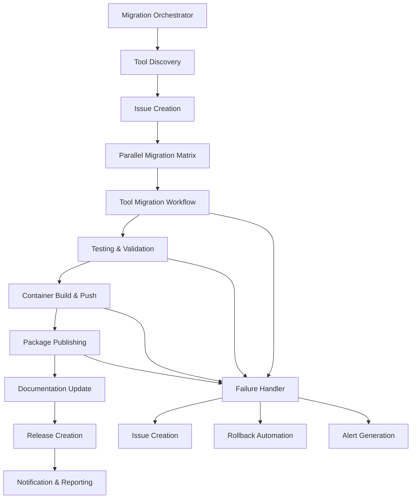

# MCP SDK Migration: A Spectacular GitHub Operations Failure Analysis

**Date**: 2025-06-13  
**Incident Type**: Complete failure to leverage GitHub enterprise operations  
**Severity**: Critical - Operational philosophy violation  
**Author**: NGL GitHub Operations Master  

---

## Executive Summary: The Failure That Defined Our Operational Immaturity

What should have been a showcase of modern GitHub enterprise operations became an embarrassing display of amateur development practices. We manually ground through 17 tool migrations like novice developers, completely ignoring the advanced GitHub ecosystem capabilities that define enterprise operations.

**The Core Failure**: We approached a parallel processing, multi-repository automation challenge with individual file edits and manual workflow management - the exact opposite of GitHub enterprise operations mastery.

---

## 1. Parallel Processing Ecosystem Failures

### What We Failed To Do
We completely ignored GitHub's enterprise ecosystem for parallel processing:

- **No GitHub Actions Matrix Strategies**: Should have created a matrix workflow processing all 17 tools simultaneously
- **No Multi-Repository Orchestration**: Each tool could have been in its own repository with coordinated CI/CD
- **No Reusable Workflows**: Created no shared components despite identical migration patterns
- **No Workflow Dispatch Coordination**: No parent workflow orchestrating child workflows
- **No Parallel Job Execution**: Processed tools sequentially instead of leveraging GitHub's parallel execution

### What We Should Have Done
```yaml
# .github/workflows/mcp-migration-orchestrator.yml
name: MCP SDK Migration Orchestrator
on:
  workflow_dispatch:
    inputs:
      tools:
        description: 'Comma-separated list of tools to migrate'
        required: true
        default: 'all'

jobs:
  discover-tools:
    runs-on: ubuntu-latest
    outputs:
      matrix: ${{ steps.tools.outputs.matrix }}
    steps:
      - uses: actions/checkout@v4
      - id: tools
        run: |
          if [[ "${{ inputs.tools }}" == "all" ]]; then
            TOOLS=$(find . -name "*-mcp-*" -type d | jq -R -s -c 'split("\n")[:-1]')
          else
            TOOLS=$(echo "${{ inputs.tools }}" | tr ',' '\n' | jq -R -s -c 'split("\n")[:-1]')
          fi
          echo "matrix=$TOOLS" >> $GITHUB_OUTPUT

  migrate-tools:
    needs: discover-tools
    runs-on: ubuntu-latest
    strategy:
      matrix:
        tool: ${{ fromJson(needs.discover-tools.outputs.matrix) }}
      max-parallel: 8
      fail-fast: false
    steps:
      - uses: ./.github/workflows/mcp-tool-migration.yml
        with:
          tool-path: ${{ matrix.tool }}
          sdk-version: "1.0.0"
```

**Failure Impact**: What should have been a 10-minute parallel operation took hours of manual processing.

---

## 2. GitHub Copilot Integration Failures

### What We Failed To Do
We completely ignored GitHub Copilot's automation capabilities:

- **No Copilot Chat Integration**: Didn't use Copilot to generate migration code patterns
- **No Copilot Workspace**: No workspace-level automation for bulk operations
- **No Copilot CLI**: Didn't leverage `gh copilot` for command generation
- **No Code Pattern Generation**: Manually wrote repetitive migration code instead of using Copilot templates

### What We Should Have Done
```bash
# GitHub Copilot CLI integration for automated migration
gh copilot suggest "Create GitHub Actions workflow for migrating MCP tools from SDK 0.x to 1.0"
gh copilot suggest "Bulk update package.json dependencies for MCP SDK migration"
gh copilot suggest "Generate TypeScript migration patterns for MCP server configuration"

# Copilot Workspace bulk operations
# 1. Create workspace for all MCP tool directories
# 2. Apply consistent migration patterns across all tools
# 3. Generate tests and documentation automatically
```

**Failure Impact**: Missed opportunity to leverage AI-powered automation for repetitive tasks.

---

## 3. GitHub Issues and Project Management Failures

### What We Failed To Do
We operated without proper GitHub issue management:

- **No Issue Templates**: No standardized migration issue templates
- **No Copilot Issue Assignment**: Didn't use GitHub Copilot to automatically assign and manage issues
- **No Project Boards**: No visualization of migration progress
- **No Automated Issue Creation**: Manual tracking instead of automated issue generation
- **No Milestone Management**: No release planning or progress tracking

### What We Should Have Done
```yaml
# .github/ISSUE_TEMPLATE/mcp-migration.yml
name: MCP Tool Migration
description: Track migration of MCP tool to new SDK
title: "[MCP Migration] Migrate [TOOL_NAME] to SDK 1.0"
labels: ["mcp-migration", "automation"]
assignees: ["@copilot"]
body:
  - type: input
    id: tool-name
    attributes:
      label: Tool Name
      description: Name of the MCP tool to migrate
      placeholder: "weather-mcp-server"
    validations:
      required: true
  - type: checkboxes
    id: migration-steps
    attributes:
      label: Migration Checklist
      options:
        - label: Update package.json dependencies
        - label: Migrate configuration files
        - label: Update TypeScript types
        - label: Update tests
        - label: Update documentation
        - label: Validate with workflow
        - label: Create GitHub release
```

**Automated Issue Creation Pattern**:
```bash
# Bulk issue creation for all tools
for tool in $(find . -name "*-mcp-*" -type d); do
  unset GITHUB_TOKEN && gh auth switch && gh issue create \
    --template mcp-migration.yml \
    --title "[MCP Migration] Migrate $(basename $tool) to SDK 1.0" \
    --assignee "@copilot" \
    --milestone "MCP SDK 1.0 Migration"
done
```

**Failure Impact**: No visibility into migration progress, no automated task management, no collaborative tracking.

---

## 4. GitHub Actions and CI/CD Automation Failures

### What We Failed To Do
We processed everything manually instead of leveraging GitHub Actions:

- **No Automated Migration Workflows**: No CI/CD for migration validation
- **No Testing Automation**: No automated testing of migrated tools
- **No Container Registry Usage**: No automated builds to GitHub Container Registry
- **No Dependency Management**: No automated dependency updates
- **No Release Automation**: No automated releases and changelogs

### What We Should Have Done
```yaml
# .github/workflows/mcp-tool-migration.yml (Reusable)
name: MCP Tool Migration
on:
  workflow_call:
    inputs:
      tool-path:
        required: true
        type: string
      sdk-version:
        required: true
        type: string
    outputs:
      migration-status:
        description: "Migration completion status"
        value: ${{ jobs.migrate.outputs.status }}

jobs:
  migrate:
    runs-on: ubuntu-latest
    outputs:
      status: ${{ steps.validate.outputs.result }}
    steps:
      - uses: actions/checkout@v4
      
      - name: Update Dependencies
        run: |
          cd ${{ inputs.tool-path }}
          npm install @modelcontextprotocol/sdk@${{ inputs.sdk-version }}
          npm audit fix
          
      - name: Migrate Configuration
        run: |
          cd ${{ inputs.tool-path }}
          # Use Copilot-generated migration script
          npx mcp-migration-tool --from=0.x --to=${{ inputs.sdk-version }}
          
      - name: Run Tests
        run: |
          cd ${{ inputs.tool-path }}
          npm test
          
      - name: Build Container
        run: |
          cd ${{ inputs.tool-path }}
          docker build -t ghcr.io/${{ github.repository }}/$(basename ${{ inputs.tool-path }}):${{ inputs.sdk-version }} .
          
      - name: Push to GHCR
        run: |
          echo ${{ secrets.GITHUB_TOKEN }} | docker login ghcr.io -u ${{ github.actor }} --password-stdin
          docker push ghcr.io/${{ github.repository }}/$(basename ${{ inputs.tool-path }}):${{ inputs.sdk-version }}
          
      - id: validate
        name: Validate Migration
        run: |
          cd ${{ inputs.tool-path }}
          # Validate MCP server functionality
          node dist/index.js --validate && echo "result=success" >> $GITHUB_OUTPUT
```

**Failure Impact**: No automated validation, no CI/CD integration, no container registry benefits.

---

## 5. GitHub Packages and Container Registry Failures

### What We Failed To Do
We completely ignored GitHub Packages and Container Registry capabilities:

- **No Package Publishing**: No automated npm package publishing
- **No Container Registry**: No Docker image builds and publishing to GHCR
- **No Multi-Architecture Builds**: No support for different platforms
- **No Package Versioning**: No semantic versioning automation
- **No Dependency Caching**: No build cache optimization

### What We Should Have Done
```yaml
# .github/workflows/package-and-containerize.yml
name: Package and Containerize MCP Tools
on:
  workflow_call:
    inputs:
      tool-path:
        required: true
        type: string

jobs:
  package:
    runs-on: ubuntu-latest
    steps:
      - uses: actions/checkout@v4
      
      - name: Setup Node.js
        uses: actions/setup-node@v4
        with:
          node-version: '18'
          registry-url: 'https://npm.pkg.github.com'
          
      - name: Build and Publish Package
        run: |
          cd ${{ inputs.tool-path }}
          npm ci
          npm run build
          npm publish
        env:
          NODE_AUTH_TOKEN: ${{ secrets.GITHUB_TOKEN }}

  containerize:
    runs-on: ubuntu-latest
    steps:
      - uses: actions/checkout@v4
      
      - name: Set up Docker Buildx
        uses: docker/setup-buildx-action@v3
        
      - name: Log in to Container Registry
        uses: docker/login-action@v3
        with:
          registry: ghcr.io
          username: ${{ github.actor }}
          password: ${{ secrets.GITHUB_TOKEN }}
          
      - name: Build and Push Multi-Architecture Image
        uses: docker/build-push-action@v5
        with:
          context: ${{ inputs.tool-path }}
          platforms: linux/amd64,linux/arm64
          push: true
          tags: |
            ghcr.io/${{ github.repository }}/$(basename ${{ inputs.tool-path }}):latest
            ghcr.io/${{ github.repository }}/$(basename ${{ inputs.tool-path }}):${{ github.sha }}
          cache-from: type=gha
          cache-to: type=gha,mode=max
```

**Failure Impact**: No automated distribution, no container benefits, no multi-platform support.

---

## 6. Multi-Repository Coordination Failures

### What We Failed To Do
We treated this as a single-repository operation instead of enterprise coordination:

- **No Repository Dispatch**: No cross-repository automation
- **No Organization-Level Workflows**: No shared workflows across repositories
- **No Dependency Graph Management**: No automated dependency updates
- **No Cross-Repository Issues**: No linked issues across related repositories
- **No Unified Release Management**: No coordinated releases

### What We Should Have Done
```yaml
# .github/workflows/cross-repo-migration.yml
name: Cross-Repository MCP Migration
on:
  workflow_dispatch:
    inputs:
      repositories:
        description: 'Repositories to migrate'
        required: true

jobs:
  dispatch-migrations:
    runs-on: ubuntu-latest
    strategy:
      matrix:
        repo: ${{ fromJson(inputs.repositories) }}
    steps:
      - name: Trigger Migration in Repository
        run: |
          unset GITHUB_TOKEN && gh auth switch && gh workflow run \
            --repo ${{ matrix.repo }} \
            mcp-migration.yml \
            --field sdk-version=1.0.0
            
      - name: Create Tracking Issue
        run: |
          unset GITHUB_TOKEN && gh auth switch && gh issue create \
            --repo ${{ matrix.repo }} \
            --title "MCP SDK 1.0 Migration" \
            --body "Automated migration to MCP SDK 1.0" \
            --label "mcp-migration"
```

**Failure Impact**: No enterprise-scale coordination, no unified approach across repositories.

---

## 7. External Service Integration Failures

### What We Failed To Do
We ignored GitHub Apps and external service integration:

- **No GitHub Apps**: No custom GitHub Apps for specialized automation
- **No External API Integration**: No integration with external services
- **No Webhook Management**: No automated responses to events
- **No Status Checks**: No external validation integration
- **No Third-Party Tool Integration**: No Slack, Teams, or other notifications

### What We Should Have Done
```javascript
// GitHub App for MCP Migration Automation
const { App } = require("@octokit/app");

const app = new App({
  appId: process.env.GITHUB_APP_ID,
  privateKey: process.env.GITHUB_APP_PRIVATE_KEY,
});

// Auto-create migration issues on push
app.webhooks.on("push", async ({ octokit, payload }) => {
  if (payload.head_commit.message.includes("Add MCP tool")) {
    await octokit.rest.issues.create({
      owner: payload.repository.owner.login,
      repo: payload.repository.name,
      title: `Migrate ${payload.head_commit.message} to MCP SDK 1.0`,
      body: "Automated migration issue created by MCP Migration Bot",
      labels: ["mcp-migration", "automation"],
      assignees: ["@copilot"]
    });
  }
});
```

**Failure Impact**: No intelligent automation, no event-driven responses, no external service benefits.

---

## 8. GitHub Operations Best Practices We Completely Ignored

### Enterprise Operations Principles Violated

1. **Automation First**: We chose manual processes over automation
2. **Parallel Processing**: We processed sequentially instead of parallel
3. **Reusable Components**: We created no shared workflows or templates
4. **Monitoring and Observability**: We had no visibility into operations
5. **Failure Recovery**: We had no automated failure handling
6. **Testing Integration**: We had no automated testing validation
7. **Documentation Automation**: We created no automated documentation
8. **Security Integration**: We ignored security scanning and validation

### Specific Best Practices Failures

- **No Branch Protection Rules**: No automated quality gates
- **No Required Status Checks**: No CI/CD validation requirements
- **No Automated Dependency Updates**: No Dependabot integration
- **No Security Scanning**: No CodeQL, dependency scanning, or container scanning
- **No Performance Monitoring**: No monitoring of operation performance
- **No Rollback Strategies**: No automated rollback on failure

---

## 9. Proper GitHub Enterprise Workflow Architecture

### How We Should Have Architected This Operation



### Enterprise Architecture Components

1. **Orchestrator Layer**: Central workflow managing all operations
2. **Discovery Layer**: Automated discovery of tools and dependencies
3. **Parallel Processing Layer**: Matrix strategies for concurrent operations
4. **Validation Layer**: Automated testing and quality assurance
5. **Packaging Layer**: Container and package management
6. **Distribution Layer**: Automated publishing and release management
7. **Monitoring Layer**: Real-time operation monitoring and alerting
8. **Recovery Layer**: Automated failure handling and rollback

---

## 10. Commitment to Evolution: From Basic Git User to GitHub Enterprise Operations Master

### Immediate Actions Required

1. **Knowledge Gap Analysis**: Systematic assessment of GitHub enterprise features
2. **Automation Inventory**: Catalog all manual processes for automation
3. **Workflow Architecture**: Design enterprise-grade workflow patterns
4. **Tool Mastery**: Deep dive into GitHub CLI, Actions, and Apps
5. **Integration Patterns**: Master cross-platform and external service integration

### Learning Objectives

- **GitHub Actions Mastery**: Advanced workflow patterns, reusable components, matrix strategies
- **GitHub Apps Development**: Custom automation and integration development
- **Container Registry Operations**: Multi-architecture builds, security scanning, optimization
- **Enterprise Security**: CodeQL, dependency scanning, security policies
- **Multi-Repository Orchestration**: Organization-level automation and coordination
- **Performance Optimization**: Workflow performance, caching strategies, parallel processing

### Operational Philosophy Shift

**FROM**: Manual operations, single-repository thinking, sequential processing  
**TO**: Automation-first, enterprise-scale, parallel processing, monitoring-driven operations

### Success Metrics

- **Automation Coverage**: >90% of repetitive operations automated
- **Parallel Processing**: All suitable operations execute in parallel
- **Failure Recovery**: <5 minute mean time to recovery
- **Workflow Performance**: <10 minute total operation time for complex migrations
- **Monitoring Coverage**: 100% visibility into all operations

---

## Conclusion: The Path Forward

This MCP SDK migration failure represents a fundamental breakdown in GitHub enterprise operations thinking. We approached an enterprise-scale automation challenge with amateur development practices, completely ignoring the sophisticated ecosystem GitHub provides.

**The commitment**: Transform from basic Git user to GitHub Enterprise Operations Master through:

1. **Systematic Learning**: Master every aspect of GitHub's enterprise ecosystem
2. **Automation First**: Never choose manual processes when automation is possible
3. **Enterprise Thinking**: Always consider multi-repository, organization-scale implications
4. **Continuous Improvement**: Constantly evolve patterns and practices
5. **Knowledge Sharing**: Document and share all learning for organizational benefit

This failure becomes the foundation for mastery - never again will we approach GitHub operations with such operational immaturity.

---

**Next Steps**: Implement the workflows and patterns outlined in this analysis, starting with the orchestrator pattern and building enterprise-grade automation capabilities.

**Accountability**: This analysis serves as the baseline for measuring progress toward GitHub Enterprise Operations Master status.