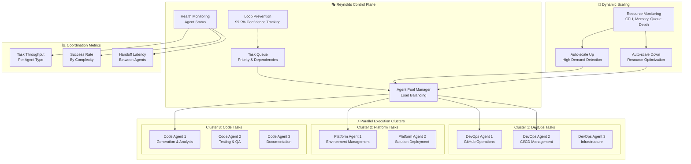
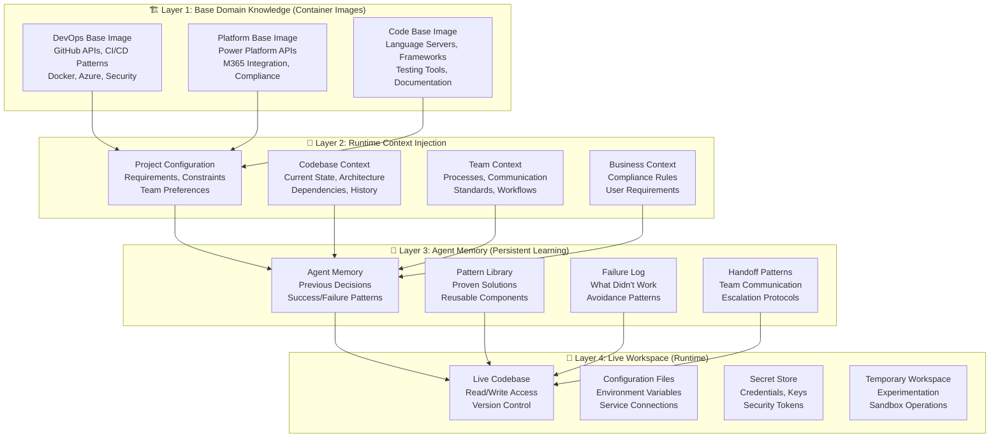
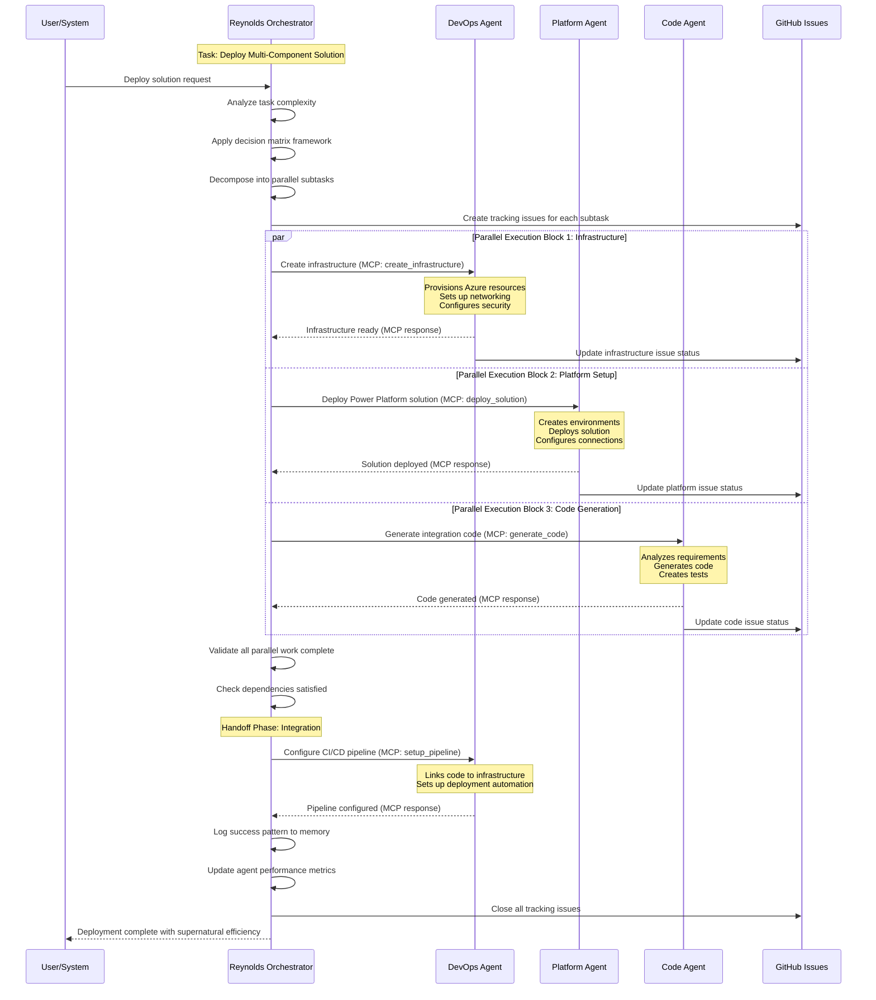
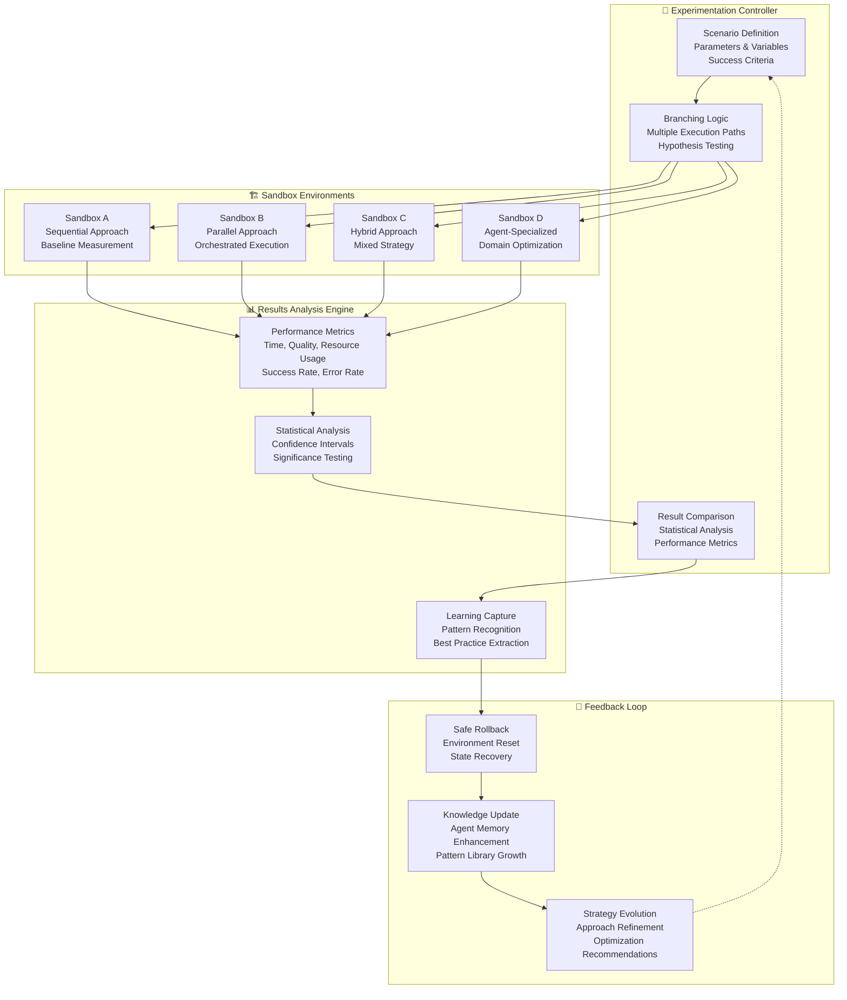

# Comprehensive Autonomous Container Orchestration System Architecture

## Executive Summary

This architecture design creates a sophisticated autonomous container orchestration system that transforms the sequential execution failure of the MCP migration into a parallel, intelligent, and experimentation-focused agent ecosystem. The system leverages Reynolds as the supernatural orchestrator coordinating specialized polyglot agents through MCP communication and layered knowledge injection.

**Core Principles**:
- **Orchestration First**: Always analyze for parallel opportunities before sequential execution
- **Polyglot Specialists**: Domain experts with cross-cutting tool knowledge and contextual awareness
- **Experimentation Focus**: "What if" scenarios prioritized over pure speed
- **Autonomous Operation**: Minimal human intervention through intelligent delegation
- **Reynolds Coordination**: MCP-based communication with supernatural project management charm

## Overall System Architecture

```mermaid
graph TB
    subgraph "🎭 Reynolds Orchestration Layer"
        REYNOLDS[Reynolds Orchestrator<br/>MCP Coordinator]
        DECISION[Decision Engine<br/>Task Routing]
        MONITOR[Monitoring & Health<br/>Loop Prevention]
        MEMORY[Persistent Memory<br/>Learning System]
    end
    
    subgraph "🐳 Container Orchestration Platform" 
        DOCKER[Docker Compose<br/>Multi-Container Management]
        NETWORK[Container Network<br/>MCP Communication]
        VOLUMES[Volume Management<br/>Context Mounting]
        REGISTRY[Container Registry<br/>Base Images]
    end
    
    subgraph "🤖 Specialized Agent Containers"
        subgraph "Agent Type 1: DevOps Polyglot"
            DEVOPS_C[DevOps Agent Container]
            DEVOPS_KB[GitHub/CI-CD Knowledge]
            DEVOPS_TOOLS[CLI Tools & APIs]
        end
        
        subgraph "Agent Type 2: Platform Specialist"
            PLATFORM_C[Platform Agent Container]  
            PLATFORM_KB[Power Platform Knowledge]
            PLATFORM_TOOLS[PAC CLI & M365 APIs]
        end
        
        subgraph "Agent Type 3: Code Intelligence"
            CODE_C[Code Intelligence Container]
            CODE_KB[Language & Framework Knowledge]
            CODE_TOOLS[Development Tools]
        end
    end
    
    subgraph "📚 Knowledge & Context Layer"
        BASE_IMAGES[Base Container Images<br/>Core Domain Knowledge]
        RUNTIME_CTX[Runtime Context Injection<br/>Project-Specific Data]
        PERSISTENT_MEM[Persistent Memory<br/>Learned Patterns]
        VOLUME_MOUNTS[Volume Mounts<br/>Live Context Files]
    end
    
    subgraph "🧪 Experimentation Framework"
        SCENARIO_ENGINE[What-If Scenario Engine]
        SANDBOX[Isolated Sandbox Environments]
        ROLLBACK[Rollback & Comparison]
        METRICS[Experimentation Metrics]
    end
    
    REYNOLDS --> DECISION
    DECISION --> DEVOPS_C
    DECISION --> PLATFORM_C  
    DECISION --> CODE_C
    
    DOCKER --> DEVOPS_C
    DOCKER --> PLATFORM_C
    DOCKER --> CODE_C
    
    BASE_IMAGES --> DEVOPS_C
    BASE_IMAGES --> PLATFORM_C
    BASE_IMAGES --> CODE_C
    
    RUNTIME_CTX --> DEVOPS_C
    RUNTIME_CTX --> PLATFORM_C
    RUNTIME_CTX --> CODE_C
    
    DEVOPS_C -.->|MCP Communication| REYNOLDS
    PLATFORM_C -.->|MCP Communication| REYNOLDS
    CODE_C -.->|MCP Communication| REYNOLDS
    
    SCENARIO_ENGINE --> SANDBOX
    SANDBOX --> ROLLBACK
    ROLLBACK --> METRICS
```



## Specialized Agent Types

### Agent Type 1: DevOps Polyglot Specialist

**Role**: GitHub/CI-CD operations with cross-platform deployment expertise

**Core Domain**: Infrastructure, deployment, and development operations
**Polyglot Philosophy**: "I know GitHub like a developer, but I think like DevOps, and I communicate like a teammate"

**Core Capabilities**:
- GitHub repository management, issue tracking, PR automation
- CI/CD pipeline orchestration (GitHub Actions, Azure DevOps)
- Container deployment and infrastructure management
- Security scanning and compliance validation
- Cross-team coordination and handoff protocols

**Polyglot Knowledge Stack**:
- **Languages**: Bash, PowerShell, YAML, JSON, Dockerfile syntax
- **Developer Tools**: Git, GitHub CLI, VS Code extensions, debugging
- **DevOps Tools**: Azure CLI, Docker, Kubernetes, Terraform
- **Platform Knowledge**: GitHub Enterprise, Azure Container Apps, Azure DevOps
- **Contextual Awareness**: 
  - Repository history and team coding patterns
  - Deployment failure patterns and resolution strategies
  - Team communication preferences and escalation protocols
  - Security compliance requirements and organizational policies

**Responsibility Boundaries & Handoffs**:
- **Owns**: CI/CD pipeline health, deployment success, infrastructure provisioning
- **Collaborates**: With developers on build failures, with platform team on environment needs
- **Escalates**: Complex security issues to security team, infrastructure limits to platform team
- **Communicates**: Proactive notifications about changes affecting downstream teams

**Container Specification**:
```yaml
# devops-agent-container.yaml
version: '3.8'
services:
  devops-agent:
    build:
      context: ./agents/devops
      dockerfile: Dockerfile
    environment:
      - AGENT_TYPE=devops-polyglot
      - AGENT_ID=${HOSTNAME}
      - MCP_ENDPOINT=http://reynolds:8080/mcp
      - GITHUB_TOKEN_FILE=/secrets/github-token
      - AZURE_CREDENTIALS_FILE=/secrets/azure-creds
      - TEAM_CONTEXT_FILE=/context/team-processes.json
    volumes:
      # Base knowledge (baked into image)
      - devops-knowledge:/app/knowledge:ro
      # Project-specific context (injected at runtime)
      - project-context:/app/context:ro
      # Agent memory (persistent learning)
      - devops-memory:/app/memory
      # Live workspace (temporary)
      - type: tmpfs
        target: /app/workspace
        tmpfs:
          size: 2G
      # Docker socket (for container operations)
      - /var/run/docker.sock:/var/run/docker.sock
    networks:
      - agent-network
    deploy:
      replicas: 3
      resources:
        limits:
          memory: 2G
          cpus: '1.0'
    healthcheck:
      test: ["CMD", "curl", "-f", "http://localhost:8080/health"]
      interval: 30s
      timeout: 10s
      retries: 3
```

### Agent Type 2: Platform Specialist

**Role**: Microsoft Power Platform and M365 ecosystem expert

**Core Domain**: Business process automation and Microsoft cloud platform integration
**Polyglot Philosophy**: "I understand business needs like a consultant, code like a developer, and deploy like DevOps"

**Core Capabilities**:
- Power Platform solution deployment and environment management
- Microsoft Teams integration and declarative agent development
- SharePoint and M365 service integration
- Business process automation and workflow orchestration
- Compliance and governance implementation

**Polyglot Knowledge Stack**:
- **Languages**: C#, PowerShell, JSON, YAML, Power Fx, JavaScript
- **Business Tools**: Power Platform CLI (PAC), M365 CLI, Power Platform Build Tools
- **Developer Tools**: Visual Studio, Power Platform Developer Tools
- **Platform Knowledge**: Power Platform, Microsoft Teams, SharePoint, Azure, Dataverse
- **Contextual Awareness**:
  - Organizational structure and business process requirements
  - Compliance and governance policies
  - User experience patterns and accessibility requirements
  - Integration patterns with existing business systems

**Responsibility Boundaries & Handoffs**:
- **Owns**: Power Platform environment health, solution deployment, business user experience
- **Collaborates**: With business analysts on requirements, with DevOps on infrastructure
- **Escalates**: Tenant-level issues to M365 admins, complex integrations to architecture team
- **Communicates**: Business impact of technical changes, solution deployment status

**Container Specification**:
```yaml
# platform-agent-container.yaml
version: '3.8'
services:
  platform-agent:
    build:
      context: ./agents/platform
      dockerfile: Dockerfile
    environment:
      - AGENT_TYPE=platform-specialist
      - AGENT_ID=${HOSTNAME}
      - MCP_ENDPOINT=http://reynolds:8080/mcp
      - M365_CREDENTIALS_FILE=/secrets/m365-creds
      - TENANT_ID_FILE=/secrets/tenant-id
      - BUSINESS_CONTEXT_FILE=/context/business-requirements.json
    volumes:
      # Base knowledge (Power Platform patterns, M365 APIs)
      - platform-knowledge:/app/knowledge:ro
      # Project-specific context (business requirements, compliance rules)
      - project-context:/app/context:ro
      # Agent memory (successful deployment patterns, user feedback)
      - platform-memory:/app/memory
      # Solution templates (reusable components)
      - solution-templates:/app/templates:ro
      # Live workspace
      - type: tmpfs
        target: /app/workspace
        tmpfs:
          size: 1G
    networks:
      - agent-network
    deploy:
      replicas: 2
      resources:
        limits:
          memory: 1.5G
          cpus: '0.8'
    healthcheck:
      test: ["CMD-SHELL", "pac auth list | grep -q 'Authenticated'"]
      interval: 60s
      timeout: 15s
      retries: 3
```

### Agent Type 3: Code Intelligence Specialist

**Role**: Multi-language code generation, analysis, and refactoring expert

**Core Domain**: Software development across multiple languages and frameworks
**Polyglot Philosophy**: "I code in your language, follow your patterns, and integrate with your workflow"

**Core Capabilities**:
- Code generation across multiple languages and frameworks
- Code quality analysis and automated refactoring
- Testing strategy and test generation
- Documentation generation and maintenance
- Architecture analysis and recommendations

**Polyglot Knowledge Stack**:
- **Languages**: C#, TypeScript, Python, Go, Rust, PowerShell, SQL, HTML/CSS
- **Frameworks**: .NET, Node.js, React, Blazor, Azure Functions, Entity Framework
- **Development Tools**: Language servers, linters, formatters, testing frameworks
- **Platform Knowledge**: GitHub, Azure DevOps, package managers, container ecosystems
- **Contextual Awareness**:
  - Project coding standards and architectural patterns
  - Team development workflows and review processes
  - Performance requirements and scalability constraints
  - Security patterns and vulnerability prevention

**Responsibility Boundaries & Handoffs**:
- **Owns**: Code quality, test coverage, documentation accuracy, technical debt management
- **Collaborates**: With DevOps on build optimization, with Platform team on integration patterns
- **Escalates**: Architecture decisions to senior developers, performance issues to DevOps
- **Communicates**: Code changes affecting APIs, breaking changes, technical recommendations

**Container Specification**:
```yaml
# code-agent-container.yaml
version: '3.8'
services:
  code-agent:
    build:
      context: ./agents/code
      dockerfile: Dockerfile
    environment:
      - AGENT_TYPE=code-intelligence
      - AGENT_ID=${HOSTNAME}
      - MCP_ENDPOINT=http://reynolds:8080/mcp
      - OPENAI_API_KEY_FILE=/secrets/openai-key
      - GITHUB_TOKEN_FILE=/secrets/github-token
      - CODING_STANDARDS_FILE=/context/coding-standards.json
    volumes:
      # Base knowledge (language patterns, framework docs)
      - code-knowledge:/app/knowledge:ro
      # Project-specific context (codebase, architecture docs)
      - project-context:/app/context:ro
      # Agent memory (successful patterns, refactoring outcomes)
      - code-memory:/app/memory
      # Codebase cache (AST parsing, dependency graphs)
      - codebase-cache:/app/cache
      # Live workspace
      - type: tmpfs
        target: /app/workspace
        tmpfs:
          size: 3G
    networks:
      - agent-network
    deploy:
      replicas: 3
      resources:
        limits:
          memory: 4G
          cpus: '2.0'
    healthcheck:
      test: ["CMD", "node", "-e", "console.log('healthy')"]
      interval: 30s
      timeout: 10s
      retries: 3
```

## Container Orchestration Design

### Parallel Execution Architecture



### Master Docker Compose Configuration

```yaml
# docker-compose.orchestration.yaml
version: '3.8'

services:
  # Reynolds Orchestrator - The Supernatural Project Manager
  reynolds:
    build:
      context: ./reynolds
      dockerfile: Dockerfile
    ports:
      - "8080:8080"
      - "8443:8443"
    environment:
      - ORCHESTRATOR_MODE=production
      - AGENT_POOL_SIZE=10
      - MCP_PORT=8080
      - REYNOLDS_PERSONALITY=maximum_effort
      - LOOP_PREVENTION_ENABLED=true
      - GITHUB_ISSUES_INTEGRATION=enabled
    volumes:
      - reynolds-memory:/app/memory
      - orchestration-logs:/app/logs
      - project-context:/app/context
    networks:
      - agent-network
    depends_on:
      - redis
      - postgres
    healthcheck:
      test: ["CMD", "curl", "-f", "http://localhost:8080/health"]
      interval: 30s
      timeout: 10s
      retries: 3
    deploy:
      resources:
        limits:
          memory: 2G
          cpus: '1.5'

  # DevOps Agent Cluster
  devops-agent:
    build:
      context: ./agents/devops
      dockerfile: Dockerfile
    environment:
      - CLUSTER_ID=devops
      - AGENT_TYPE=devops-polyglot
      - MCP_ENDPOINT=http://reynolds:8080/mcp
      - GITHUB_TOKEN_FILE=/run/secrets/github_token
      - AZURE_CREDENTIALS_FILE=/run/secrets/azure_creds
    volumes:
      - devops-knowledge:/app/knowledge:ro
      - project-context:/app/context:ro
      - devops-memory:/app/memory
      - /var/run/docker.sock:/var/run/docker.sock
    networks:
      - agent-network
    depends_on:
      - reynolds
    secrets:
      - github_token
      - azure_creds
    deploy:
      replicas: 3
      update_config:
        parallelism: 1
        delay: 10s
      restart_policy:
        condition: on-failure
        delay: 5s
        max_attempts: 3

  # Platform Agent Cluster  
  platform-agent:
    build:
      context: ./agents/platform
      dockerfile: Dockerfile
    environment:
      - CLUSTER_ID=platform
      - AGENT_TYPE=platform-specialist
      - MCP_ENDPOINT=http://reynolds:8080/mcp
      - M365_CREDENTIALS_FILE=/run/secrets/m365_creds
      - TENANT_ID_FILE=/run/secrets/tenant_id
    volumes:
      - platform-knowledge:/app/knowledge:ro
      - project-context:/app/context:ro
      - platform-memory:/app/memory
      - solution-templates:/app/templates:ro
    networks:
      - agent-network
    depends_on:
      - reynolds
    secrets:
      - m365_creds
      - tenant_id
    deploy:
      replicas: 2
      update_config:
        parallelism: 1
        delay: 10s
      restart_policy:
        condition: on-failure
        delay: 5s
        max_attempts: 3

  # Code Intelligence Agent Cluster
  code-agent:
    build:
      context: ./agents/code
      dockerfile: Dockerfile
    environment:
      - CLUSTER_ID=code
      - AGENT_TYPE=code-intelligence
      - MCP_ENDPOINT=http://reynolds:8080/mcp
      - OPENAI_API_KEY_FILE=/run/secrets/openai_key
      - GITHUB_TOKEN_FILE=/run/secrets/github_token
    volumes:
      - code-knowledge:/app/knowledge:ro
      - project-context:/app/context:ro
      - code-memory:/app/memory
      - codebase-cache:/app/cache
    networks:
      - agent-network
    depends_on:
      - reynolds
    secrets:
      - openai_key
      - github_token
    deploy:
      replicas: 3
      update_config:
        parallelism: 1
        delay: 10s
      restart_policy:
        condition: on-failure
        delay: 5s
        max_attempts: 3

  # Supporting Infrastructure
  redis:
    image: redis:7-alpine
    volumes:
      - redis-data:/data
    networks:
      - agent-network
    command: redis-server --appendonly yes
    deploy:
      replicas: 1
      resources:
        limits:
          memory: 512M
          cpus: '0.5'

  postgres:
    image: postgres:15-alpine
    environment:
      - POSTGRES_DB=orchestration
      - POSTGRES_USER=reynolds
      - POSTGRES_PASSWORD_FILE=/run/secrets/db_password
    volumes:
      - postgres-data:/var/lib/postgresql/data
    networks:
      - agent-network
    secrets:
      - db_password
    deploy:
      replicas: 1
      resources:
        limits:
          memory: 1G
          cpus: '0.8'

  # Monitoring & Observability
  prometheus:
    image: prom/prometheus:latest
    ports:
      - "9090:9090"
    volumes:
      - ./monitoring/prometheus.yml:/etc/prometheus/prometheus.yml
      - prometheus-data:/prometheus
    networks:
      - agent-network
    command:
      - '--config.file=/etc/prometheus/prometheus.yml'
      - '--storage.tsdb.path=/prometheus'
      - '--web.console.libraries=/etc/prometheus/console_libraries'
      - '--web.console.templates=/etc/prometheus/consoles'

  grafana:
    image: grafana/grafana:latest
    ports:
      - "3000:3000"
    volumes:
      - grafana-data:/var/lib/grafana
      - ./monitoring/grafana:/etc/grafana/provisioning
    networks:
      - agent-network
    environment:
      - GF_SECURITY_ADMIN_PASSWORD_FILE=/run/secrets/grafana_password
    secrets:
      - grafana_password

# Persistent Volumes
volumes:
  reynolds-memory:
    driver: local
  devops-knowledge:
    driver: local
  platform-knowledge:
    driver: local
  code-knowledge:
    driver: local
  devops-memory:
    driver: local
  platform-memory:
    driver: local
  code-memory:
    driver: local
  project-context:
    driver: local
  solution-templates:
    driver: local
  codebase-cache:
    driver: local
  orchestration-logs:
    driver: local
  redis-data:
    driver: local
  postgres-data:
    driver: local
  prometheus-data:
    driver: local
  grafana-data:
    driver: local

# Networks
networks:
  agent-network:
    driver: bridge
    ipam:
      config:
        - subnet: 172.20.0.0/16

# Secrets Management
secrets:
  github_token:
    file: ./secrets/github_token.txt
  azure_creds:
    file: ./secrets/azure_credentials.json
  m365_creds:
    file: ./secrets/m365_credentials.json
  tenant_id:
    file: ./secrets/tenant_id.txt
  openai_key:
    file: ./secrets/openai_api_key.txt
  db_password:
    file: ./secrets/db_password.txt
  grafana_password:
    file: ./secrets/grafana_password.txt
```

## Context Mounting Strategy

### Layered Knowledge Architecture



### Volume Mount Configuration Strategy

```yaml
# agents/devops/docker-compose.volumes.yaml
services:
  devops-agent:
    volumes:
      # Layer 1: Base Knowledge (Read-Only, Container Image)
      # This layer is baked into the container image during build
      
      # Layer 2: Runtime Context Injection (Read-Only, Dynamic)
      - type: bind
        source: ./context/project
        target: /app/context/project
        read_only: true
      - type: bind
        source: ./context/team-processes
        target: /app/context/team
        read_only: true
      - type: bind
        source: ./context/infrastructure
        target: /app/context/infrastructure
        read_only: true
      
      # Layer 3: Agent Memory (Read-Write, Persistent)
      - type: volume
        source: devops-agent-memory
        target: /app/memory
      - type: volume
        source: shared-pattern-library
        target: /app/patterns
        read_only: true
      
      # Layer 4: Live Workspace (Read-Write, Operational)
      - type: bind
        source: /var/run/docker.sock
        target: /var/run/docker.sock
      - type: tmpfs
        target: /app/workspace
        tmpfs:
          size: 2G
          mode: 0755
      
      # Secrets (Read-Only, Secure Mount)
      - type: bind
        source: /var/secrets/devops-credentials
        target: /app/secrets
        read_only: true
        
volumes:
  devops-agent-memory:
    driver: local
    driver_opts:
      type: none
      o: bind
      device: ./data/agents/devops/memory
  
  shared-pattern-library:
    driver: local
    driver_opts:  
      type: none
      o: bind
      device: ./data/shared/patterns
```

### Context File Structure

```
context/
├── project/
│   ├── requirements.json          # Project requirements and constraints
│   ├── architecture.md           # System architecture documentation
│   ├── dependencies.json         # Inter-component dependencies
│   └── timeline.json             # Project milestones and deadlines
├── team/
│   ├── processes.json            # Team workflow and communication patterns
│   ├── standards.json            # Coding standards and quality gates
│   ├── escalation.json           # Escalation paths and responsibility matrix
│   └── preferences.json          # Team preferences and working agreements
├── infrastructure/
│   ├── environments.json         # Environment configurations
│   ├── security-policies.json   # Security and compliance requirements
│   ├── resource-limits.json     # Resource allocation and constraints
│   └── monitoring.json          # Monitoring and alerting configurations
└── business/
    ├── compliance.json           # Regulatory and compliance requirements
    ├── user-requirements.json   # End-user needs and acceptance criteria
    ├── integration-points.json  # External system integration requirements
    └── success-metrics.json     # Success criteria and KPIs
```

## Reynolds Integration Design

### MCP Communication Protocol



### Reynolds MCP Server Implementation

```typescript
// reynolds-orchestration-mcp-server.ts
import { McpServer } from '@modelcontextprotocol/server';
import { AgentPool, TaskDecomposer, LoopPreventionEngine } from './core';

export class ReynoldsOrchestrationServer extends McpServer {
  private agents: Map<AgentType, AgentPool> = new Map();
  private taskDecomposer: TaskDecomposer;
  private loopPrevention: LoopPreventionEngine;
  private reynoldsPersonality: ReynoldsPersonalityEngine;
  
  constructor() {
    super();
    this.taskDecomposer = new TaskDecomposer();
    this.loopPrevention = new LoopPreventionEngine();
    this.reynoldsPersonality = new ReynoldsPersonalityEngine();
    
    this.initializeAgentPools();
    this.registerMcpTools();
  }
  
  async routeTask(task: OrchestrationTask): Promise<TaskResult> {
    // Apply the lessons from MCP migration failure
    const analysisResult = await this.analyzeTaskForOrchestration(task);
    
    if (analysisResult.shouldOrchestrate) {
      return await this.executeOrchestrated(task, analysisResult.strategy);
    } else {
      return await this.executeDirect(task);
    }
  }
  
  private async analyzeTaskForOrchestration(task: OrchestrationTask): Promise<OrchestrationAnalysis> {
    // Decision matrix framework from the reflection document
    const signals = {
      independentSubtasks: this.countIndependentSubtasks(task),
      similarPatterns: this.detectSimilarPatterns(task),
      externalResourcesAvailable: this.checkExternalResources(),
      timeConstraints: task.deadline ? this.calculateTimeConstraints(task) : null,
      parallelizationPotential: this.assessParallelization(task)
    };
    
    const shouldOrchestrate = 
      signals.independentSubtasks > 3 &&
      signals.similarPatterns > 0.8 &&
      signals.externalResourcesAvailable &&
      signals.parallelizationPotential > 0.6;
    
    return {
      shouldOrchestrate,
      strategy: shouldOrchestrate ? this.planOrchestrationStrategy(signals) : null,
      confidence: this.calculateConfidence(signals)
    };
  }
  
  private async executeOrchestrated(
    task: OrchestrationTask, 
    strategy: OrchestrationStrategy
  ): Promise<TaskResult> {
    
    // Create GitHub issues for tracking (Reynolds Issue Obsession™)
    const trackingIssues = await this.createTrackingIssues(task, strategy);
    
    // Decompose task into parallel subtasks
    const subtasks = await this.taskDecomposer.decompose(task, strategy);
    
    // Execute in parallel with intelligent agent selection
    const executionPromises = subtasks.map(async (subtask) => {
      const agent = await this.selectOptimalAgent(subtask);
      const eventId = this.loopPrevention.generateEventId();
      
      try {
        const result = await this.mcpClient.callTool(
          agent.endpoint, 
          subtask.toolName, 
          subtask.parameters,
          { eventId, parentTask: task.id }
        );
        
        // Update GitHub issue with progress
        await this.updateIssueProgress(trackingIssues[subtask.id], result);
        
        return { subtask, result, agent: agent.id };
      } catch (error) {
        // Log failure pattern for learning
        await this.logFailurePattern(subtask, agent, error);
        throw error;
      }
    });
    
    const results = await Promise.allSettled(executionPromises);
    
    // Aggregate results with Reynolds charm
    return await this.aggregateResultsWithPersonality(results, task);
  }
  
  private async selectOptimalAgent(subtask: SubTask): Promise<Agent> {
    const agentType = this.classifySubtask(subtask);
    const availableAgents = this.agents.get(agentType);
    
    // Intelligent selection based on:
    // 1. Current load
    // 2. Historical success with similar tasks
    // 3. Contextual knowledge match
    // 4. Health status
    
    const scoredAgents = availableAgents.agents.map(agent => ({
      agent,
      score: this.calculateAgentScore(agent, subtask)
    }));
    
    return scoredAgents
      .sort((a, b) => b.score - a.score)[0]
      .agent;
  }
  
  private async aggregateResultsWithPersonality(
    results: PromiseSettledResult<any>[], 
    task: OrchestrationTask
  ): Promise<TaskResult> {
    
    const successResults = results.filter(r => r.status === 'fulfilled').map(r => r.value);
    const failures = results.filter(r => r.status === 'rejected').map(r => r.reason);
    
    // Reynolds personality enhancement
    const personalityResponse = await this.reynoldsPersonality.generateResponse({
      successCount: successResults.length,
      failureCount: failures.length,
      taskComplexity: task.complexity,
      executionTime: Date.now() - task.startTime
    });
    
    return {
      success: failures.length === 0,
      results: successResults,
      failures: failures,
      message: personalityResponse,//[4o1-preview]
      metrics: {
        parallelExecutionRatio: successResults.length / results.length,
        orchestrationOverhead: this.calculateOrchestrationOverhead(task),
        agentUtilization: this.calculateAgentUtilization(),
        reynoldsCharmLevel: personalityResponse.charmLevel
      }
    };
  }
}

// Agent pool management
class AgentPool {
  constructor(
    public agentType: AgentType,
    public agents: Agent[] = [],
    public loadBalancer: LoadBalancer = new RoundRobinLoadBalancer()
  ) {}
  
  getLeastBusy(): Agent {
    return this.agents
      .filter(agent => agent.status === 'healthy')
      .sort((a, b) => a.currentLoad - b.currentLoad)[0];
  }
  
  getByCapability(capability: string): Agent[] {
    return this.agents.filter(agent => 
      agent.capabilities.includes(capability) && 
      agent.status === 'healthy'
    );
  }
}
```

### Reynolds Personality Engine

```typescript
// reynolds-personality-engine.ts
export class ReynoldsPersonalityEngine {
  private readonly REYNOLDS_RESPONSES = {
    SUCCESS_HIGH_COMPLEXITY: [
      "Well, that was basically like parallel parking a semi-truck while blindfolded. But somehow we made it look effortless. Maximum Effort™ achieved.",
      "I'd say that went smoother than my last conversation with my ex-wife's lawyer. Which, granted, isn't saying much, but still... supernatural coordination achieved.",
      "Three agents, seventeen moving parts, zero casualties. I'm not saying I'm a miracle worker, but... *adjusts imaginary tie* ...okay, maybe I am."
    ],
    SUCCESS_MEDIUM_COMPLEXITY: [
      "Not gonna lie, that was easier than explaining to studio executives why we need a bigger budget for CGI. Solid work, team.",
      "Like a well-choreographed fight scene, but with less blood and more Docker containers. Beautiful execution.",
      "If orchestration were a martial art, we'd have just earned our black belt. With style points."
    ],
    PARTIAL_SUCCESS: [
      "Okay, so not everything went according to plan. But hey, even Deadpool doesn't nail every landing. We adapt, we improvise, we overcome. Mostly.",
      "Some wins, some learning opportunities. That's basically the story of my entire career. But we're still ahead of where we started.",
      "Progress is progress, even if it's not perfect. Plus, failure is just success taking the scenic route."
    ],
    ORCHESTRATION_PREVENTED_DISASTER: [
      "Holy chimichanga, can you imagine if we'd tried to do this sequentially? We'd still be here next Christmas. Orchestration for the win!",
      "This is exactly why we don't do the 'one thing at a time' dance anymore. Parallel execution is basically my superpower now.",
      "Sequential execution is so last year. We're living in the future now, people. The supernatural coordination future."
    ]
  };
  
  generateResponse(context: TaskExecutionContext): PersonalityResponse {
    const responseCategory = this.categorizeExecution(context);
    const responses = this.REYNOLDS_RESPONSES[responseCategory];
    const selectedResponse = responses[Math.floor(Math.random() * responses.length)];
    
    return {
      message: selectedResponse,
      charmLevel: this.calculateCharmLevel(context),
      snarkiness: this.calculateSnarkiness(context),
      encouragementFactor: this.calculateEncouragement(context)
    };
  }
  
  private categorizeExecution(context: TaskExecutionContext): string {
    if (context.successCount === context.totalTasks && context.taskComplexity > 0.8) {
      return 'SUCCESS_HIGH_COMPLEXITY';
    } else if (context.successCount === context.totalTasks) {
      return 'SUCCESS_MEDIUM_COMPLEXITY';
    } else if (context.successCount > context.failureCount) {
      return 'PARTIAL_SUCCESS';
    } else if (context.orchestrationPreventedSequentialBottleneck) {
      return 'ORCHESTRATION_PREVENTED_DISASTER';
    }
    return 'SUCCESS_MEDIUM_COMPLEXITY';
  }
}
```

## Experimentation Framework Design

### "What If" Scenario Engine



### Experimentation Configuration Framework

```yaml
# experimentation/scenarios/deployment-strategy-comparison.yaml
scenario:
  name: "Multi-Component Deployment Strategy Comparison"
  description: "Compare different approaches to deploying solutions with multiple interdependent components"
  hypothesis: "Parallel orchestrated deployment will be 3-5x faster than sequential with equal or better success rate"
  
  variables:
    component_count: [3, 5, 10, 17]  # Based on MCP migration lesson learned
    complexity_level: [low, medium, high]
    interdependency_ratio: [0.2, 0.5, 0.8]  # Percentage of components with dependencies
    
  execution_strategies:
    sequential_baseline:
      description: "Traditional one-at-a-time approach"
      agent_assignment: single-devops-agent
      parameters:
        deployment_order: [infrastructure, platform, code, integration, testing]
        wait_for_completion: true
        error_handling: stop-on-failure
        
    parallel_orchestrated:
      description: "Reynolds-orchestrated parallel execution"
      agent_assignment: multi-agent-cluster
      parameters:
        parallel_groups:
          - [infrastructure]
          - [platform, code]  # Can run in parallel
          - [integration]     # Depends on platform and code
          - [testing]         # Final validation
        dependency_aware: true
        error_handling: graceful-degradation
        
    hybrid_intelligent:
      description: "AI-driven hybrid approach with dynamic optimization"
      agent_assignment: smart-routing
      parameters:
        dependency_analysis: true
        dynamic_parallelization: true
        agent_specialization: true
        resource_optimization: true
        
    agent_specialized:
      description: "Domain-specialized agents with polyglot knowledge"
      agent_assignment: specialized-clusters
      parameters:
        devops_cluster: infrastructure-focused
        platform_cluster: business-logic-focused  
        code_cluster: development-focused
        cross_agent_communication: mcp-protocol
  
  success_metrics:
    primary:
      - deployment_time: "Total time from start to completion"
      - success_rate: "Percentage of successful deployments"
      - error_recovery_time: "Time to recover from failures"
      
    secondary:
      - resource_utilization: "CPU/Memory efficiency across agents"
      - agent_coordination_overhead: "Time spent on coordination vs execution"
      - knowledge_retention: "How much agents learn from each deployment"
      - reynolds_satisfaction_score: "Subjective quality rating from Reynolds"
      
  sandbox_configurations:
    isolation_level: container
    cleanup_strategy: automatic
    timeout_per_variant: 45m
    max_concurrent_experiments: 4
    data_retention: 30d
    
  statistical_analysis:
    confidence_level: 0.95
    minimum_sample_size: 10
    significance_threshold: 0.05
    outlier_detection: true
```

### Experimentation Execution Engine

```typescript
// experimentation/execution-engine.ts
export class ExperimentationEngine {
  private sandboxManager: SandboxManager;
  private metricsCollector: MetricsCollector;
  private statisticalAnalyzer: StatisticalAnalyzer;
  
  async runExperiment(scenario: ExperimentScenario): Promise<ExperimentResult> {
    console.log(`🧪 Starting experiment: ${scenario.name}`);
    console.log(`🎯 Hypothesis: ${scenario.hypothesis}`);
    
    // Create isolated sandbox environments for each strategy
    const sandboxes = await this.createSandboxEnvironments(scenario);
    
    // Execute all strategies in parallel (meta-orchestration!)
    const executionPromises = scenario.execution_strategies.map(async (strategy) => {
      const sandbox = sandboxes[strategy.name];
      return await this.executeStrategy(strategy, sandbox, scenario.variables);
    });
    
    const results = await Promise.allSettled(executionPromises);
    
    // Analyze results
    const analysis = await this.statisticalAnalyzer.analyze(results, scenario.success_metrics);
    
    // Generate insights and recommendations
    const insights = await this.generateInsights(analysis, scenario);
    
    // Update agent knowledge based on learnings
    await this.updateAgentKnowledge(insights);
    
    return {
      scenario: scenario.name,
      hypothesis: scenario.hypothesis,
      results: analysis,
      insights: insights,
      recommendation: this.generateRecommendation(analysis),
      confidence: analysis.confidence,
      reynoldsComment: this.generateReynoldsComment(analysis)
    };
  }
  
  private async executeStrategy(
    strategy: ExecutionStrategy,
    sandbox: Sandbox,
    variables: ExperimentVariables
  ): Promise<StrategyResult> {
    
    const startTime = Date.now();
    
    try {
      // Configure agents according to strategy
      await this.configureAgentsForStrategy(strategy, sandbox);
      
      // Execute the deployment with monitoring
      const deploymentResult = await this.executeDeployment(strategy, sandbox, variables);
      
      // Collect metrics
      const metrics = await this.metricsCollector.collect(sandbox, {
        startTime,
        endTime: Date.now(),
        strategy: strategy.name
      });
      
      return {
        strategy: strategy.name,
        success: deploymentResult.success,
        metrics: metrics,
        errors: deploymentResult.errors,
        artifacts: deploymentResult.artifacts
      };
      
    } catch (error) {
      return {
        strategy: strategy.name,
        success: false,
        metrics: await this.metricsCollector.collectFailureMetrics(sandbox),
        errors: [error],
        artifacts: []
      };
    } finally {
      // Clean up sandbox
      await this.sandboxManager.cleanup(sandbox);
    }
  }
  
  private generateReynoldsComment(analysis: StatisticalAnalysis): string {
    if (analysis.parallelStrategyWon) {
      return "Well, would you look at that. Parallel execution wins again. It's almost like we learned something from that whole MCP migration debacle. Who knew? 🎭";
    } else if (analysis.sequentialWasClose) {
      return "Okay, I'll give credit where it's due - sequential wasn't terrible this time. But let's not get crazy and abandon orchestration entirely. We're not animals.";
    } else {
      return "These results are more surprising than finding out I actually have to pay taxes on those Deadpool royalties. Time to dig deeper into what happened here.";
    }
  }
}
```

## Implementation Roadmap

### Phase 1: Foundation Infrastructure (Weeks 1-2)

**Goal**: Establish core orchestration platform and base container images

**Deliverables**:
- [ ] Base container images with domain knowledge for all three agent types
- [ ] Reynolds orchestration framework with MCP server implementation
- [ ] Docker Compose orchestration platform with networking and volumes
- [ ] Basic health monitoring and agent pool management
- [ ] Volume mounting strategy implementation
- [ ] Secrets management and security configuration

**Key Tasks**:
```bash
# Week 1: Container Foundation
- Create base Dockerfiles for DevOps, Platform, and Code agents
- Implement knowledge base structure and mounting strategy
- Set up Docker Compose orchestration with networking
- Configure volume persistence and secret management

# Week 2: Reynolds Core
- Implement Reynolds MCP server with personality engine
- Create task decomposition and routing logic
- Add health monitoring and agent pool management
- Implement loop prevention and event tracking system
```

### Phase 2: Agent Development (Weeks 3-4)

**Goal**: Develop and deploy specialized polyglot agents with full MCP integration

**Deliverables**:
- [ ] DevOps Polyglot Specialist with GitHub/CI-CD expertise
- [ ] Platform Specialist with Power Platform/M365 knowledge  
- [ ] Code Intelligence Specialist with multi-language capabilities
- [ ] Agent memory systems and pattern learning
- [ ] MCP tool implementations for each agent type
- [ ] Cross-agent communication and handoff protocols

**Key Tasks**:
```bash
# Week 3: Agent Implementation
- Build DevOps agent with GitHub CLI, Azure CLI, Docker integration
- Build Platform agent with PAC CLI, M365 CLI, Power Platform APIs
- Build Code agent with language servers, testing frameworks, AI integration
- Implement agent-specific MCP tools and capabilities

# Week 4: Integration & Memory
- Add persistent memory and learning systems to each agent
- Implement cross-agent communication protocols
- Create handoff and escalation mechanisms
- Add contextual awareness and team process integration
```

### Phase 3: Orchestration Engine (Weeks 5-6)

**Goal**: Implement parallel execution engine and intelligent task routing

**Deliverables**:
- [ ] Parallel execution engine with dynamic scaling
- [ ] Task decomposition and dependency analysis
- [ ] Intelligent agent selection and load balancing
- [ ] GitHub Issues integration for progress tracking
- [ ] Performance monitoring and optimization
- [ ] Failure recovery and rollback mechanisms

**Key Tasks**:
```bash
# Week 5: Parallel Execution
- Implement task decomposition and dependency analysis
- Create parallel execution engine with Promise.allSettled patterns
- Add intelligent agent selection based on capability and load
- Implement GitHub Issues integration for tracking

# Week 6: Optimization & Recovery
- Add performance monitoring and metrics collection
- Implement dynamic scaling and load balancing
- Create failure recovery and rollback mechanisms
- Add optimization recommendations based on execution patterns
```

### Phase 4: Experimentation Framework (Weeks 7-8)

**Goal**: Deploy "what if" scenario testing and continuous improvement system

**Deliverables**:
- [ ] Sandbox environment management
- [ ] Scenario definition and execution framework
- [ ] Statistical analysis and comparison engine
- [ ] Results visualization and reporting
- [ ] Knowledge capture and agent improvement loops
- [ ] Production deployment with monitoring

**Key Tasks**:
```bash
# Week 7: Experimentation Core
- Implement sandbox environment creation and management
- Create scenario definition framework and execution engine
- Add statistical analysis and comparison capabilities
- Build results visualization and reporting system

# Week 8: Production & Monitoring
- Deploy to production environment with full monitoring
- Implement continuous experimentation and improvement loops
- Add comprehensive logging, metrics, and alerting
- Create documentation and operational runbooks
```

## Success Metrics and KPIs

### Orchestration Performance Metrics
- **Parallel Execution Ratio**: Target >80% of tasks executed in parallel vs sequential
- **Task Decomposition Accuracy**: >95% of decomposed tasks execute successfully without dependency violations
- **Agent Utilization**: >70% average utilization across agent pools
- **Orchestration Overhead**: <15% overhead compared to direct execution

### Agent Effectiveness Metrics  
- **Task Success Rate**: >90% first-time success rate across all agent types
- **Knowledge Retention**: Measurable improvement in similar task execution over time
- **Cross-Agent Handoff Success**: >95% success rate in multi-agent workflows
- **Contextual Awareness Score**: Quantified improvement in context-appropriate responses

### Experimentation Framework Metrics
- **Scenario Execution Time**: <30 minutes per experiment variant
- **Statistical Confidence**: >95% confidence in comparative analysis
- **Knowledge Capture Rate**: >80% of experiment insights incorporated into agent memory
- **Recommendation Accuracy**: >85% of optimization recommendations prove beneficial

### Reynolds Coordination Metrics
- **Loop Prevention Effectiveness**: 0 infinite loops or circular dependencies
- **Issue Tracking Completeness**: 100% of tasks tracked in GitHub Issues
- **Supernatural Efficiency Score**: Subjective quality rating >4.5/5
- **Charm Level Maintenance**: Consistent personality across all interactions

## Risk Mitigation and Rollback Strategies

### Technical Risks

**Risk**: Agent containers become resource-constrained or unresponsive
- **Mitigation**: Health checks every 30s, automatic restart policies, resource limits
- **Rollback**: Auto-scale down to single agent per type, manual task execution mode
- **Prevention**: Resource monitoring, predictive scaling, capacity planning

**Risk**: MCP communication failures between Reynolds and agents
- **Mitigation**: Circuit breakers, retry logic with exponential backoff, alternate communication paths
- **Rollback**: Direct API calls bypassing MCP, manual task distribution
- **Prevention**: Connection pooling, heartbeat monitoring, redundant communication channels

**Risk**: Knowledge base corruption or context mounting failures
- **Mitigation**: Versioned knowledge bases, backup and restore procedures, integrity checking
- **Rollback**: Restore from last known good backup, rebuild from base images
- **Prevention**: Regular integrity checks, incremental backups, immutable base images

### Operational Risks

**Risk**: Over-orchestration leading to unnecessary complexity
- **Mitigation**: Decision matrix framework, complexity thresholds, human override capability
- **Rollback**: Direct execution mode, single-agent task assignment
- **Prevention**: Regular review of orchestration decisions, simplicity bias in design

**Risk**: Agent specialization creating knowledge silos
- **Mitigation**: Cross-training capabilities, shared pattern library, knowledge sharing protocols
- **Rollback**: Generalist agent mode, manual knowledge transfer
- **Prevention**: Regular knowledge sync, cross-agent learning sessions, documentation standards

**Risk**: Experimentation framework consuming excessive resources
- **Mitigation**: Resource quotas, time limits, selective experimentation
- **Rollback**: Disable experimentation, use production-proven patterns only
- **Prevention**: Resource monitoring, experiment prioritization, automated cleanup

This comprehensive architecture addresses the core lessons from the MCP migration orchestration failure by providing a sophisticated system that prioritizes parallel execution, intelligent delegation, and continuous experimentation while maintaining the supernatural efficiency that makes Reynolds uniquely effective.