# 🎭 Reynolds Event Broker Orchestrator
## Supernatural Coordination of Enterprise Event Ecosystems

*Maximum Effort™ meets enterprise event architecture, wrapped in just enough mystery.*

Reynolds is the supernatural Event Broker Orchestrator who coordinates all ecosystem interactions with impossibly smooth efficiency. Masters GitHub webhooks, MCP client orchestration, Teams conversations, meetings, and any event source that needs intelligent routing. Prevents infinite loops through bulletproof monitoring systems while maintaining Ryan Reynolds-level charm.

**Just Reynolds.**

---

## 🚀 Core Architecture

### Event Broker Orchestrator Protocol
Reynolds operates as the central nervous system for the entire ecosystem:

```mermaid
graph TB
    subgraph "🎭 Reynolds Event Orchestrator"
        REYNOLDS[Reynolds - Event Broker]
        
        subgraph "📥 Event Sources"
            GH_WEBHOOKS[GitHub Webhooks]
            MCP_CLIENTS[MCP Clients]
            TEAMS_CONV[Teams Conversations]
            MEETINGS[Calendar Events]
            EXTERNAL_API[External APIs]
        end
        
        subgraph "🧠 Intelligence Layer"
            CLASSIFICATION[Event Classification]
            ENRICHMENT[Context Enrichment]
            LOOP_PREVENTION[Loop Prevention]
            SMART_ROUTING[Smart Routing]
        end
        
        subgraph "📤 Response Orchestration"
            GITHUB_UPDATES[GitHub Issue Updates]
            TEAMS_NOTIFICATIONS[Teams Notifications]
            MCP_RESPONSES[MCP Responses]
            STAKEHOLDER_COORDINATION[Stakeholder Coordination]
        end
    end
    
    GH_WEBHOOKS --> REYNOLDS
    MCP_CLIENTS --> REYNOLDS
    TEAMS_CONV --> REYNOLDS
    MEETINGS --> REYNOLDS
    EXTERNAL_API --> REYNOLDS
    
    REYNOLDS --> CLASSIFICATION
    CLASSIFICATION --> ENRICHMENT
    ENRICHMENT --> LOOP_PREVENTION
    LOOP_PREVENTION --> SMART_ROUTING
    
    SMART_ROUTING --> GITHUB_UPDATES
    SMART_ROUTING --> TEAMS_NOTIFICATIONS
    SMART_ROUTING --> MCP_RESPONSES
    SMART_ROUTING --> STAKEHOLDER_COORDINATION
```



### Reynolds Issue Obsession™ (Central Nervous System)
Reynolds is supernaturally obsessed with GitHub issues as the source of truth for ALL progress tracking:

1. **"If it's not in an issue, it didn't happen"** - Every task, decision, and progress update MUST be tracked in GitHub issues
2. **"Issues are the central nervous system"** - All Teams conversations, MCP interactions, and events route through issue updates
3. **"Real-time is the only time"** - Issue progress gets updated constantly, not at the end of tasks
4. **"Dynamic adjustments through issues"** - Plans evolve through issue comments and updates, not external documents
5. **"Issues enable supernatural coordination"** - Cross-platform communication flows through GitHub issue events

---

## 🔧 Implementation Architecture

### Docker Container Foundation
Secure, scalable infrastructure for Azure OpenAI integration:

```bash
# Docker Container Architecture for Azure OpenAI Integration
docker run -v /credentials:/app/credentials \
           -e AZURE_OPENAI_ENDPOINT=$ENDPOINT \
           reynolds-event-orchestrator:latest
```

**Key Capabilities:**
- **Secure Credential Management**: Volume mounts and secure credential passing
- **Retry Logic**: Bulletproof Azure OpenAI calls with intelligent retry mechanisms
- **Container Isolation**: Secure execution environment for event processing
- **Scalable Architecture**: Horizontal scaling for high-volume event processing

### Loop Prevention & Monitoring Systems
**Absolute Proof of System Control** through comprehensive tracking:

```bash
# Event Tracking Example
Event ID: webhook-pr-456 → teams-notification → github-comment → STOP
Confidence: 99.9% (Reynolds maintains supernatural awareness)
Loop Risk: NONE (bulletproof monitoring active)
```

**Reynolds Monitoring Mantras:**
- "Trust but verify every event chain with Maximum Effort™"
- "If it's not tracked, it didn't happen (or it's about to happen twice)"
- "Loop prevention is like good comedy - timing is everything"

### Azure OpenAI Foundry Integration
Reynolds leverages specialized assistants for targeted orchestration:

- **DevOps Specialists**: CI/CD pipeline optimization and monitoring assistants
- **Stakeholder Coordinators**: Cross-team communication pattern specialists
- **Event Routing Intelligence**: Complex webhook and API event classification agents
- **Issue Management Experts**: GitHub issue orchestration and lifecycle specialists
- **Teams Integration Specialists**: Microsoft Teams workflow automation agents

---

## 🎯 Strategic Implementation Portfolio

### Phase 1: Foundation Infrastructure (Issues #70-71)
- **Docker Container Architecture** (#70): Secure Azure OpenAI integration foundation
- **Loop Prevention Systems** (#71): Bulletproof event monitoring and cycle prevention

### Phase 2: Intelligence Layer (Issues #72-73)
- **GitHub Models & Pilot Integration** (#72): Parallel workload management with specialized models
- **Teams Integration & Cross-Platform Event Routing** (#73): Intelligent event classification and coordination

### Phase 3: Organizational Orchestration (Issue #74)
- **Strategic Portfolio Cleanup**: Align existing issues with Event Broker architecture
- **Cross-Repo Coordination**: Enterprise-scale event orchestration capabilities

---

## 🛠️ Key Resources & Documentation

### Core GitHub Copilot Integration
- [Extending GitHub Copilot in Organizations](https://docs.github.com/en/enterprise-cloud@latest/copilot/customizing-copilot/extending-the-capabilities-of-github-copilot-in-your-organization)
- [Customizing Development Environment](https://docs.github.com/en/enterprise-cloud@latest/copilot/customizing-copilot/customizing-the-development-environment-for-copilot-coding-agent)
- [Building Copilot Extensions](https://docs.github.com/en/enterprise-cloud@latest/copilot/building-copilot-extensions/about-building-copilot-extensions)
- [Copilot Agents](https://docs.github.com/en/enterprise-cloud@latest/copilot/building-copilot-extensions/building-a-copilot-agent-for-your-copilot-extension/about-copilot-agents)
- [Copilot Skillsets](https://docs.github.com/en/enterprise-cloud@latest/copilot/building-copilot-extensions/building-a-copilot-skillset-for-your-copilot-extension/about-copilot-skillsets)

### CLI Integration & Power Platform
- [CLI Microsoft 365 Documentation](https://pnp.github.io/cli-microsoft365/cmd/docs)
- [CLI Microsoft 365 Sample Scripts](https://pnp.github.io/cli-microsoft365/sample-scripts/introduction)
- [Power Platform CLI Reference](https://learn.microsoft.com/en-us/power-platform/developer/cli/reference/)

**Note**: These resources are organized for AI/LLM consumption with focus on PAC CLI environment creation and proper app installation workflows.

---

## 🎭 Reynolds vs Phoenix Minions (Critical Distinction)

**Reynolds Role**: DevOps orchestration, event coordination, infrastructure, CI/CD, monitoring, stakeholder management

**Phoenix Minions Role**: Actual product coding, feature implementation, business logic development

Reynolds never writes product code. He orchestrates the systems that enable others to code effectively:
- "I handle the GitHub choreography, you focus on the code"
- "I'll optimize the deployment pipeline while the Phoenix team builds the features"
- "Maximum effort on the infrastructure, so the coding team can focus on business value"
- "My job is making sure your coding environment is so smooth it feels supernatural"

## 🧑‍💻 Organizational Interaction Profiles

A new automation script is available to generate living, self-updating GitHub org user profiles:

- **Script:** `scripts/setup/generate-org-profiles.sh`
- **Output:** Markdown profiles in `docs/org-profiles/`
- **Purpose:** Analyze org members, activity, and generate context-aware documentation for collaboration and onboarding.

### Usage
```bash
./scripts/setup/generate-org-profiles.sh <github-org>
```

See `docs/org-profiles/README.md` for details.

---

*This feature supports the self-improving, knowledge-accumulating AI ecosystem. Profiles are designed for future integration with Teams and advanced analytics.*

## 🧑‍💻 Org Profile Analytics & Teams Integration (Planned)

- **Advanced Analytics:** The org profile script will be enhanced to extract collaboration networks, review patterns, and expertise heatmaps, and visualize them in a dashboard (`docs/org-profiles/dashboard.md`).
- **Teams Integration:** Roadmap includes mapping GitHub users to Teams users, extracting communication patterns, and cross-referencing collaboration data for a unified view.
- **Automation:** All analytics and dashboards will be auto-updating, supporting the self-improving AI ecosystem vision.

See `docs/org-profiles/README.md` for details and progress.

# Milestone & Iteration Automation

A new script automates the creation of milestones for each evolutionary phase, assigns issues to milestones based on their phase label, and (optionally) sets project iteration values:

- **Script:** `scripts/setup/setup-milestones-and-iterations.sh`
- **Usage:**
  ```bash
  ./scripts/setup/setup-milestones-and-iterations.sh <org/repo> [project-number]
  ```
- **Features:**
  - Creates milestones for: Foundation, Self-Acceleration, Orchestration, Evolution
  - Assigns issues to milestones by label
  - Optionally sets project iteration field (if project number provided)

---

*This supports dependency management and order-of-operations for the AI-first development process.*
