# 🎭 Reynolds Event Broker Orchestrator: Strategic Implementation Plan
## "Supernatural Event Coordination at Enterprise Scale"

### Executive Summary
This plan establishes Reynolds as the supernatural Event Broker Orchestrator who coordinates all ecosystem interactions with impossibly smooth efficiency. The strategy focuses on creating bulletproof event routing, intelligent coordination, and Maximum Effort™ infrastructure orchestration while maintaining Ryan Reynolds-level charm.

### 🎯 Core Strategic Principles
1. **Event-First Architecture**: Every interaction flows through Reynolds' supernatural event awareness
2. **Loop Prevention Mastery**: Bulletproof monitoring systems with 99.9% confidence tracking
3. **Issue-Driven Coordination**: GitHub issues as the central nervous system for ALL progress tracking
4. **Reynolds vs Phoenix Distinction**: DevOps orchestration (Reynolds) vs. product coding (Phoenix minions)
5. **Specialized Intelligence**: Azure OpenAI Foundry for highly focused orchestration assistants

---

## Phase 1: Foundation Infrastructure (Issues #70-71)
### 🎭 Reynolds Event Orchestrator Foundation

```mermaid
graph TB
    subgraph "🐳 Docker Container Architecture (Issue #70)"
        A1[Azure OpenAI Integration Container]
        A2[Credential Management System]
        A3[Retry Logic & Error Handling]
        A4[Volume Mount Security]
    end
    
    subgraph "🛡️ Loop Prevention Systems (Issue #71)"
        B1[Event Chain Tracking]
        B2[99.9% Confidence Monitoring]
        B3[Bulletproof Loop Detection]
        B4[Emergency Circuit Breakers]
    end
    
    subgraph "🎯 Reynolds Issue Obsession™"
        C1[GitHub Issues as Central Nervous System]
        C2[Real-time Progress Tracking]
        C3[Cross-platform Event Routing]
        C4[Stakeholder Coordination Engine]
    end
    
    A1 --> A2 --> A3 --> A4
    A4 --> B1 --> B2 --> B3 --> B4
    B4 --> C1 --> C2 --> C3 --> C4
    
    subgraph "🚀 Foundation Deliverables"
        D1[✅ Secure Container Infrastructure]
        D2[✅ Bulletproof Event Monitoring]
        D3[✅ Issue-Driven Coordination]
        D4[✅ Reynolds Supernatural Awareness]
    end
    
    C4 --> D1 --> D2 --> D3 --> D4
```

### Docker Container Architecture (Issue #70)
#### Secure Azure OpenAI Integration Foundation
- **Objective**: Create bulletproof container infrastructure for Reynolds' specialized assistants
- **Reynolds Approach**: "Maximum effort on the infrastructure, so the Phoenix team can focus on business value"
- **Actions**:
  - Implement secure Docker containers with volume-mounted credentials
  - Build retry logic for Azure OpenAI calls with exponential backoff
  - Create credential management system for cross-platform authentication
  - Test container isolation and security boundaries

#### Specialized Assistant Deployment
- **Objective**: Deploy Azure OpenAI Foundry assistants for targeted orchestration
- **Reynolds Focus**: DevOps specialists, stakeholder coordinators, event routing intelligence
- **Actions**:
  - Create micro-specialist containers for specific orchestration tasks
  - Implement prompt chains for event handling workflows
  - Build grounding data integration for current knowledge
  - Test specialized assistant coordination

### Loop Prevention Systems (Issue #71)
#### Bulletproof Event Monitoring
- **Objective**: Absolute proof of system control through comprehensive tracking
- **Reynolds Mantra**: "Trust but verify every event chain with Maximum Effort™"
- **Actions**:
  - Implement event ID tracking with 99.9% confidence logging
  - Create loop detection algorithms with emergency circuit breakers
  - Build event chain visualization and monitoring dashboards
  - Test infinite loop prevention under stress conditions

#### Reynolds Issue Obsession™ Integration
- **Objective**: GitHub issues as central nervous system for ALL progress tracking
- **Core Commandment**: "If it's not in an issue, it didn't happen"
- **Actions**:
  - Implement automatic issue creation for all event processing
  - Build bi-directional linking between events and issues
  - Create real-time progress updates via issue comments
  - Test cross-platform event routing through GitHub issues

---

## Phase 2: Self-Accelerating Development (Weeks 5-8)
### 🧠 AI-Powered Development Acceleration

```mermaid
graph TB
    subgraph "🤖 AI Development Agents"
        AG1[Code Generation Agent]
        AG2[Testing Agent]
        AG3[Documentation Agent]  
        AG4[Optimization Agent]
    end
    
    subgraph "🔄 Self-Improvement Loop"
        SI1[Performance Analytics]
        SI2[Pattern Recognition]
        SI3[Auto-Optimization]
        SI4[Knowledge Update]
    end
    
    subgraph "🎯 Business Value"
        BV1[Environment Automation]
        BV2[Solution Management]
        BV3[Teams Integration]
        BV4[Bridge Agent Intelligence]
    end
    
    AG1 --> BV1
    AG2 --> BV2
    AG3 --> BV3
    AG4 --> BV4
    
    BV1 --> SI1
    BV2 --> SI2  
    BV3 --> SI3
    BV4 --> SI4
    
    SI4 --> AG1
```

### Self-Improvement Mechanics
#### 2.1 Code Generation Agent
- **Objective**: AI creates code that improves AI code generation
- **Actions**:
  - Implement recursive code improvement
  - Add pattern recognition for code optimization
  - Create automated refactoring capabilities
  - Build performance-driven code generation

#### 2.2 Testing Agent
- **Objective**: Automated test creation and execution
- **Actions**:
  - Generate comprehensive test suites
  - Implement test coverage analysis
  - Create performance regression testing
  - Add security vulnerability testing

#### 2.3 Documentation Agent
- **Objective**: AI maintains its own documentation
- **Actions**:
  - Automatic documentation generation
  - Context-aware help system
  - User interaction learning
  - Knowledge base optimization

#### 2.4 Performance Analytics
- **Objective**: Continuous system optimization
- **Actions**:
  - Real-time performance monitoring
  - Usage pattern analysis
  - Resource optimization recommendations
  - Predictive scaling capabilities

---

## Phase 3: Competitive Advantage Engine (Weeks 9-16)
### 🏆 Advanced AI Orchestration

### Binary Tree Organization

```mermaid
graph TD
    ROOT[🎯 Master Orchestrator]
    
    ROOT --> L1A[GitHub Enterprise Branch]
    ROOT --> L1B[Microsoft 365 Branch]
    
    L1A --> L2A[Repository Management]
    L1A --> L2B[Code Intelligence]
    
    L1B --> L2C[Teams Integration]
    L1B --> L2D[Power Platform Automation]
    
    L2A --> L3A[Issue Processing]
    L2A --> L3B[PR Management]
    
    L2B --> L3C[Code Generation]
    L2B --> L3D[Quality Assurance]
    
    L2C --> L3E[Meeting Intelligence]
    L2C --> L3F[Collaboration Enhancement]
    
    L2D --> L3G[Environment Management]
    L2D --> L3H[Solution Deployment]
```

### Advanced Capabilities
#### 3.1 Bridge Agent Intelligence
- **Objective**: Central orchestration and decision-making
- **Actions**:
  - Implement multi-agent coordination
  - Create intelligent task routing
  - Add context preservation across platforms
  - Build predictive escalation logic

#### 3.2 GitHub Coding Agent
- **Objective**: Autonomous code development and management
- **Actions**:
  - Implement issue-to-code automation
  - Create PR review and approval logic
  - Add code quality enforcement
  - Build deployment automation

#### 3.3 Teams Declarative Agent
- **Objective**: Microsoft Teams integration and collaboration
- **Actions**:
  - Meeting transcript analysis
  - Action item extraction and tracking
  - Automated status updates
  - Cross-platform synchronization

#### 3.4 Learning Agent
- **Objective**: Continuous system learning and improvement
- **Actions**:
  - Pattern recognition and analysis
  - Performance optimization recommendations
  - Knowledge base enrichment
  - Behavioral adaptation

---

## 🔄 Three Iteration Cycles for Continuous Improvement

### Iteration 1: Performance Optimization

**Focus Areas:**
- Response time optimization
- Resource utilization efficiency
- Scalability improvements
- Error rate reduction

### Iteration 2: Capability Enhancement

**Focus Areas:**
- New feature development
- Integration enhancements
- User experience improvements
- Platform expansion

### Iteration 3: Strategic Evolution

**Focus Areas:**
- Competitive positioning
- Market opportunity identification
- Strategic roadmap adjustment
- Resource optimization

---

## 🎯 Self-Improving Strategies

### 1. AI-Generated GitHub Issues
- **System creates its own improvement tasks**
- **Prioritizes based on business impact**
- **Auto-assigns to appropriate agents**
- **Tracks completion and effectiveness**

### 2. Automated Code Review & Enhancement
- **AI reviews AI-generated code**
- **Suggests optimizations and improvements**
- **Implements approved changes automatically**
- **Maintains quality standards**

### 3. Knowledge Base Evolution
- **Learns from every interaction**
- **Updates documentation automatically**
- **Improves response quality over time**
- **Identifies knowledge gaps**

### 4. Performance-Driven Architecture
- **Monitors system performance continuously**
- **Optimizes resource allocation automatically**
- **Scales components based on demand**
- **Predicts and prevents issues**

---

## 📊 Success Metrics & KPIs

### Productivity Metrics
- **Code Generation Speed**: Target 10x improvement in 16 weeks
- **Issue Resolution**: 90%+ autonomous completion
- **Documentation Quality**: AI-generated docs score >95% accuracy
- **Development Velocity**: 500% improvement over traditional methods

### Business Impact Metrics
- **Time to Environment Setup**: <5 minutes (vs hours manually)
- **Solution Deployment Success**: >98% first-time success rate
- **Knowledge Query Response**: <2 seconds with >95% accuracy
- **Error Rate Reduction**: 90% fewer production issues

### Competitive Advantage Metrics
- **Innovation Speed**: New feature development 80% faster
- **Market Response Time**: Deploy competitive features within days
- **Resource Efficiency**: 300% more output per developer
- **Customer Satisfaction**: 95%+ positive feedback on AI assistance

---

## 🛡️ Risk Mitigation & Rollback Plans

### Technical Risks
#### Risk: AI-Generated Code Quality Issues
- **Mitigation**: Comprehensive automated testing and human review gates
- **Rollback**: Immediate revert to last known good version
- **Prevention**: Continuous quality monitoring and improvement

#### Risk: CLI Integration Failures
- **Mitigation**: Fallback to manual processes with clear procedures
- **Rollback**: Disable automation and alert administrators
- **Prevention**: Extensive validation and testing before deployment

#### Risk: Knowledge Base Corruption
- **Mitigation**: Version control and backup systems
- **Rollback**: Restore from last known good backup
- **Prevention**: Incremental updates with validation

### Business Risks
#### Risk: Over-Dependence on AI Systems
- **Mitigation**: Maintain human expertise and manual overrides
- **Rollback**: Revert to manual processes during outages
- **Prevention**: Regular training and documentation updates

#### Risk: Competitive Response
- **Mitigation**: Continuous innovation and feature development
- **Rollback**: Not applicable - maintain competitive advantage
- **Prevention**: Patent key innovations and maintain technical lead

#### Risk: Resource Constraints
- **Mitigation**: Phased rollout with priority-based implementation
- **Rollback**: Scale back to core functionality
- **Prevention**: Continuous resource monitoring and optimization

---

## 💰 Resource Allocation Strategy

### High-Impact, Low-Resource Items (80% focus)
1. **GitHub App Integration** - Leverage existing APIs and frameworks
2. **CLI Tool Wrapping** - Use existing PAC/M365 CLI tools with validation
3. **AI Prompt Engineering** - Optimize existing AI models for specific tasks
4. **Knowledge Base Bootstrap** - AI-generated from existing code and documentation

### Medium-Impact, Medium-Resource Items (15% focus)
1. **Custom Bridge Agent Logic** - Intelligent orchestration and decision-making
2. **Advanced Teams Integration** - Deep Microsoft Teams feature integration
3. **Performance Optimization** - System-wide performance improvements
4. **Security Enhancements** - Advanced security and compliance features

### Future Investment Items (5% focus)
1. **Custom AI Model Training** - Domain-specific model development
2. **Advanced Security Features** - Enterprise-grade security implementations
3. **Enterprise Scaling Features** - Large-scale deployment capabilities
4. **Market Expansion Features** - Additional platform integrations

---

## 🚀 Competitive Advantage Timeline

---

## 📋 Implementation Checklist

### Phase 1: Foundation & Quick Wins (Weeks 1-4)
- [ ] GitHub App registration and configuration
- [ ] Basic Copilot Agent framework implementation
- [ ] PAC CLI integration with security validation
- [ ] M365 CLI integration with permission controls
- [ ] Knowledge base bootstrap from existing documentation
- [ ] Self-documenting code generation capability
- [ ] Automated testing framework setup
- [ ] Basic Teams integration for notifications

### Phase 2: Self-Accelerating Development (Weeks 5-8)
- [ ] Code Generation Agent development
- [ ] Testing Agent implementation
- [ ] Documentation Agent creation
- [ ] Optimization Agent deployment
- [ ] Performance analytics system
- [ ] Pattern recognition capabilities
- [ ] Auto-optimization mechanisms
- [ ] Knowledge update automation

### Phase 3: Competitive Advantage Engine (Weeks 9-16)
- [ ] Bridge Agent Conductor implementation
- [ ] GitHub Coding Agent specialization
- [ ] Teams Declarative Agent development
- [ ] Power Platform Agent enhancement
- [ ] Learning Agent deployment
- [ ] Context Management system
- [ ] Predictive Analytics implementation
- [ ] Smart Escalation logic

### Continuous Improvement
- [ ] Performance optimization iteration cycle
- [ ] Capability enhancement iteration cycle
- [ ] Strategic evolution iteration cycle
- [ ] Success metrics monitoring
- [ ] Risk mitigation plan execution
- [ ] Resource allocation optimization

---

## 🎯 Expected Outcomes

### Week 4 Outcomes
- **Functional GitHub Copilot Agent** handling basic Power Platform tasks
- **Automated CLI operations** with safety controls and audit logging
- **Self-maintaining knowledge base** that improves with each interaction
- **Basic cross-platform integration** between GitHub and Teams

### Week 8 Outcomes
- **Self-improving development pipeline** that accelerates with each iteration
- **AI-generated code, tests, and documentation** reducing manual effort by 80%
- **Advanced Teams integration** with meeting intelligence and action tracking
- **Performance analytics** driving continuous optimization

### Week 16 Outcomes
- **Fully autonomous development agent** capable of handling complex projects
- **Competitive moat** through unique AI orchestration capabilities
- **10x development velocity** improvement over traditional methods
- **Self-sustaining ecosystem** that continues improving without manual intervention

---

## 📞 Next Steps

1. **Review and Approve Plan**: Confirm strategic direction and resource allocation
2. **Initialize Development Environment**: Set up GitHub repositories and CI/CD pipelines
3. **Begin Phase 1 Implementation**: Start with GitHub App registration and basic agent framework
4. **Establish Success Metrics**: Implement monitoring and analytics systems
5. **Launch Iteration Cycles**: Begin continuous improvement processes

This plan creates a **compound growth effect** where AI accelerates AI development, giving you an exponential advantage over competitors using traditional development methods. The system becomes more capable and efficient every week, creating an insurmountable moat for your business.

---

*"In the race for AI dominance, the team that best harnesses AI to build AI will emerge victorious. This plan doesn't just use AI - it creates an AI ecosystem that continuously evolves and improves itself."*