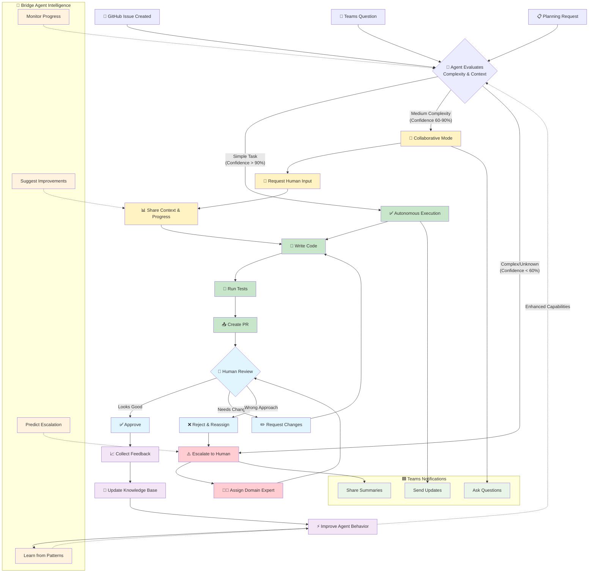

```mermaid
flowchart TD
    %% Starting Points
    START1[🎯 GitHub Issue Created]
    START2[💬 Teams Question]
    START3[📋 Planning Request]

    %% Agent Processing
    AGENT_EVAL{🤖 Agent Evaluates\nComplexity & Context}
    
    %% Autonomous Path
    AUTO[✅ Autonomous Execution]
    AUTO_CODE[📝 Write Code]
    AUTO_TEST[🧪 Run Tests]
    AUTO_PR[📤 Create PR]
    
    %% Collaborative Path
    COLLAB[🤝 Collaborative Mode]
    HUMAN_INPUT[👤 Request Human Input]
    CONTEXT_SHARE[📊 Share Context & Progress]
    
    %% Escalation Path
    ESCALATE[⚠️ Escalate to Human]
    EXPERT_ASSIGN[👨‍💻 Assign Domain Expert]
    
    %% Human Decision Points
    HUMAN_REVIEW{👥 Human Review}
    APPROVE[✅ Approve]
    MODIFY[✏️ Request Changes]
    REJECT[❌ Reject & Reassign]
    
    %% Learning & Feedback
    FEEDBACK[📈 Collect Feedback]
    LEARN[🧠 Update Knowledge Base]
    IMPROVE[⚡ Improve Agent Behavior]
    
    %% Bridge Agent Intelligence
    subgraph "🤖 Bridge Agent Intelligence"
        BA_MONITOR[Monitor Progress]
        BA_PREDICT[Predict Escalation]
        BA_SUGGEST[Suggest Improvements]
        BA_LEARN[Learn from Patterns]
    end
    
    %% Teams Integration
    subgraph "🟦 Teams Notifications"
        TEAMS_NOTIFY[Send Updates]
        TEAMS_ASK[Ask Questions]
        TEAMS_SUMMARY[Share Summaries]
    end

    %% Flow Logic
    START1 --> AGENT_EVAL
    START2 --> AGENT_EVAL
    START3 --> AGENT_EVAL
    
    AGENT_EVAL -->|"Simple Task\n(Confidence > 90%)"| AUTO
    AGENT_EVAL -->|"Medium Complexity\n(Confidence 60-90%)"| COLLAB
    AGENT_EVAL -->|"Complex/Unknown\n(Confidence < 60%)"| ESCALATE
    
    AUTO --> AUTO_CODE
    AUTO_CODE --> AUTO_TEST
    AUTO_TEST --> AUTO_PR
    AUTO_PR --> HUMAN_REVIEW
    
    COLLAB --> HUMAN_INPUT
    HUMAN_INPUT --> CONTEXT_SHARE
    CONTEXT_SHARE --> AUTO_CODE
    
    ESCALATE --> EXPERT_ASSIGN
    EXPERT_ASSIGN --> HUMAN_REVIEW
    
    HUMAN_REVIEW -->|"Looks Good"| APPROVE
    HUMAN_REVIEW -->|"Needs Changes"| MODIFY
    HUMAN_REVIEW -->|"Wrong Approach"| REJECT
    
    APPROVE --> FEEDBACK
    MODIFY --> AUTO_CODE
    REJECT --> ESCALATE
    
    FEEDBACK --> LEARN
    LEARN --> IMPROVE
    IMPROVE --> BA_LEARN
    
    %% Bridge Agent Connections
    BA_MONITOR -.-> AGENT_EVAL
    BA_PREDICT -.-> ESCALATE
    BA_SUGGEST -.-> CONTEXT_SHARE
    BA_LEARN -.-> IMPROVE
    
    %% Teams Integration
    AUTO --> TEAMS_NOTIFY
    COLLAB --> TEAMS_ASK
    ESCALATE --> TEAMS_SUMMARY
    
    %% Continuous Loop
    IMPROVE -.->|"Enhanced Capabilities"| AGENT_EVAL

    %% Styling
    classDef autonomous fill:#c8e6c9
    classDef collaborative fill:#fff3c4
    classDef escalation fill:#ffcdd2
    classDef human fill:#e1f5fe
    classDef learning fill:#f3e5f5
    classDef bridge fill:#fff3e0
    classDef teams fill:#e8f5e8

    class AUTO,AUTO_CODE,AUTO_TEST,AUTO_PR autonomous
    class COLLAB,HUMAN_INPUT,CONTEXT_SHARE collaborative
    class ESCALATE,EXPERT_ASSIGN escalation
    class HUMAN_REVIEW,APPROVE,MODIFY,REJECT human
    class FEEDBACK,LEARN,IMPROVE learning
    class BA_MONITOR,BA_PREDICT,BA_SUGGEST,BA_LEARN bridge
    class TEAMS_NOTIFY,TEAMS_ASK,TEAMS_SUMMARY teams
```
