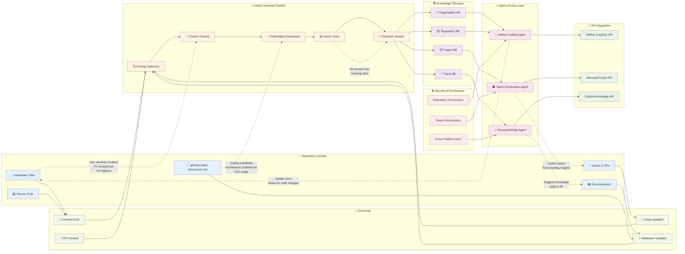

```mermaid
graph LR
    %% Source Content
    subgraph "📁 Repository Content"
        MD[📄 Markdown Files]
        CODE[💻 Source Code]
        DOCS[📚 Documentation]
        ISSUES_SRC[🎯 Issues & PRs]
        COPILOT_INST[🤖 .github/copilot-instructions.md]
    end

    %% Git Events
    subgraph "🔄 Git Events"
        COMMIT[📝 Commit Push]
        PR_CREATE[🔀 PR Created]
        ISSUE_UPDATE[🎯 Issue Updated]
        MD_CHANGE[📄 Markdown Updated]
    end

    %% Indexing Pipeline
    subgraph "⚡ Instant Indexing Pipeline"
        DETECT[🔍 Change Detection]
        PARSE[📖 Content Parsing]
        EMBED[🧠 Embedding Generation]
        VECTOR[📊 Vector Store]
        SEARCH[🔎 Semantic Search]
    end

    %% Knowledge Structure
    subgraph "🏗️ Knowledge Structure"
        ORG_KB[🏢 Organization KB]
        REPO_KB[📦 Repository KB]
        PROJ_KB[📋 Project KB]
        TEAM_KB[👥 Team KB]
    end

    %% Agent Access
    subgraph "🤖 Agent Access Layer"
        GITHUB_AGENT[🐙 GitHub Coding Agent]
        TEAMS_AGENT[🟦 Teams Declarative Agent]
        BRIDGE_AGENT[🌉 Personal Bridge Agent]
    end

    %% API Layer
    subgraph "🔌 API Integration"
        GITHUB_API[GitHub GraphQL API]
        TEAMS_API[Microsoft Graph API]
        COPILOT_API[Copilot Knowledge API]
    end

    %% Permission & Security
    subgraph "🔒 Security & Permissions"
        REPO_PERMS[Repository Permissions]
        TEAMS_PERMS[Teams Permissions]
        CROSS_SYNC[Cross-Platform Sync]
    end

    %% Implementation Flow
    MD --> COMMIT
    CODE --> COMMIT
    DOCS --> MD_CHANGE
    ISSUES_SRC --> ISSUE_UPDATE
    COPILOT_INST --> MD_CHANGE

    COMMIT --> DETECT
    PR_CREATE --> DETECT
    ISSUE_UPDATE --> DETECT
    MD_CHANGE --> DETECT

    DETECT --> PARSE
    PARSE --> EMBED
    EMBED --> VECTOR
    VECTOR --> SEARCH

    SEARCH --> ORG_KB
    SEARCH --> REPO_KB
    SEARCH --> PROJ_KB
    SEARCH --> TEAM_KB

    ORG_KB --> GITHUB_AGENT
    REPO_KB --> GITHUB_AGENT
    PROJ_KB --> TEAMS_AGENT
    TEAM_KB --> BRIDGE_AGENT

    GITHUB_AGENT --> GITHUB_API
    TEAMS_AGENT --> TEAMS_API
    BRIDGE_AGENT --> COPILOT_API

    REPO_PERMS --> GITHUB_AGENT
    TEAMS_PERMS --> TEAMS_AGENT
    CROSS_SYNC --> BRIDGE_AGENT

    %% Best Practices Annotations
    MD -.->|"Use semantic headers\n## Architecture\n## Patterns"| PARSE
    COPILOT_INST -.->|"Coding standards\nArchitecture preferences\nTool usage"| EMBED
    VECTOR -.->|"60 second max\nindexing time"| SEARCH

    %% Bidirectional Updates
    GITHUB_AGENT -.->|"Update docs\nbased on code changes"| MD
    TEAMS_AGENT -.->|"Create issues\nfrom meeting insights"| ISSUES_SRC
    BRIDGE_AGENT -.->|"Suggest knowledge\ngaps to fill"| DOCS

    %% Styling
    classDef source fill:#e3f2fd
    classDef events fill:#f1f8e9
    classDef processing fill:#fff3e0
    classDef knowledge fill:#f3e5f5
    classDef agents fill:#fce4ec
    classDef api fill:#e8f5e8
    classDef security fill:#ffebee

    class MD,CODE,DOCS,ISSUES_SRC,COPILOT_INST source
    class COMMIT,PR_CREATE,ISSUE_UPDATE,MD_CHANGE events
    class DETECT,PARSE,EMBED,VECTOR,SEARCH processing
    class ORG_KB,REPO_KB,PROJ_KB,TEAM_KB knowledge
    class GITHUB_AGENT,TEAMS_AGENT,BRIDGE_AGENT agents
    class GITHUB_API,TEAMS_API,COPILOT_API api
    class REPO_PERMS,TEAMS_PERMS,CROSS_SYNC security
```
