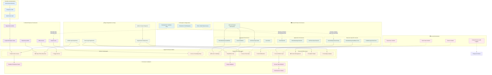

```mermaid
graph TB
    %% Identity & Authentication
    subgraph "🔐 Identity & Authentication"
        AAD[Azure Active Directory]
        SSO[Enterprise SSO]
        MFA[Multi-Factor Auth]
    end

    %% GitHub Permissions
    subgraph "🐙 GitHub Enterprise Permissions"
        ORG_ADMIN[Organization Admin]
        REPO_ADMIN[Repository Admin]
        WRITE_ACCESS[Write Access]
        READ_ACCESS[Read Access]
        COPILOT_SEATS[Copilot Enterprise Seats]
    end

    %% Teams Permissions
    subgraph "🟦 Microsoft Teams Permissions"
        GRAPH_PERMS[Microsoft Graph Permissions]
        
        subgraph "Delegated Permissions"
            CHAT_RW[Chat.ReadWrite]
            MEET_RW[OnlineMeetings.ReadWrite]
            TRANS_R[CallTranscripts.Read]
            USER_R[User.Read]
        end
        
        subgraph "Application Permissions"
            CHAT_ALL[Chat.Read.All]
            MEET_ALL[OnlineMeetings.Read.All]
            TRANS_ALL[CallTranscripts.Read.All]
        end
        
        subgraph "Resource-Specific Consent"
            TEAM_RSC[TeamSettings.Read.Group]
            CHAT_RSC[ChatMessage.Read.Chat]
            MEET_RSC[OnlineMeeting.ReadBasic.Chat]
        end
    end

    %% Agent Permissions
    subgraph "🤖 Agent Permission Matrix"
        
        subgraph "GitHub Coding Agent"
            GCA_READ[📖 Read Code & Issues]
            GCA_WRITE[✏️ Create PRs & Branches]
            GCA_ACTIONS[⚡ Trigger Actions]
            GCA_KB[🧠 Access Knowledge Base]
        end
        
        subgraph "Teams Declarative Agent"
            TDA_LISTEN[👂 Listen to Meetings]
            TDA_CHAT[💬 Read/Write Chat]
            TDA_TRANS[📝 Access Transcripts]
            TDA_NOTIFY[📢 Send Notifications]
        end
        
        subgraph "Personal Bridge Agent"
            PBA_SYNC[🔄 Cross-Platform Sync]
            PBA_CONTEXT[📊 Context Management]
            PBA_ESCALATE[⚡ Escalation Rights]
            PBA_LEARN[🧠 Knowledge Updates]
        end
    end

    %% Permission Boundaries
    subgraph "🛡️ Security Boundaries"
        REPO_BOUNDARY[Repository Isolation]
        TEAM_BOUNDARY[Team Data Isolation]
        TENANT_BOUNDARY[Tenant Isolation]
        AUDIT_LOG[Comprehensive Audit Logging]
    end

    %% App Registration
    subgraph "📋 App Registration & Setup"
        GH_APP[GitHub App Registration]
        TEAMS_APP[Teams App Registration]
        CONSENT[Admin Consent Required]
        DEPLOY[Organization Deployment]
    end

    %% Permission Flow
    AAD --> SSO
    SSO --> MFA
    MFA --> ORG_ADMIN

    ORG_ADMIN --> COPILOT_SEATS
    COPILOT_SEATS --> GCA_READ
    REPO_ADMIN --> GCA_WRITE
    WRITE_ACCESS --> GCA_ACTIONS
    READ_ACCESS --> GCA_KB

    GRAPH_PERMS --> CHAT_RW
    GRAPH_PERMS --> MEET_RW
    GRAPH_PERMS --> TRANS_R
    CHAT_RW --> TDA_CHAT
    MEET_RW --> TDA_LISTEN
    TRANS_R --> TDA_TRANS

    TEAM_RSC --> TDA_NOTIFY
    CHAT_RSC --> PBA_CONTEXT
    MEET_RSC --> PBA_SYNC

    GH_APP --> GCA_READ
    GH_APP --> GCA_WRITE
    TEAMS_APP --> TDA_LISTEN
    TEAMS_APP --> TDA_CHAT

    CONSENT --> DEPLOY
    DEPLOY --> PBA_ESCALATE
    DEPLOY --> PBA_LEARN

    %% Security Enforcement
    REPO_BOUNDARY -.-> GCA_KB
    TEAM_BOUNDARY -.-> TDA_TRANS
    TENANT_BOUNDARY -.-> PBA_SYNC
    AUDIT_LOG -.-> ALL_AGENTS[All Agent Activities]

    %% Permission Validation
    subgraph "✅ Permission Validation"
        RUNTIME_CHECK[Runtime Permission Check]
        SCOPE_VALIDATE[Scope Validation]
        ACCESS_TOKEN[Access Token Refresh]
        FAIL_SECURE[Fail-Secure on Denial]
    end

    GCA_READ --> RUNTIME_CHECK
    TDA_CHAT --> SCOPE_VALIDATE
    PBA_SYNC --> ACCESS_TOKEN
    ACCESS_TOKEN --> FAIL_SECURE

    %% Configuration Examples
    subgraph "⚙️ Example Configurations"
        PILOT_CONFIG[Pilot: Limited Team Access]
        PROD_CONFIG[Production: Full Enterprise]
        DEV_CONFIG[Development: Sandbox Only]
    end

    PILOT_CONFIG -.->|"5 users, 2 repos\nread-only transcripts"| TEAM_RSC
    PROD_CONFIG -.->|"All users, all repos\nfull meeting access"| CHAT_ALL
    DEV_CONFIG -.->|"Dev team only\ntest repos only"| READ_ACCESS

    %% Styling
    classDef identity fill:#e3f2fd
    classDef github fill:#f3e5f5
    classDef teams fill:#e8f5e8
    classDef agents fill:#fff3e0
    classDef security fill:#ffebee
    classDef apps fill:#f1f8e9
    classDef validation fill:#fce4ec
    classDef config fill:#e0f2f1

    class AAD,SSO,MFA identity
    class ORG_ADMIN,REPO_ADMIN,WRITE_ACCESS,READ_ACCESS,COPILOT_SEATS github
    class GRAPH_PERMS,CHAT_RW,MEET_RW,TRANS_R,USER_R,CHAT_ALL,MEET_ALL,TRANS_ALL,TEAM_RSC,CHAT_RSC,MEET_RSC teams
    class GCA_READ,GCA_WRITE,GCA_ACTIONS,GCA_KB,TDA_LISTEN,TDA_CHAT,TDA_TRANS,TDA_NOTIFY,PBA_SYNC,PBA_CONTEXT,PBA_ESCALATE,PBA_LEARN agents
    class REPO_BOUNDARY,TEAM_BOUNDARY,TENANT_BOUNDARY,AUDIT_LOG security
    class GH_APP,TEAMS_APP,CONSENT,DEPLOY apps
    class RUNTIME_CHECK,SCOPE_VALIDATE,ACCESS_TOKEN,FAIL_SECURE validation
    class PILOT_CONFIG,PROD_CONFIG,DEV_CONFIG config
```
