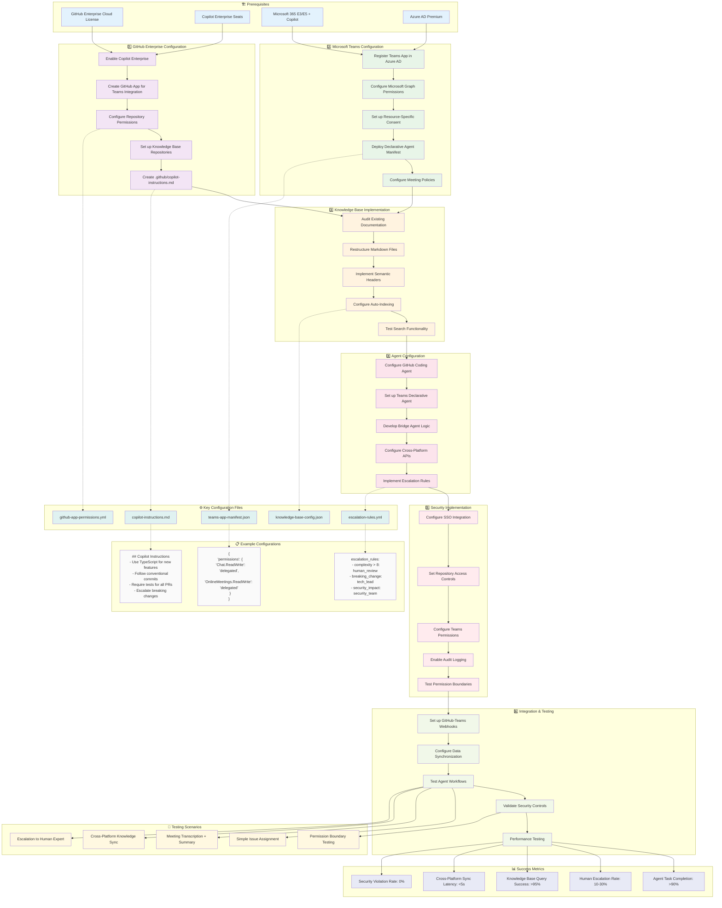

```mermaid
flowchart TD
    %% Prerequisites
    subgraph "🏗️ Prerequisites"
        PREREQ1[GitHub Enterprise Cloud License]
        PREREQ2[Copilot Enterprise Seats]
        PREREQ3[Microsoft 365 E3/E5 + Copilot]
        PREREQ4[Azure AD Premium]
    end

    %% Step 1: GitHub Setup
    subgraph "1️⃣ GitHub Enterprise Configuration"
        GH1[Enable Copilot Enterprise]
        GH2[Create GitHub App for Teams Integration]
        GH3[Configure Repository Permissions]
        GH4[Set up Knowledge Base Repositories]
        GH5[Create .github/copilot-instructions.md]
    end

    %% Step 2: Teams Setup
    subgraph "2️⃣ Microsoft Teams Configuration"
        T1[Register Teams App in Azure AD]
        T2[Configure Microsoft Graph Permissions]
        T3[Set up Resource-Specific Consent]
        T4[Deploy Declarative Agent Manifest]
        T5[Configure Meeting Policies]
    end

    %% Step 3: Knowledge Base
    subgraph "3️⃣ Knowledge Base Implementation"
        KB1[Audit Existing Documentation]
        KB2[Restructure Markdown Files]
        KB3[Implement Semantic Headers]
        KB4[Configure Auto-Indexing]
        KB5[Test Search Functionality]
    end

    %% Step 4: Agent Configuration
    subgraph "4️⃣ Agent Configuration"
        A1[Configure GitHub Coding Agent]
        A2[Set up Teams Declarative Agent]
        A3[Develop Bridge Agent Logic]
        A4[Configure Cross-Platform APIs]
        A5[Implement Escalation Rules]
    end

    %% Step 5: Security & Permissions
    subgraph "5️⃣ Security Implementation"
        S1[Configure SSO Integration]
        S2[Set Repository Access Controls]
        S3[Configure Teams Permissions]
        S4[Enable Audit Logging]
        S5[Test Permission Boundaries]
    end

    %% Step 6: Integration & Testing
    subgraph "6️⃣ Integration & Testing"
        I1[Set up GitHub-Teams Webhooks]
        I2[Configure Data Synchronization]
        I3[Test Agent Workflows]
        I4[Validate Security Controls]
        I5[Performance Testing]
    end

    %% Implementation Flow
    PREREQ1 --> GH1
    PREREQ2 --> GH1
    PREREQ3 --> T1
    PREREQ4 --> T1

    GH1 --> GH2
    GH2 --> GH3
    GH3 --> GH4
    GH4 --> GH5

    T1 --> T2
    T2 --> T3
    T3 --> T4
    T4 --> T5

    GH5 --> KB1
    T5 --> KB1
    KB1 --> KB2
    KB2 --> KB3
    KB3 --> KB4
    KB4 --> KB5

    KB5 --> A1
    A1 --> A2
    A2 --> A3
    A3 --> A4
    A4 --> A5

    A5 --> S1
    S1 --> S2
    S2 --> S3
    S3 --> S4
    S4 --> S5

    S5 --> I1
    I1 --> I2
    I2 --> I3
    I3 --> I4
    I4 --> I5

    %% Configuration Details
    subgraph "⚙️ Key Configuration Files"
        CONFIG1[copilot-instructions.md]
        CONFIG2[teams-app-manifest.json]
        CONFIG3[github-app-permissions.yml]
        CONFIG4[knowledge-base-config.json]
        CONFIG5[escalation-rules.yml]
    end

    GH5 -.-> CONFIG1
    T4 -.-> CONFIG2
    GH3 -.-> CONFIG3
    KB4 -.-> CONFIG4
    A5 -.-> CONFIG5

    %% Sample Configurations
    subgraph "📋 Example Configurations"
        EX1["## Copilot Instructions\n- Use TypeScript for new features\n- Follow conventional commits\n- Require tests for all PRs\n- Escalate breaking changes"]
        
        EX2["{\n  'permissions': {\n    'Chat.ReadWrite': 'delegated',\n    'OnlineMeetings.ReadWrite': 'delegated'\n  }\n}"]
        
        EX3["escalation_rules:\n  - complexity > 8: human_review\n  - breaking_change: tech_lead\n  - security_impact: security_team"]
    end

    CONFIG1 -.-> EX1
    CONFIG2 -.-> EX2
    CONFIG5 -.-> EX3

    %% Testing Scenarios
    subgraph "🧪 Testing Scenarios"
        TEST1[Simple Issue Assignment]
        TEST2[Meeting Transcription + Summary]
        TEST3[Cross-Platform Knowledge Sync]
        TEST4[Escalation to Human Expert]
        TEST5[Permission Boundary Testing]
    end

    I3 --> TEST1
    I3 --> TEST2
    I3 --> TEST3
    I3 --> TEST4
    I4 --> TEST5

    %% Success Metrics
    subgraph "📊 Success Metrics"
        METRIC1[Agent Task Completion: >90%]
        METRIC2[Human Escalation Rate: 10-30%]
        METRIC3[Knowledge Base Query Success: >95%]
        METRIC4[Cross-Platform Sync Latency: <5s]
        METRIC5[Security Violation Rate: 0%]
    end

    I5 --> METRIC1
    I5 --> METRIC2
    I5 --> METRIC3
    I5 --> METRIC4
    I5 --> METRIC5

    %% Styling
    classDef prereq fill:#e3f2fd
    classDef github fill:#f3e5f5
    classDef teams fill:#e8f5e8
    classDef knowledge fill:#fff3e0
    classDef agents fill:#fce4ec
    classDef security fill:#ffebee
    classDef integration fill:#f1f8e9
    classDef config fill:#e0f2f1
    classDef examples fill:#fafafa
    classDef testing fill:#fff8e1
    classDef metrics fill:#e8eaf6

    class PREREQ1,PREREQ2,PREREQ3,PREREQ4 prereq
    class GH1,GH2,GH3,GH4,GH5 github
    class T1,T2,T3,T4,T5 teams
    class KB1,KB2,KB3,KB4,KB5 knowledge
    class A1,A2,A3,A4,A5 agents
    class S1,S2,S3,S4,S5 security
    class I1,I2,I3,I4,I5 integration
    class CONFIG1,CONFIG2,CONFIG3,CONFIG4,CONFIG5 config
    class EX1,EX2,EX3 examples
    class TEST1,TEST2,TEST3,TEST4,TEST5 testing
    class METRIC1,METRIC2,METRIC3,METRIC4,METRIC5 metrics
```
