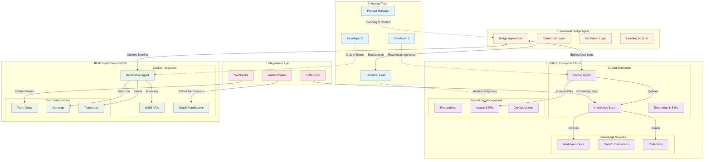

```mermaid
graph TB
    %% Human Users
    subgraph "👥 Human Team"
        H1[Developer 1]
        H2[Developer 2]
        H3[Technical Lead]
        H4[Product Manager]
    end

    %% GitHub Enterprise Cloud
    subgraph "🐙 GitHub Enterprise Cloud"
        subgraph "Copilot Enterprise"
            CA[Coding Agent]
            KB[Knowledge Base]
            EXT[Extensions & Skills]
        end
        
        subgraph "Repository Management"
            REPO[Repositories]
            ISSUES[Issues & PRs]
            ACTIONS[GitHub Actions]
        end
        
        subgraph "Knowledge Sources"
            MD[Markdown Docs]
            CI[Copilot Instructions]
            CODE[Code Files]
        end
    end

    %% Microsoft Teams
    subgraph "🟦 Microsoft Teams M365"
        subgraph "Copilot Integration"
            DA[Declarative Agent]
            API[M365 APIs]
            PERMS[Graph Permissions]
        end
        
        subgraph "Team Collaboration"
            CHAT[Team Chats]
            MEET[Meetings]
            TRANS[Transcripts]
        end
    end

    %% Bridge Agent (Your Personal Assistant)
    subgraph "🤖 Personal Bridge Agent"
        BA[Bridge Agent Core]
        CTX[Context Manager]
        ESC[Escalation Logic]
        LEARN[Learning Module]
    end

    %% Integration Layer
    subgraph "🔗 Integration Layer"
        WH[Webhooks]
        SYNC[Data Sync]
        AUTH[Authentication]
    end

    %% Connections
    H1 -.-> |"@copilot assign issue"| CA
    H2 -.-> |"Chat in Teams"| DA
    H3 -.-> |"Review & Approve"| ISSUES
    H4 -.-> |"Planning & Context"| BA

    CA --> |"Creates PRs"| ISSUES
    CA --> |"Queries"| KB
    KB --> |"Indexes"| MD
    KB --> |"Reads"| CODE
    
    DA --> |"Accesses"| API
    DA --> |"Listens to"| MEET
    DA --> |"Reads"| TRANS
    
    BA <--> |"Bidirectional Sync"| CA
    BA <--> |"Context Sharing"| DA
    BA --> |"Escalates to"| H3
    
    WH --> |"GitHub Events"| CHAT
    SYNC --> |"Knowledge Sync"| KB
    AUTH --> |"SSO & Permissions"| PERMS

    %% Styling
    classDef human fill:#e1f5fe
    classDef github fill:#f3e5f5
    classDef teams fill:#e8f5e8
    classDef bridge fill:#fff3e0
    classDef integration fill:#fce4ec

    class H1,H2,H3,H4 human
    class CA,KB,EXT,REPO,ISSUES,ACTIONS,MD,CI,CODE github
    class DA,API,PERMS,CHAT,MEET,TRANS teams
    class BA,CTX,ESC,LEARN bridge
    class WH,SYNC,AUTH integration
```
