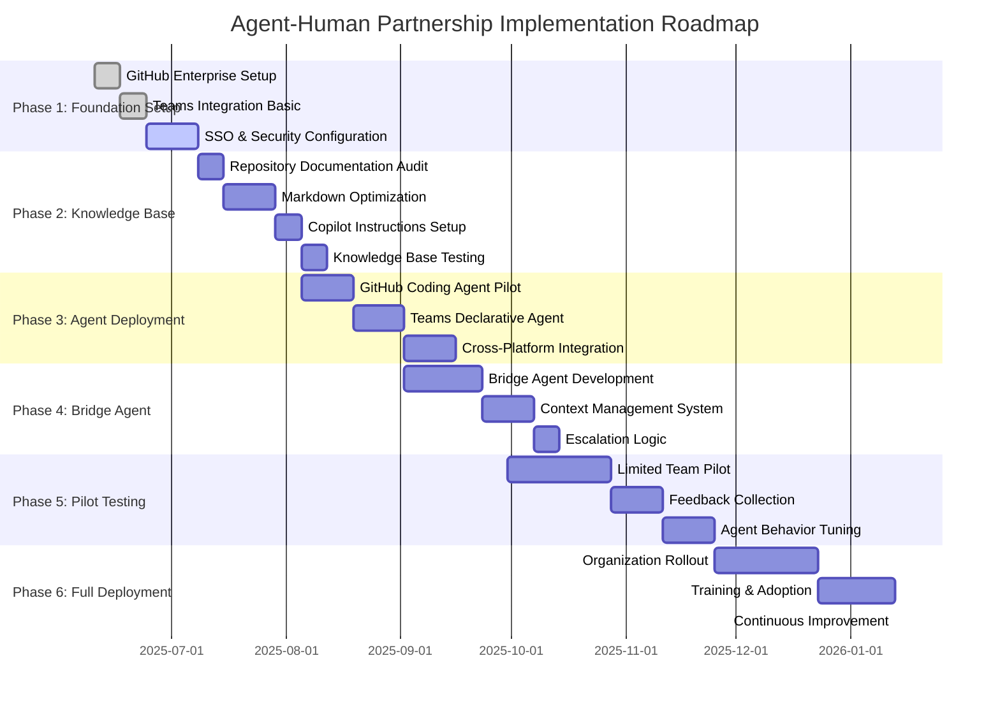

```mermaid
gantt
    title Agent-Human Partnership Implementation Roadmap
    dateFormat  YYYY-MM-DD
    section Phase 1: Foundation Setup
    GitHub Enterprise Setup        :done, gh-setup, 2025-06-10, 1w
    Teams Integration Basic        :done, teams-basic, 2025-06-17, 1w
    SSO & Security Configuration   :active, security, 2025-06-24, 2w
    
    section Phase 2: Knowledge Base
    Repository Documentation Audit :doc-audit, 2025-07-08, 1w
    Markdown Optimization          :md-opt, after doc-audit, 2w
    Copilot Instructions Setup     :copilot-inst, after md-opt, 1w
    Knowledge Base Testing         :kb-test, after copilot-inst, 1w
    
    section Phase 3: Agent Deployment
    GitHub Coding Agent Pilot      :gh-agent, 2025-08-05, 2w
    Teams Declarative Agent        :teams-agent, after gh-agent, 2w
    Cross-Platform Integration     :cross-platform, after teams-agent, 2w
    
    section Phase 4: Bridge Agent
    Bridge Agent Development       :bridge-dev, 2025-09-02, 3w
    Context Management System      :context-mgmt, after bridge-dev, 2w
    Escalation Logic               :escalation, after context-mgmt, 1w
    
    section Phase 5: Pilot Testing
    Limited Team Pilot            :pilot, 2025-09-30, 4w
    Feedback Collection           :feedback, after pilot, 2w
    Agent Behavior Tuning         :tuning, after feedback, 2w
    
    section Phase 6: Full Deployment
    Organization Rollout          :rollout, 2025-11-25, 4w
    Training & Adoption           :training, after rollout, 3w
    Continuous Improvement        :improvement, after training, ongoing
```
