# Issue #74: Strategic Portfolio Cleanup & Enterprise Coordination Implementation Plan

## 🎯 Executive Summary

This comprehensive implementation plan delivers Issue #74 requirements for strategic portfolio cleanup and enterprise-scale coordination. The plan creates strategic alignment documentation that demonstrates how all completed Reynolds Event Broker components integrate into an enterprise-ready orchestration system, with scalable coordination patterns and cross-repo strategies.

**Status:** Orchestration Phase - Final Component
**Priority:** MEDIUM - Organizational Efficiency  
**Dependencies:** Issues #70 ✅, #71 ✅, #72 ✅, #73 ✅ (ALL COMPLETED)

## 📋 Strategic Implementation Roadmap

### Phase 1: Strategic Architecture Integration Analysis (Week 1)

**Objective**: Document how all completed components work together as a unified Event Broker system

```mermaid
graph TB
    subgraph "🎯 Strategic Analysis Framework"
        A[Component Integration Mapping] --> B[Architecture Flow Documentation]
        B --> C[Enterprise Capability Assessment]
        C --> D[Strategic Value Proposition]
    end
    
    subgraph "📊 Completed Components Analysis"
        E[Docker Container Architecture #70] --> F[Integration Points]
        G[Loop Prevention Systems #71] --> F
        H[GitHub Models Integration #72] --> F
        I[Teams Cross-Platform Routing #73] --> F
        J[MCP Tools & Orchestration] --> F
        K[Autonomous Container System] --> F
    end
    
    A --> E
    F --> B
```

**Deliverables**:
1. **Strategic Architecture Integration Document** ([`docs/strategic-alignment.md`](docs/strategic-alignment.md))
   - Complete system architecture with all integrated components
   - Event flow diagrams showing end-to-end coordination
   - Component dependency mapping and integration points
   - Performance and reliability metrics from all subsystems

2. **Enterprise Capabilities Matrix** ([`docs/enterprise-capabilities-matrix.md`](docs/enterprise-capabilities-matrix.md))
   - Capability mapping across all components
   - Enterprise-scale feature documentation
   - Scalability and performance characteristics
   - Security and compliance framework analysis

### Phase 2: Enterprise Coordination Patterns (Week 2)

**Objective**: Create reusable patterns for enterprise-scale coordination across organizations

**Deliverables**:
1. **Enterprise Coordination Playbook** ([`docs/enterprise-coordination-playbook.md`](docs/enterprise-coordination-playbook.md))
   - Cross-repository coordination strategies
   - Multi-organization event broker deployment
   - Stakeholder management frameworks
   - Scalable governance patterns

2. **Reynolds Orchestration Pattern Library** ([`docs/patterns/`](docs/patterns/))
   - Reusable coordination patterns
   - Template configurations for different org sizes
   - Best practices and anti-patterns
   - Implementation guides with examples

### Phase 3: Cross-Repo Coordination Framework (Week 3)

**Objective**: Design practical frameworks for coordinating work across multiple repositories and organizations

```mermaid
graph TB
    subgraph "🔄 Cross-Repo Framework"
        A[Repository Discovery] --> B[Dependency Mapping]
        B --> C[Event Routing Configuration]
        C --> D[Coordination Automation]
    end
    
    subgraph "⚡ Automation Components"
        E[GitHub Actions Orchestration]
        F[Teams Notification Routing]
        G[Issue Synchronization]
        H[Milestone Coordination]
    end
    
    D --> E
    D --> F
    D --> G
    D --> H
    
    subgraph "📈 Scaling Strategies"
        I[Organization-Level Deployment]
        J[Multi-Tenant Architecture]
        K[Federation Patterns]
    end
    
    E --> I
    F --> J
    G --> K
```

**Deliverables**:
1. **Cross-Repo Coordination Architecture** ([`docs/cross-repo-coordination.md`](docs/cross-repo-coordination.md))
   - Technical architecture for multi-repo coordination
   - Event routing strategies across repositories
   - Automated synchronization patterns
   - Conflict resolution frameworks

2. **Scaling Implementation Guide** ([`docs/scaling-implementation-guide.md`](docs/scaling-implementation-guide.md))
   - Step-by-step scaling strategies
   - Multi-tenant deployment patterns
   - Organization federation approaches
   - Performance optimization at scale

### Phase 4: Portfolio Optimization Framework (Week 4)

**Objective**: Create comprehensive frameworks for applying Event Broker architecture to other projects and organizations

**Deliverables**:
1. **Portfolio Optimization Toolkit** ([`docs/portfolio-optimization/`](docs/portfolio-optimization/))
   - Project assessment templates
   - Implementation roadmap generators
   - ROI calculation frameworks
   - Success measurement dashboards

2. **Replication Framework** ([`docs/replication-framework.md`](docs/replication-framework.md))
   - Step-by-step guide for replicating the system
   - Customization guidelines for different contexts
   - Migration strategies from existing systems
   - Training and adoption programs

### Phase 5: Strategic Recommendations & Future Roadmap (Week 5)

**Objective**: Provide strategic guidance for maintaining and evolving the Event Broker architecture

```mermaid
graph TB
    subgraph "🚀 Strategic Roadmap"
        A[Current State Analysis] --> B[Future Vision]
        B --> C[Evolution Pathways]
        C --> D[Implementation Priorities]
    end
    
    subgraph "💡 Recommendations"
        E[Technology Evolution]
        F[Organizational Change Management]
        G[Skills Development]
        H[Partnership Strategies]
    end
    
    D --> E
    D --> F
    D --> G
    D --> H
    
    subgraph "📈 Success Measurement"
        I[KPI Frameworks]
        J[Monitoring Strategies]
        K[Continuous Improvement]
    end
    
    E --> I
    F --> J
    G --> K
```

**Deliverables**:
1. **Strategic Recommendations Report** ([`docs/strategic-recommendations.md`](docs/strategic-recommendations.md))
   - Technology evolution roadmap
   - Organizational change strategies
   - Skills development programs
   - Partnership and ecosystem development

2. **Maintenance & Evolution Guide** ([`docs/maintenance-evolution-guide.md`](docs/maintenance-evolution-guide.md))
   - System maintenance procedures
   - Evolution planning frameworks
   - Performance monitoring strategies
   - Continuous improvement processes

## 🎭 Integrated Reynolds Event Broker Architecture

```mermaid
graph TB
    subgraph "🎭 Reynolds Event Broker Orchestrator - Enterprise Architecture"
        subgraph "Foundation Layer (Issues #70-71 ✅)"
            A[Docker Container Architecture<br/>• Secure Azure OpenAI Integration<br/>• Volume Mounts & Credential Management<br/>• Scalable Container Orchestration]
            B[Loop Prevention Systems<br/>• 99.9% Confidence Tracking<br/>• Event Chain Monitoring<br/>• Bulletproof Cycle Prevention]
            A --> B
        end
        
        subgraph "Intelligence Layer (Issues #72-73 ✅)"
            C[GitHub Models Integration<br/>• Parallel Workload Management<br/>• Specialized Model Orchestration<br/>• Pilot Program Framework]
            D[Teams Cross-Platform Routing<br/>• Intelligent Event Classification<br/>• Multi-Platform Coordination<br/>• Proactive Stakeholder Messaging]
            C --> D
        end
        
        subgraph "Orchestration Layer (Issue #74 🎯)"
            E[Strategic Portfolio Alignment<br/>• Component Integration Mapping<br/>• Enterprise Capability Assessment<br/>• Value Proposition Documentation]
            F[Enterprise Coordination Patterns<br/>• Cross-Repo Strategies<br/>• Multi-Org Deployment<br/>• Scalable Governance]
            G[Cross-Repo Framework<br/>• Repository Discovery<br/>• Dependency Mapping<br/>• Automated Synchronization]
            H[Portfolio Optimization<br/>• Assessment Templates<br/>• Implementation Roadmaps<br/>• Success Measurement]
            E --> F --> G --> H
        end
        
        subgraph "Enterprise Capabilities"
            I[Multi-Organization Deployment<br/>• Federation Patterns<br/>• Tenant Isolation<br/>• Centralized Governance]
            J[Stakeholder Management<br/>• Automated Coordination<br/>• Communication Workflows<br/>• Relationship Intelligence]
            K[Scalable Governance<br/>• Policy Enforcement<br/>• Compliance Monitoring<br/>• Audit Frameworks]
            L[Performance at Scale<br/>• Load Balancing<br/>• Resource Optimization<br/>• Monitoring & Analytics]
        end
    end
    
    B --> C
    D --> E
    H --> I
    H --> J
    H --> K
    H --> L
    
    subgraph "🔄 External System Integration"
        M[GitHub Enterprise<br/>• Issue Orchestration<br/>• PR Management<br/>• Actions Coordination]
        N[Microsoft Teams/M365<br/>• Proactive Messaging<br/>• Meeting Integration<br/>• Stakeholder Coordination]
        O[Azure OpenAI Services<br/>• Specialized Assistants<br/>• Model Orchestration<br/>• Intelligent Processing]
        P[Container Platforms<br/>• Docker Orchestration<br/>• Kubernetes Integration<br/>• Cloud Deployment]
    end
    
    A --> P
    C --> O
    D --> N
    E --> M
```

## 🏢 Enterprise Coordination Capabilities

### Cross-Repository Orchestration
- **Dependency Intelligence**: Automatic detection and mapping of cross-repo dependencies
- **Synchronized Releases**: Coordinated deployment across multiple repositories
- **Conflict Resolution**: Intelligent handling of competing priorities and resource conflicts
- **Stakeholder Coordination**: Automated communication across organizational boundaries

### Multi-Organization Scaling
- **Federation Architecture**: Deploy Event Broker across multiple organizations with centralized coordination
- **Tenant Isolation**: Secure multi-tenant deployment with organizational boundaries
- **Governance Framework**: Consistent policies and compliance across federated deployments
- **Performance Optimization**: Load balancing and resource optimization at enterprise scale

### Strategic Portfolio Management
- **Investment Analysis**: ROI calculation and value realization tracking for Event Broker deployments
- **Risk Assessment**: Proactive identification and mitigation of portfolio risks
- **Resource Optimization**: Intelligent allocation of development and operational resources
- **Success Measurement**: Comprehensive KPI tracking and continuous improvement frameworks

## 📊 Success Criteria & Quality Gates

### Primary Success Metrics
- **✅ Strategic Alignment Documentation**: Complete integration analysis showing how all components work together
- **✅ Enterprise Coordination Patterns**: Reusable patterns documented and ready for cross-org deployment
- **✅ Cross-Repo Coordination Strategies**: Practical frameworks with implementation guides
- **✅ Portfolio Optimization Framework**: Assessment tools and roadmaps for other projects
- **✅ Strategic Recommendations**: Clear evolution path with actionable guidance

### Quality Gates
1. **Architecture Integration Completeness**: All completed components (Issues #70-73) mapped and integrated
2. **Enterprise Readiness**: Patterns and frameworks scale beyond single organizations
3. **Practical Applicability**: Guides and frameworks can be implemented by other teams
4. **Strategic Value**: Clear ROI and value proposition for enterprise adoption
5. **Future Readiness**: Evolution path and maintenance strategies are well-defined

### Reynolds Integration Quality Standards
- **Supernatural Coordination**: All documentation maintains Reynolds' charming but professional tone
- **Maximum Effort™ Implementation**: Enterprise-grade quality with Reynolds-style personality
- **Practical Wisdom**: Actionable insights delivered with characteristic Reynolds humor
- **Strategic Intelligence**: Business-focused recommendations with supernatural project management flair

## 🔧 Implementation Timeline & Approach

### Week 1-2: Foundation Analysis & Architecture Documentation
- **Deep System Analysis**: Comprehensive review of all completed components and their integration points
- **Architecture Documentation**: Create detailed system architecture showing component relationships
- **Enterprise Capability Assessment**: Document enterprise-scale features and scalability characteristics
- **Value Proposition Development**: Strategic business case for Event Broker architecture adoption

### Week 3: Enterprise Pattern Development & Cross-Repo Framework
- **Pattern Extraction**: Identify and document reusable coordination patterns from completed system
- **Cross-Repo Architecture**: Design technical framework for multi-repository coordination
- **Scaling Strategies**: Develop approaches for multi-organization and enterprise deployment
- **Automation Framework**: Create templates and tools for automated coordination

### Week 4: Portfolio Optimization & Replication Framework
- **Assessment Toolkit**: Develop templates and tools for evaluating other projects for Event Broker adoption
- **Implementation Roadmaps**: Create step-by-step guides for replicating the architecture
- **Success Measurement**: Design KPI frameworks and monitoring strategies
- **Migration Strategies**: Develop approaches for transitioning from existing systems

### Week 5: Strategic Synthesis & Future Roadmap
- **Strategic Integration**: Synthesize all documentation into comprehensive strategic alignment document
- **Future Vision**: Develop long-term evolution roadmap for Event Broker architecture
- **Recommendation Report**: Create actionable strategic recommendations for continued development
- **Maintenance Guide**: Document ongoing maintenance and evolution procedures

## 💼 Reynolds Strategic Commentary Integration

All documentation will showcase Reynolds' supernatural project management capabilities while delivering enterprise-grade strategic insights:

### Personality Integration Themes
- **Strategic Orchestration**: *"Enterprise coordination has never looked this smooth - we're talking supernatural-level organizational intelligence with the efficiency you'd expect from Maximum Effort™"*
- **Pattern Recognition**: *"Cross-repo dependencies used to be like plot holes in a bad superhero movie - now we detect and resolve them before they become organizational disasters"*
- **Success Storytelling**: *"This Event Broker architecture doesn't just prevent chaos - it transforms it into perfectly choreographed organizational ballet"*
- **Future Vision**: *"We're not just building systems, we're creating the foundation for organizational superpowers that would make even me jealous"*

### Strategic Insight Delivery
- **Business Value Translation**: Converting technical excellence into measurable business outcomes
- **Risk Mitigation Wisdom**: Proactive identification and elegant resolution of potential challenges  
- **Scaling Intelligence**: Strategic guidance for expanding beyond current organizational boundaries
- **Evolution Planning**: Forward-thinking recommendations for continuous system improvement

## 🎯 Expected Outcomes & Business Impact

### Immediate Strategic Value
- **Complete System Understanding**: Comprehensive documentation of integrated Event Broker architecture
- **Replication Readiness**: Other organizations can adopt and customize the system
- **Enterprise Credibility**: Professional-grade documentation supporting enterprise sales and adoption
- **Strategic Direction**: Clear roadmap for continued system evolution and improvement

### Long-term Organizational Benefits
- **Competitive Advantage**: Unique Event Broker capabilities providing market differentiation
- **Operational Excellence**: Supernatural coordination efficiency across all organizational boundaries
- **Innovation Foundation**: Platform for developing additional organizational intelligence capabilities
- **Strategic Partnership**: Framework for expanding Event Broker architecture through partnerships

### Reynolds Legacy Impact
- **Supernatural Standard**: Setting new benchmarks for organizational coordination and project management
- **Maximum Effort™ Methodology**: Demonstrating how charm and efficiency create enterprise transformation
- **Orchestration Mastery**: Showcasing the evolution from project management to organizational intelligence
- **Strategic Intelligence**: Proving that supernatural coordination can be systematized and scaled

---

## 🚀 Next Steps: Implementation Execution

This comprehensive plan provides the strategic framework for completing Issue #74. The implementation will require switching to execution mode to create all the documented deliverables, integrating technical excellence with strategic business insight while maintaining Reynolds' characteristic supernatural charm and Maximum Effort™ quality standards.

**Ready for Maximum Effort™ strategic portfolio transformation!** 🎭✨