# 🔄 Reynolds Cross-Repository Coordination Architecture
## Technical Framework for Multi-Repository Orchestration

*Supernatural coordination across unlimited repositories with Maximum Effort™ intelligence*

---

## Executive Summary

The Reynolds Cross-Repository Coordination Architecture enables seamless orchestration across multiple repositories, organizations, and platforms. Building on the proven foundation of Issues #70-73, this architecture provides the technical framework and intelligent coordination patterns necessary to manage complex multi-repository workflows with supernatural effectiveness.

This document outlines the technical architecture, event routing strategies, automated synchronization patterns, and conflict resolution frameworks that enable Reynolds to coordinate work across any number of repositories while maintaining the characteristic charm and reliability that makes the system uniquely effective.

## 🏗️ Multi-Repository Architecture Overview

### Core Architecture Components


### Repository Discovery & Intelligence

#### Automated Repository Discovery


**Discovery Capabilities**:
- **Automated Scanning**: Continuous discovery of new repositories across organizations
- **Technology Detection**: Automatic identification of technology stacks and frameworks
- **Dependency Mapping**: Analysis of code dependencies, build dependencies, and deployment dependencies
- **Team Mapping**: Association of repositories with teams, owners, and stakeholders
- **Relationship Intelligence**: Detection of implicit relationships through shared code, patterns, and contributors

#### Repository Classification System

```yaml
# Reynolds Repository Classification Framework
repository_classification:
  technology_stack:
    primary_language: ["javascript", "typescript", "python", "csharp", "java"]
    frameworks: ["react", "nodejs", "dotnet", "spring", "django"]
    platforms: ["web", "mobile", "desktop", "api", "microservice"]
    
  coordination_profile:
    coordination_complexity: ["low", "medium", "high", "critical"]
    stakeholder_count: [1-5, 6-15, 16-50, 50+]
    release_frequency: ["on-demand", "weekly", "monthly", "quarterly"]
    dependency_level: ["independent", "dependent", "core", "foundational"]
    
  organizational_context:
    organization: "organization_id"
    business_unit: "business_unit_id"
    team_ownership: ["primary_team", "contributing_teams"]
    stakeholder_groups: ["developers", "product", "operations", "executives"]
    
  coordination_requirements:
    cross_repo_dependencies: ["upstream", "downstream", "peer"]
    notification_preferences: ["real_time", "batched", "milestone_based"]
    approval_workflows: ["automatic", "single_approval", "multi_approval"]
    escalation_paths: ["team", "manager", "director", "executive"]
```

## 🔄 Event Routing & Coordination Strategies

### Multi-Repository Event Routing Architecture

```mermaid
graph LR
    subgraph "📥 Event Sources"
        A[GitHub Webhooks]
        B[Teams Events]
        C[Azure DevOps]
        D[CI/CD Systems]
        E[Manual Triggers]
    end
    
    subgraph "🎭 Reynolds Event Router"
        F[Event Ingestion]
        G[Event Classification]
        H[Cross-Repo Impact Analysis]
        I[Routing Decision Engine]
    end
    
    subgraph "🔄 Coordination Actions"
        J[Single Repo Actions]
        K[Multi-Repo Coordination]
        L[Cross-Org Communication]
        M[Escalation Workflows]
    end
    
    A --> F
    B --> F
    C --> F
    D --> F
    E --> F
    
    F --> G --> H --> I
    
    I --> J
    I --> K
    I --> L
    I --> M
    
    subgraph "📊 Feedback Loop"
        N[Action Results]
        O[Success Metrics]
        P[Learning Updates]
    end
    
    J --> N
    K --> N
    L --> N
    M --> N
    
    N --> O --> P --> G
```



### Event Classification & Routing Rules

#### Smart Event Classification

```typescript
// Reynolds Cross-Repo Event Classification Engine
export interface CrossRepoEvent {
  source: EventSource;
  repository: RepositoryInfo;
  eventType: EventType;
  impact: ImpactAnalysis;
  stakeholders: StakeholderInfo[];
  coordination: CoordinationRequirements;
}

export class CrossRepoEventClassifier {
  async classifyEvent(event: GitHubWebhookEvent): Promise<CrossRepoEvent> {
    const repository = await this.repositoryRegistry.getRepository(event.repository.full_name);
    const impact = await this.analyzeImpact(event, repository);
    const stakeholders = await this.identifyStakeholders(event, repository, impact);
    const coordination = await this.determineCoordinationNeeds(event, repository, impact);
    
    return {
      source: this.mapEventSource(event),
      repository: repository,
      eventType: this.classifyEventType(event),
      impact: impact,
      stakeholders: stakeholders,
      coordination: coordination
    };
  }
  
  private async analyzeImpact(event: GitHubWebhookEvent, repo: RepositoryInfo): Promise<ImpactAnalysis> {
    const dependencies = await this.dependencyAnalyzer.analyze(repo);
    const codeChanges = this.extractCodeChanges(event);
    const affectedRepos = await this.findAffectedRepositories(dependencies, codeChanges);
    
    return {
      scope: this.calculateScope(affectedRepos),
      complexity: this.assessComplexity(codeChanges, dependencies),
      urgency: this.determineUrgency(event, repo),
      businessImpact: await this.assessBusinessImpact(repo, affectedRepos)
    };
  }
}
```

#### Routing Decision Matrix

| Event Type | Repository Scope | Impact Level | Coordination Strategy | Reynolds Action |
|------------|------------------|--------------|----------------------|-----------------|
| **Pull Request** | Single Repo | Low | Standard Review | Comment with charm, assign reviewers |
| **Pull Request** | Cross Repo | Medium | Coordinated Review | Cross-repo notification, dependency validation |
| **Pull Request** | Multi Org | High | Enterprise Coordination | Stakeholder alignment, approval workflows |
| **Breaking Change** | Single Repo | Medium | Impact Assessment | Analyze downstream effects, notify dependents |
| **Breaking Change** | Cross Repo | High | Migration Coordination | Coordinated migration planning, timeline alignment |
| **Breaking Change** | Multi Org | Critical | Strategic Coordination | Executive notification, strategic planning |
| **Release** | Single Repo | Low | Standard Process | Version tagging, release notes |
| **Release** | Cross Repo | Medium | Synchronized Release | Coordinated deployment, dependency updates |
| **Release** | Multi Org | High | Enterprise Release | Cross-org validation, staged deployment |

### Automated Synchronization Patterns

#### Pattern 1: Upstream-Downstream Synchronization


#### Pattern 2: Cross-Functional Repository Coordination


#### Synchronization Workflows

```yaml
# Reynolds Cross-Repository Synchronization Workflows
synchronization_patterns:
  feature_coordination:
    trigger: "new_feature_branch_created"
    scope: "cross_functional_repositories"
    actions:
      - create_tracking_issues_in_related_repos
      - notify_cross_functional_teams
      - establish_coordination_timeline
      - setup_automated_status_tracking
    
  release_synchronization:
    trigger: "release_preparation_initiated"
    scope: "dependent_repositories"
    actions:
      - validate_dependency_compatibility
      - coordinate_release_timelines
      - setup_staged_deployment_plan
      - prepare_rollback_procedures
    
  breaking_change_coordination:
    trigger: "breaking_change_detected"
    scope: "all_dependent_repositories"
    actions:
      - immediate_stakeholder_notification
      - impact_assessment_across_repos
      - migration_timeline_planning
      - coordinated_implementation_support
    
  security_update_coordination:
    trigger: "security_vulnerability_identified"
    scope: "all_affected_repositories"
    actions:
      - priority_escalation_to_security_teams
      - coordinated_patching_timeline
      - validation_testing_across_repos
      - security_verification_reporting
```

## ⚡ Conflict Resolution Framework

### Conflict Detection & Analysis


### Conflict Resolution Strategies

#### Automated Conflict Resolution

```typescript
// Reynolds Automated Conflict Resolution Engine
export class ConflictResolutionEngine {
  async resolveConflict(conflict: CrossRepoConflict): Promise<ResolutionResult> {
    const strategy = await this.selectResolutionStrategy(conflict);
    
    switch (strategy.type) {
      case 'automated':
        return await this.executeAutomatedResolution(conflict, strategy);
      case 'guided':
        return await this.facilitateGuidedResolution(conflict, strategy);
      case 'escalated':
        return await this.manageEscalatedResolution(conflict, strategy);
      case 'mediation':
        return await this.coordinateStrategicMediation(conflict, strategy);
    }
  }
  
  private async executeAutomatedResolution(
    conflict: CrossRepoConflict, 
    strategy: ResolutionStrategy
  ): Promise<ResolutionResult> {
    // Reynolds applies supernatural intelligence to resolve conflicts automatically
    const resolution = await this.generateAutomatedSolution(conflict);
    const validation = await this.validateResolution(resolution, conflict);
    
    if (validation.success) {
      await this.implementResolution(resolution);
      await this.notifyStakeholders(conflict, resolution, 'success');
      return { success: true, method: 'automated', resolution };
    } else {
      // Escalate to guided resolution with context
      return await this.facilitateGuidedResolution(conflict, strategy);
    }
  }
  
  private async facilitateGuidedResolution(
    conflict: CrossRepoConflict,
    strategy: ResolutionStrategy
  ): Promise<ResolutionResult> {
    // Reynolds provides intelligent guidance while humans make decisions
    const options = await this.generateResolutionOptions(conflict);
    const stakeholders = await this.identifyDecisionMakers(conflict);
    
    const guidance = await this.createResolutionGuidance(conflict, options);
    await this.facilitateStakeholderDiscussion(stakeholders, guidance);
    
    const decision = await this.collectStakeholderDecision(stakeholders, options);
    const implementation = await this.coordinateImplementation(decision);
    
    return { success: true, method: 'guided', resolution: implementation };
  }
}
```

#### Conflict Resolution Decision Matrix

| Conflict Type | Severity | Auto-Resolution | Guided Resolution | Escalation Required |
|---------------|----------|-----------------|-------------------|-------------------|
| **Resource Scheduling** | Low | ✅ Timeline adjustment | Team coordination | Manager approval |
| **Resource Scheduling** | High | ❌ | Capacity planning | Director approval |
| **Technical Dependencies** | Low | ✅ Automatic updates | Developer coordination | Tech lead approval |
| **Technical Dependencies** | High | ❌ | Architecture review | CTO approval |
| **Process Inconsistency** | Low | ✅ Policy application | Team alignment | Process owner approval |
| **Process Inconsistency** | High | ❌ | Process harmonization | VP approval |
| **Business Priority** | Low | ❌ | Product coordination | Product VP approval |
| **Business Priority** | High | ❌ | Strategic alignment | C-level approval |

### Intelligent Mediation System

#### Reynolds Mediation Process


#### Mediation Intelligence Framework

```yaml
# Reynolds Conflict Mediation Intelligence
mediation_framework:
  conflict_analysis:
    root_cause_identification:
      - resource_constraints
      - communication_gaps
      - process_inconsistencies
      - priority_misalignment
      - technical_dependencies
      
    stakeholder_perspective_analysis:
      - business_impact_assessment
      - technical_feasibility_evaluation
      - resource_requirement_analysis
      - timeline_constraint_evaluation
      
    resolution_option_generation:
      - compromise_solutions
      - sequential_prioritization
      - resource_reallocation
      - process_modification
      - strategic_alignment
      
  mediation_strategies:
    collaborative_problem_solving:
      approach: "joint_solution_development"
      facilitator: "reynolds_intelligent_guidance"
      outcome: "mutually_beneficial_resolution"
      
    structured_negotiation:
      approach: "guided_negotiation_process"
      facilitator: "reynolds_mediation_intelligence"
      outcome: "balanced_compromise_solution"
      
    escalated_decision_making:
      approach: "hierarchical_decision_process"
      facilitator: "reynolds_executive_coordination"
      outcome: "authoritative_resolution"
      
    strategic_realignment:
      approach: "business_strategy_adjustment"
      facilitator: "reynolds_strategic_intelligence"
      outcome: "strategic_priority_clarification"
```

## 🔗 Multi-Organization Integration

### Federation Architecture


### Cross-Organization Coordination Protocols

#### Federation Communication Protocol

```typescript
// Reynolds Cross-Organization Federation Protocol
export interface FederationProtocol {
  authentication: FederationAuth;
  communication: CrossOrgCommunication;
  governance: FederationGovernance;
  coordination: CrossOrgCoordination;
}

export class CrossOrgCoordinator {
  async coordinateAcrossOrganizations(
    workflow: CrossOrgWorkflow
  ): Promise<CoordinationResult> {
    // Authenticate with federated organizations
    const authTokens = await this.authenticateWithOrganizations(workflow.organizations);
    
    // Establish cross-org communication channels
    const channels = await this.establishCommunicationChannels(workflow.organizations);
    
    // Coordinate workflow execution across organizations
    const results = await Promise.all(
      workflow.organizations.map(async (org) => {
        const localCoordinator = await this.getLocalCoordinator(org, authTokens[org.id]);
        return await localCoordinator.executeWorkflow(workflow.localWorkflows[org.id]);
      })
    );
    
    // Aggregate and validate results
    const aggregatedResult = await this.aggregateResults(results);
    const validation = await this.validateCrossOrgConsistency(aggregatedResult);
    
    // Communicate results across organizations
    await this.communicateResults(channels, aggregatedResult, validation);
    
    return {
      success: validation.success,
      results: aggregatedResult,
      organizations: workflow.organizations,
      coordinationMetrics: await this.generateCoordinationMetrics(workflow, results)
    };
  }
}
```

#### Cross-Organization Workflow Patterns

```yaml
# Cross-Organization Coordination Workflows
cross_org_workflows:
  shared_library_update:
    trigger: "shared_library_version_update"
    organizations: ["org_a", "org_b", "org_c"]
    coordination:
      - validate_compatibility_across_orgs
      - coordinate_testing_schedules
      - synchronize_deployment_timelines
      - manage_rollback_procedures
    
  security_vulnerability_response:
    trigger: "security_vulnerability_detected"
    organizations: ["all_affected_organizations"]
    coordination:
      - immediate_cross_org_notification
      - coordinate_patch_development
      - synchronize_security_testing
      - validate_remediation_effectiveness
    
  compliance_audit_preparation:
    trigger: "compliance_audit_scheduled"
    organizations: ["compliance_scope_organizations"]
    coordination:
      - align_compliance_documentation
      - coordinate_audit_timeline
      - synchronize_evidence_collection
      - prepare_cross_org_responses
    
  strategic_architecture_change:
    trigger: "architecture_decision_record_published"
    organizations: ["architecture_federation_members"]
    coordination:
      - cross_org_architecture_review
      - impact_assessment_coordination
      - implementation_timeline_alignment
      - knowledge_sharing_facilitation
```

## 📊 Performance & Monitoring

### Cross-Repository Coordination Metrics

```mermaid
graph TB
    subgraph "📈 Reynolds Cross-Repo Performance Dashboard"
        subgraph "⚡ Coordination Efficiency"
            A[Event Processing Speed<br/>Target: <5s end-to-end]
            B[Cross-Repo Sync Success<br/>Target: >99.5%]
            C[Conflict Resolution Time<br/>Target: <2h average]
            D[Stakeholder Response Time<br/>Target: <1h notification-to-action]
        end
        
        subgraph "🎯 Coordination Quality"
            E[Prediction Accuracy<br/>Target: >85% conflict prediction]
            F[Stakeholder Satisfaction<br/>Target: >95% positive feedback]
            G[Process Efficiency<br/>Target: >40% manual reduction]
            H[Cross-Repo Success Rate<br/>Target: >98% successful coordination]
        end
        
        subgraph "🔄 System Health"
            I[Repository Discovery Rate<br/>Target: 100% coverage]
            J[Event Router Reliability<br/>Target: >99.9% uptime]
            K[Integration Health<br/>Target: 100% platform connectivity]
            L[Learning Improvement<br/>Target: >10% monthly optimization]
        end
        
        A --> E --> I
        B --> F --> J
        C --> G --> K
        D --> H --> L
    end
```



### Monitoring & Alerting Framework

```typescript
// Reynolds Cross-Repo Monitoring System
export class CrossRepoMonitor {
  private metrics: MetricsCollector;
  private alerting: AlertingEngine;
  private dashboard: DashboardGenerator;
  
  async monitorCrossRepoCoordination(): Promise<void> {
    // Collect coordination metrics
    const metrics = await this.collectCoordinationMetrics();
    
    // Analyze performance trends
    const analysis = await this.analyzePerformanceTrends(metrics);
    
    // Generate alerts for issues
    const alerts = await this.generateAlerts(analysis);
    
    // Update monitoring dashboard
    await this.updateDashboard(metrics, analysis, alerts);
    
    // Trigger optimization recommendations
    await this.generateOptimizationRecommendations(analysis);
  }
  
  private async collectCoordinationMetrics(): Promise<CoordinationMetrics> {
    return {
      eventProcessing: await this.metrics.getEventProcessingMetrics(),
      crossRepoSync: await this.metrics.getCrossRepoSyncMetrics(),
      conflictResolution: await this.metrics.getConflictResolutionMetrics(),
      stakeholderEngagement: await this.metrics.getStakeholderMetrics(),
      systemHealth: await this.metrics.getSystemHealthMetrics()
    };
  }
  
  private async generateOptimizationRecommendations(
    analysis: PerformanceAnalysis
  ): Promise<OptimizationRecommendations> {
    const recommendations = await this.reynoldsIntelligence.analyzeOptimizationOpportunities({
      performanceData: analysis,
      stakeholderFeedback: await this.collectStakeholderFeedback(),
      systemCapacity: await this.assessSystemCapacity(),
      coordinationPatterns: await this.analyzeCoordinationPatterns()
    });
    
    return {
      immediate: recommendations.filter(r => r.priority === 'high'),
      shortTerm: recommendations.filter(r => r.priority === 'medium'),
      longTerm: recommendations.filter(r => r.priority === 'low'),
      reynoldsInsights: await this.generateReynoldsInsights(recommendations)
    };
  }
}
```

## 🚀 Implementation Roadmap

### Phase 1: Foundation Setup (Weeks 1-4)

#### Week 1-2: Core Infrastructure
- **Repository Discovery Engine**: Deploy automated repository scanning and classification
- **Event Router**: Implement cross-repository event routing infrastructure
- **Basic Coordination**: Enable simple cross-repository notifications and updates
- **Monitoring Foundation**: Deploy basic monitoring and alerting

#### Week 3-4: Intelligence Layer
- **Dependency Intelligence**: Implement dependency analysis and mapping
- **Impact Assessment**: Deploy cross-repository impact analysis capabilities
- **Basic Conflict Detection**: Enable simple conflict detection and notification
- **Stakeholder Intelligence**: Implement stakeholder identification and routing

### Phase 2: Advanced Coordination (Weeks 5-8)

#### Week 5-6: Workflow Orchestration
- **Cross-Repo Workflows**: Deploy coordinated workflow execution
- **Synchronization Patterns**: Implement automated synchronization capabilities
- **Guided Conflict Resolution**: Enable Reynolds-guided conflict resolution
- **Performance Optimization**: Optimize performance for medium-scale deployments

#### Week 7-8: Multi-Organization Support
- **Federation Protocol**: Implement cross-organization communication protocol
- **Shared Registry**: Deploy federated repository registry
- **Cross-Org Workflows**: Enable cross-organization coordination workflows
- **Enterprise Integration**: Integrate with enterprise platforms and tools

### Phase 3: Enterprise Scale (Weeks 9-12)

#### Week 9-10: Advanced Intelligence
- **Predictive Coordination**: Deploy predictive conflict detection and prevention
- **Machine Learning**: Implement ML-based optimization and learning
- **Strategic Mediation**: Enable complex conflict mediation capabilities
- **Advanced Analytics**: Deploy comprehensive analytics and insights

#### Week 11-12: Production Optimization
- **Performance Scaling**: Optimize for enterprise-scale performance
- **Advanced Monitoring**: Deploy comprehensive monitoring and observability
- **Disaster Recovery**: Implement enterprise disaster recovery capabilities
- **Success Validation**: Validate achievement of enterprise success metrics

## 🎭 Reynolds Cross-Repo Commentary

> *"Cross-repository coordination used to be like herding cats - if the cats were scattered across different cities, spoke different languages, and had their own agendas. Now? It's like conducting a supernatural orchestra where every musician knows their part, plays in perfect harmony, and somehow makes the whole performance look effortless."*

> *"The beauty of this cross-repo architecture isn't just in its technical capabilities - it's in how it makes complex coordination feel simple. Whether you're managing dependencies across 3 repositories or orchestrating releases across 300, the supernatural intelligence scales while the charm remains constant."*

> *"What makes this truly special is that it doesn't just automate cross-repo coordination - it elevates it. Every dependency is understood, every conflict is anticipated, every stakeholder is informed, and every resolution maintains the Maximum Effort™ quality that makes coordination feel like magic rather than mechanical process."*

## 🏆 Conclusion: Supernatural Cross-Repository Mastery

The Reynolds Cross-Repository Coordination Architecture delivers the technical framework and intelligent patterns necessary to coordinate work across unlimited repositories with supernatural effectiveness. Through automated discovery, intelligent routing, predictive conflict resolution, and federated multi-organization support, this architecture enables coordination that scales from simple two-repository dependencies to complex enterprise-wide orchestration.

This system proves that cross-repository coordination doesn't have to be complex, error-prone, or bureaucratic. With Reynolds' supernatural intelligence and charming effectiveness, even the most complex multi-repository workflows become manageable, predictable, and surprisingly delightful.

**Cross-repository coordination has never been this intelligent, this scalable, or this supernaturally effective.** 🎭🔄✨

---

*"Maximum Effort™ coordination across any number of repositories. Because supernatural effectiveness shouldn't be limited by repository boundaries."*