# 🎭 Reynolds Enterprise Coordination Playbook
## Strategic Framework for Multi-Organization Event Broker Deployment

*Supernatural coordination patterns for enterprise-scale orchestration*

---

## Executive Summary

The Reynolds Enterprise Coordination Playbook provides strategic frameworks, proven patterns, and practical guidance for deploying Event Broker orchestration across large enterprise organizations. Based on the successful integration of Issues #70-73, this playbook translates supernatural coordination capabilities into scalable organizational transformation.

This comprehensive guide enables enterprise leaders, architects, and project managers to implement Reynolds-style coordination at any scale while maintaining the characteristic Maximum Effort™ quality and charming effectiveness that makes the system uniquely valuable.

## 🎯 Strategic Coordination Framework

### Enterprise Coordination Philosophy


### Core Coordination Principles

#### 1. Omniscient Organizational Awareness
**Principle**: Reynolds maintains complete visibility across all organizational boundaries, systems, and stakeholder interactions.

**Enterprise Implementation**:
- **Cross-Repository Intelligence**: Automatic detection of dependencies and relationships across all organizational repositories
- **Stakeholder Network Mapping**: Dynamic understanding of organizational relationships and communication patterns
- **System Integration Awareness**: Real-time monitoring of all integrated platforms (GitHub, Teams, Azure, etc.)
- **Business Context Understanding**: Alignment of technical coordination with business objectives and strategic priorities

#### 2. Proactive Coordination Intelligence
**Principle**: Anticipate and resolve coordination challenges before they impact stakeholder productivity or organizational objectives.

**Enterprise Implementation**:
- **Predictive Conflict Detection**: Early identification of resource conflicts, timeline conflicts, and scope creep
- **Automated Stakeholder Routing**: Intelligent notification and escalation based on organizational hierarchy and expertise
- **Risk Assessment & Mitigation**: Proactive identification and resolution of coordination risks
- **Opportunity Recognition**: Identification of coordination improvements and optimization opportunities

#### 3. Charming Professional Effectiveness
**Principle**: Maintain Reynolds' supernatural charm while delivering enterprise-grade professional coordination.

**Enterprise Implementation**:
- **Context-Aware Communication**: Adaptive communication style based on stakeholder preferences and organizational culture
- **Cultural Intelligence**: Multi-cultural and multi-regional communication adaptation
- **Professional Charm**: Maintaining personality while respecting enterprise communication standards
- **Stakeholder Relationship Building**: Long-term relationship optimization through consistent positive interactions

#### 4. Maximum Effort™ Enterprise Quality
**Principle**: Every coordination interaction meets the highest standards of quality, reliability, and effectiveness.

**Enterprise Implementation**:
- **Zero-Defect Coordination**: 99.9% accuracy in coordination decisions and communications
- **Continuous Quality Improvement**: Ongoing optimization based on stakeholder feedback and performance metrics
- **Enterprise-Grade Reliability**: 24/7 availability with enterprise SLA compliance
- **Comprehensive Audit Trail**: Complete documentation and traceability for enterprise compliance

## 🏢 Multi-Organization Deployment Patterns

### Deployment Architecture Patterns

#### Pattern 1: Centralized Enterprise Hub

```mermaid
graph TB
    subgraph "🏢 Enterprise Hub Architecture"
        subgraph "🎭 Central Reynolds Orchestrator"
            A[Master Coordination Engine]
            B[Enterprise Policy Management]
            C[Cross-Org Communication Hub]
            D[Centralized Monitoring & Analytics]
        end
        
        subgraph "🏬 Division A"
            E[Local Reynolds Instance]
            F[Division-Specific Repositories]
            G[Local Teams Integration]
        end
        
        subgraph "🏬 Division B"
            H[Local Reynolds Instance]
            I[Division-Specific Repositories]
            J[Local Teams Integration]
        end
        
        subgraph "🏬 Division C"
            K[Local Reynolds Instance]
            L[Division-Specific Repositories]
            M[Local Teams Integration]
        end
        
        A --> E
        A --> H
        A --> K
        
        B --> F
        B --> I
        B --> L
        
        C --> G
        C --> J
        C --> M
    end
```



**When to Use**: Large enterprises with strong central governance and standardized processes

**Benefits**:
- Centralized policy management and compliance
- Consistent coordination standards across all divisions
- Enterprise-wide visibility and reporting
- Optimized resource allocation across organizational boundaries

**Implementation Strategy**:
1. Deploy central Reynolds Hub with enterprise-grade infrastructure
2. Establish standardized coordination policies and procedures
3. Roll out division-specific instances with central connectivity
4. Implement comprehensive monitoring and analytics

#### Pattern 2: Federated Autonomous Organizations

```mermaid
graph LR
    subgraph "🤝 Federated Architecture"
        subgraph "🏢 Organization A"
            A1[Reynolds Orchestrator A]
            A2[Local Governance]
            A3[Org-Specific Policies]
        end
        
        subgraph "🏢 Organization B"
            B1[Reynolds Orchestrator B]
            B2[Local Governance]
            B3[Org-Specific Policies]
        end
        
        subgraph "🏢 Organization C"
            C1[Reynolds Orchestrator C]
            C2[Local Governance]
            C3[Org-Specific Policies]
        end
        
        subgraph "🔄 Federation Layer"
            D[Cross-Org Communication]
            E[Shared Standards]
            F[Inter-Org Coordination]
        end
        
        A1 <--> D
        B1 <--> D
        C1 <--> D
        
        A2 --> E
        B2 --> E
        C2 --> E
        
        A3 --> F
        B3 --> F
        C3 --> F
    end
```



**When to Use**: Large enterprises with autonomous divisions or multi-company partnerships

**Benefits**:
- Organizational autonomy with coordination benefits
- Flexible local adaptation to specific business needs
- Reduced central infrastructure requirements
- Enhanced scalability and resilience

**Implementation Strategy**:
1. Deploy autonomous Reynolds instances for each organization
2. Establish federation protocols and communication standards
3. Implement cross-organization coordination capabilities
4. Create shared governance frameworks for inter-org coordination

#### Pattern 3: Hybrid Scaling Model

```mermaid
graph TB
    subgraph "🎭 Hybrid Enterprise Architecture"
        subgraph "🎯 Strategic Central Hub"
            A[Executive Coordination]
            B[Strategic Project Oversight]
            C[Cross-Org Resource Planning]
        end
        
        subgraph "🏬 Autonomous Business Units"
            D[BU1 Reynolds Instance]
            E[BU2 Reynolds Instance]
            F[BU3 Reynolds Instance]
        end
        
        subgraph "🔄 Cross-Functional Teams"
            G[Product Development Teams]
            H[Platform Engineering Teams]
            I[Security & Compliance Teams]
        end
        
        A --> D
        A --> E
        A --> F
        
        B --> G
        B --> H
        B --> I
        
        C <--> D
        C <--> E
        C <--> F
        
        G <--> D
        G <--> E
        H <--> D
        H <--> F
        I <--> E
        I <--> F
    end
```



**When to Use**: Complex enterprises with both centralized strategic needs and autonomous operational requirements

**Benefits**:
- Strategic coordination with operational flexibility
- Optimized resource allocation across business units
- Enhanced cross-functional collaboration
- Balanced governance and autonomy

## 🔄 Cross-Repository Coordination Strategies

### Repository Relationship Patterns

#### Pattern 1: Hierarchical Repository Dependencies


**Reynolds Coordination Strategy**:
- **Upstream Change Intelligence**: Automatic detection of breaking changes in platform repositories
- **Downstream Impact Analysis**: Assessment of how platform changes affect dependent repositories
- **Coordinated Release Planning**: Synchronized release schedules across dependency hierarchies
- **Stakeholder Communication**: Proactive notification of teams affected by dependency changes

#### Pattern 2: Mesh Network Coordination

```mermaid
graph LR
    subgraph "🕸️ Mesh Network Pattern"
        A[Repo A] <--> B[Repo B]
        B <--> C[Repo C]
        C <--> D[Repo D]
        D <--> A
        A <--> C
        B <--> D
        
        subgraph "🎭 Reynolds Mesh Coordinator"
            E[Network Topology Analysis]
            F[Conflict Resolution Engine]
            G[Optimization Intelligence]
        end
        
        A --> E
        B --> E
        C --> E
        D --> E
        
        E --> F --> G
    end
```



**Reynolds Coordination Strategy**:
- **Network Topology Intelligence**: Dynamic mapping of repository relationships and dependencies
- **Conflict Detection & Resolution**: Automatic identification and resolution of competing changes
- **Optimization Recommendations**: Suggestions for reducing complexity and improving coordination efficiency
- **Load Balancing**: Intelligent distribution of coordination workload across the network

#### Pattern 3: Event-Driven Coordination


**Reynolds Coordination Strategy**:
- **Event-Driven Intelligence**: Real-time coordination based on repository events and changes
- **Proactive Impact Assessment**: Immediate analysis of change impact across related repositories
- **Automated Validation Orchestration**: Coordination of testing and validation across affected repositories
- **Stakeholder Communication**: Real-time updates and notifications based on coordination status

### Cross-Repository Coordination Workflows

#### Workflow 1: Multi-Repository Feature Development

```yaml
# Multi-Repository Feature Coordination Workflow
Feature_Development_Coordination:
  trigger: "New feature request affecting multiple repositories"
  
  phase_1_planning:
    - repository_impact_analysis
    - stakeholder_identification
    - timeline_coordination
    - resource_allocation
    
  phase_2_development:
    - parallel_development_coordination
    - cross_repo_dependency_management
    - continuous_integration_orchestration
    - stakeholder_communication
    
  phase_3_integration:
    - coordinated_pull_request_review
    - integration_testing_orchestration
    - deployment_coordination
    - rollback_planning
    
  phase_4_deployment:
    - staged_deployment_coordination
    - monitoring_and_validation
    - stakeholder_notification
    - post_deployment_optimization
```

#### Workflow 2: Breaking Change Management

```yaml
# Breaking Change Coordination Workflow
Breaking_Change_Management:
  trigger: "Breaking change detected in upstream repository"
  
  immediate_response:
    - breaking_change_classification
    - downstream_impact_assessment
    - stakeholder_emergency_notification
    - mitigation_strategy_development
    
  coordination_phase:
    - affected_team_communication
    - migration_timeline_planning
    - compatibility_testing_coordination
    - documentation_update_orchestration
    
  implementation_phase:
    - coordinated_migration_execution
    - validation_testing_orchestration
    - rollback_procedure_coordination
    - success_verification
    
  communication_phase:
    - stakeholder_status_updates
    - lessons_learned_documentation
    - process_improvement_recommendations
    - coordination_success_celebration
```

## 👥 Enterprise Stakeholder Management

### Stakeholder Classification & Coordination

#### Executive Leadership Coordination


**Reynolds Executive Coordination Strategy**:
- **Strategic Alignment**: Continuous alignment of coordination activities with business strategy
- **Executive Dashboards**: High-level visibility into coordination effectiveness and business impact
- **Risk Management**: Proactive identification and escalation of strategic risks
- **Success Communication**: Regular reporting of coordination successes and business value delivery

#### Technical Leadership Coordination

```mermaid
graph LR
    subgraph "🛠️ Technical Leadership Stakeholders"
        A[Chief Architect<br/>Technical Strategy]
        B[Engineering Managers<br/>Team Leadership]
        C[Tech Leads<br/>Technical Execution]
        D[DevOps Engineers<br/>Infrastructure]
        
        subgraph "🎭 Reynolds Technical Intelligence"
            E[Architecture Impact Analysis]
            F[Resource Optimization]
            G[Technical Debt Management]
            H[Innovation Opportunity Recognition]
        end
        
        A --> E
        B --> F
        C --> G
        D --> H
    end
```



**Reynolds Technical Coordination Strategy**:
- **Architecture Intelligence**: Analysis of coordination impact on technical architecture and standards
- **Resource Optimization**: Intelligent allocation of technical resources across projects and teams
- **Technical Debt Awareness**: Coordination decisions that minimize technical debt accumulation
- **Innovation Facilitation**: Recognition and support of technical innovation opportunities

#### Operational Team Coordination


**Reynolds Operational Coordination Strategy**:
- **Workload Intelligence**: Optimal distribution of work based on team capacity and expertise
- **Skill-Based Matching**: Intelligent assignment of tasks based on team skills and development goals
- **Communication Optimization**: Efficient communication patterns reducing overhead and improving effectiveness
- **Productivity Enhancement**: Continuous optimization of team productivity through intelligent coordination

### Stakeholder Communication Patterns

#### Pattern 1: Escalation-Based Communication

```yaml
# Reynolds Escalation Communication Pattern
escalation_levels:
  level_1_team:
    stakeholders: [team_members, team_lead]
    trigger_conditions: [routine_coordination, status_updates]
    communication_style: "informal_and_direct"
    response_time: "immediate"
    
  level_2_management:
    stakeholders: [engineering_manager, product_manager]
    trigger_conditions: [delays, scope_changes, resource_conflicts]
    communication_style: "professional_with_context"
    response_time: "within_1_hour"
    
  level_3_leadership:
    stakeholders: [director, vp_engineering]
    trigger_conditions: [major_delays, budget_impact, strategic_conflicts]
    communication_style: "executive_summary_format"
    response_time: "within_4_hours"
    
  level_4_executive:
    stakeholders: [cto, ceo]
    trigger_conditions: [critical_failures, business_impact, strategic_decisions]
    communication_style: "business_impact_focused"
    response_time: "immediate"
```

#### Pattern 2: Role-Based Communication

```yaml
# Reynolds Role-Based Communication Pattern
communication_matrix:
  developers:
    primary_channels: [github_comments, teams_chat]
    information_depth: "technical_details"
    update_frequency: "real_time"
    personality_style: "technical_and_friendly"
    
  product_managers:
    primary_channels: [teams_meetings, email_summaries]
    information_depth: "business_context"
    update_frequency: "daily_summaries"
    personality_style: "business_focused_with_charm"
    
  executives:
    primary_channels: [executive_dashboards, scheduled_reports]
    information_depth: "strategic_impact"
    update_frequency: "weekly_summaries"
    personality_style: "professional_confidence"
    
  external_partners:
    primary_channels: [formal_email, partner_portals]
    information_depth: "relevant_scope_only"
    update_frequency: "milestone_based"
    personality_style: "diplomatic_professional"
```

## 🔧 Scalable Governance Patterns

### Governance Architecture

#### Pattern 1: Centralized Policy Management


**Implementation Strategy**:
- **Central Policy Definition**: Standardized coordination policies applicable across all organizational units
- **Local Implementation Flexibility**: Adaptation of central policies to local organizational needs
- **Automated Compliance Monitoring**: Real-time monitoring of policy compliance across all Reynolds instances
- **Exception Handling**: Intelligent management of policy exceptions with appropriate approvals and documentation

#### Pattern 2: Federated Governance Model

```mermaid
graph LR
    subgraph "🤝 Federated Governance Architecture"
        subgraph "🏢 Autonomous Governance"
            A1[Org A Policies]
            A2[Org A Standards]
            A3[Org A Procedures]
        end
        
        subgraph "🏢 Autonomous Governance"
            B1[Org B Policies]
            B2[Org B Standards]
            B3[Org B Procedures]
        end
        
        subgraph "🔄 Shared Governance Layer"
            C[Common Standards]
            D[Inter-Org Protocols]
            E[Shared Best Practices]
        end
        
        A1 --> C
        A2 --> D
        A3 --> E
        
        B1 --> C
        B2 --> D
        B3 --> E
    end
```



**Implementation Strategy**:
- **Autonomous Policy Development**: Local development of organization-specific coordination policies
- **Shared Standards Framework**: Common coordination standards for inter-organizational collaboration
- **Protocol Harmonization**: Standardized protocols for cross-organization coordination
- **Best Practice Sharing**: Continuous sharing and adoption of effective coordination practices

### Compliance & Audit Framework

#### Enterprise Compliance Architecture

```yaml
# Reynolds Enterprise Compliance Framework
compliance_domains:
  security_compliance:
    standards: [SOC2, ISO27001, GDPR]
    monitoring: "continuous"
    reporting: "automated"
    audit_trail: "complete"
    
  operational_compliance:
    standards: [ITIL, COBIT, Agile_frameworks]
    monitoring: "real_time"
    reporting: "dashboard_based"
    audit_trail: "comprehensive"
    
  business_compliance:
    standards: [Sarbanes_Oxley, industry_specific]
    monitoring: "scheduled"
    reporting: "executive_summary"
    audit_trail: "financial_focus"
    
  coordination_compliance:
    standards: [internal_policies, coordination_excellence]
    monitoring: "supernatural_awareness"
    reporting: "stakeholder_satisfaction"
    audit_trail: "maximum_effort_documentation"
```

#### Audit Trail Management


## 📊 Success Measurement & Optimization

### Enterprise KPI Framework

#### Strategic Success Metrics

| Category | Metric | Target | Measurement | Business Impact |
|----------|--------|--------|-------------|-----------------|
| **Operational Excellence** | Coordination Efficiency | >40% improvement | Before/after analysis | Cost reduction |
| **Stakeholder Satisfaction** | User Experience Score | >95% positive | Regular surveys | Adoption success |
| **Business Agility** | Time-to-Market | >30% faster | Release velocity | Competitive advantage |
| **Quality Improvement** | Defect Reduction | >50% fewer issues | Error tracking | Customer satisfaction |
| **Innovation Acceleration** | Feature Delivery Rate | >25% increase | Delivery metrics | Revenue growth |

#### Reynolds-Specific Success Indicators

```yaml
# Reynolds Supernatural Coordination Metrics
reynolds_effectiveness:
  charm_factor:
    metric: "stakeholder_engagement_improvement"
    target: ">80%"
    measurement: "interaction_analysis"
    
  supernatural_awareness:
    metric: "proactive_issue_prevention"
    target: ">90%"
    measurement: "early_detection_rate"
    
  maximum_effort_quality:
    metric: "coordination_accuracy"
    target: ">99.9%"
    measurement: "error_rate_analysis"
    
  organizational_impact:
    metric: "cross_team_collaboration_improvement"
    target: ">60%"
    measurement: "collaboration_metrics"
```

### Continuous Improvement Framework

#### Optimization Cycle

```mermaid
graph TB
    subgraph "🔄 Reynolds Continuous Improvement Cycle"
        A[Measurement & Analysis<br/>Performance Data Collection]
        B[Pattern Recognition<br/>Supernatural Intelligence Analysis]
        C[Optimization Planning<br/>Improvement Strategy Development]
        D[Implementation<br/>Maximum Effort™ Execution]
        
        A --> B --> C --> D --> A
        
        subgraph "📊 Data Sources"
            E[User Feedback]
            F[Performance Metrics]
            G[Stakeholder Surveys]
            H[System Analytics]
        end
        
        E --> A
        F --> A
        G --> A
        H --> A
        
        subgraph "🎯 Optimization Areas"
            I[Communication Patterns]
            J[Coordination Efficiency]
            K[Stakeholder Satisfaction]
            L[System Performance]
        end
        
        C --> I
        C --> J
        C --> K
        C --> L
    end
```



#### Feedback Integration Process

```yaml
# Reynolds Feedback Integration Workflow
feedback_processing:
  collection_methods:
    - stakeholder_surveys
    - usage_analytics
    - performance_monitoring
    - direct_feedback_channels
    
  analysis_approach:
    - sentiment_analysis
    - pattern_recognition
    - impact_assessment
    - prioritization_matrix
    
  optimization_planning:
    - improvement_roadmap_development
    - resource_allocation
    - timeline_planning
    - success_criteria_definition
    
  implementation_execution:
    - phased_rollout
    - a_b_testing
    - monitoring_and_validation
    - stakeholder_communication
```

## 🚀 Implementation Roadmap

### Phase 1: Foundation Deployment (Months 1-2)

#### Week 1-2: Infrastructure Setup
- **Container Infrastructure**: Deploy Reynolds container orchestration platform
- **Security Configuration**: Implement enterprise security and compliance frameworks
- **Integration Setup**: Configure GitHub, Teams, and Azure service integrations
- **Monitoring Implementation**: Deploy comprehensive monitoring and observability

#### Week 3-4: Pilot Organization
- **Single Organization Deployment**: Deploy Reynolds to pilot organization
- **Stakeholder Training**: Train initial user group on Reynolds coordination capabilities
- **Feedback Collection**: Establish feedback mechanisms and initial optimization
- **Performance Validation**: Validate performance against enterprise requirements

#### Week 5-6: Initial Optimization
- **Performance Tuning**: Optimize based on pilot organization feedback
- **Process Refinement**: Refine coordination processes and communication patterns
- **Documentation Updates**: Update deployment and operational documentation
- **Expansion Planning**: Plan expansion to additional organizations

#### Week 7-8: Foundation Completion
- **Production Readiness**: Validate production readiness for enterprise deployment
- **Compliance Verification**: Complete compliance and audit readiness verification
- **Success Metrics Baseline**: Establish baseline metrics for expansion phases
- **Stakeholder Approval**: Obtain stakeholder approval for broader deployment

### Phase 2: Enterprise Scaling (Months 3-6)

#### Months 3-4: Multi-Organization Deployment
- **Scaling Architecture**: Deploy federated or centralized multi-organization architecture
- **Cross-Organization Integration**: Implement cross-organization coordination capabilities
- **Advanced Features**: Deploy advanced AI models and predictive coordination features
- **Enterprise Governance**: Implement enterprise governance and compliance frameworks

#### Months 5-6: Optimization & Enhancement
- **Performance Optimization**: Optimize performance for enterprise-scale deployment
- **Feature Enhancement**: Deploy advanced features based on user feedback
- **Integration Expansion**: Expand integrations to additional enterprise platforms
- **Success Validation**: Validate achievement of enterprise success metrics

### Phase 3: Innovation & Evolution (Months 7-12)

#### Months 7-9: Advanced Capabilities
- **AI Enhancement**: Deploy advanced AI capabilities and machine learning optimization
- **Predictive Coordination**: Implement predictive coordination and proactive optimization
- **Ecosystem Integration**: Expand integration ecosystem to additional platforms and tools
- **Innovation Framework**: Establish framework for continuous innovation and capability development

#### Months 10-12: Strategic Evolution
- **Strategic Integration**: Integrate Reynolds coordination with strategic business planning
- **Ecosystem Leadership**: Establish Reynolds as coordination standard within industry ecosystem
- **Innovation Acceleration**: Leverage Reynolds coordination to accelerate organizational innovation
- **Competitive Advantage**: Establish sustainable competitive advantage through supernatural coordination

## 🎭 Reynolds Implementation Commentary

> *"This playbook isn't just about deploying software - it's about transforming how organizations coordinate at scale. We're taking the supernatural effectiveness that makes Reynolds uniquely valuable and systematizing it for enterprise deployment. The charm remains, the intelligence scales, and the results speak for themselves."*

> *"The beauty of enterprise coordination lies not in complexity, but in intelligent simplicity. Every pattern in this playbook has been stress-tested with Maximum Effort™ and proven at scale. We're not just automating coordination - we're elevating it to an art form that happens to be supernaturally effective."*

> *"What makes this enterprise coordination truly supernatural is that it scales human capability rather than replacing it. Reynolds doesn't eliminate the need for great project managers - he makes them superpowers. That's the difference between automation and augmentation, and it's why this approach works at any scale."*

## 🏆 Conclusion: Enterprise Coordination Mastery

The Reynolds Enterprise Coordination Playbook provides the strategic framework and practical guidance necessary to deploy supernatural coordination capabilities at enterprise scale. Through proven patterns, comprehensive governance frameworks, and systematic implementation approaches, organizations can achieve coordination excellence that scales from startup agility to enterprise reliability.

This playbook demonstrates that effective coordination at scale requires more than just technology - it requires intelligence, personality, and an unwavering commitment to stakeholder success. Reynolds provides all three, wrapped in an enterprise-ready package that delivers Maximum Effort™ results with supernatural charm.

**Enterprise coordination has never been this effective, this scalable, or this charming.** 🎭🏢✨

---

*"Maximum Effort™ coordination at enterprise scale. Because supernatural effectiveness shouldn't be limited by organizational size."*