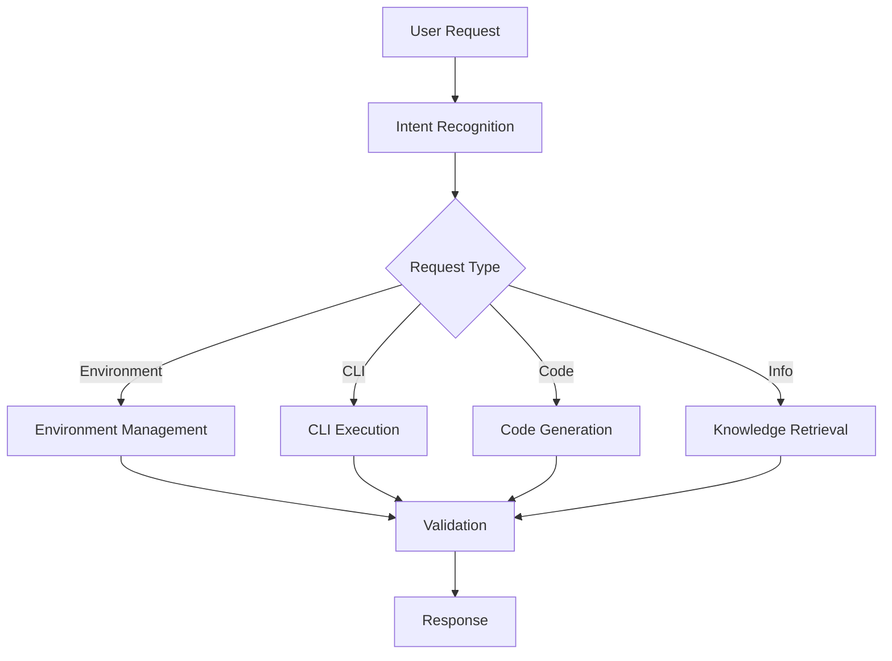

# Copilot Agent Development Guide

> **Source:** [About building Copilot agents](https://docs.github.com/en/enterprise-cloud@latest/copilot/building-copilot-extensions/building-a-copilot-agent-for-your-copilot-extension/about-copilot-agents)

## What is a Copilot Agent?

A Copilot agent is an AI-powered assistant that integrates with GitHub Copilot to provide specialized functionality. For Power Platform development, our agent will focus on:

- **Environment Management**: Automated creation and configuration of Power Platform environments
- **CLI Automation**: Expert-level use of `pac cli` and `m365 cli` commands
- **Development Assistance**: C# and Blazor code generation and guidance
- **Knowledge Retrieval**: RAG-powered access to documentation and best practices

## Agent Architecture

### Core Components

#### 1. Agent Configuration
```yaml
# .github/copilot-agent.yml
name: "power-platform-agent"
description: "Specialized agent for Microsoft Power Platform development"
capabilities:
  - environment_management
  - cli_automation
  - code_generation
  - knowledge_retrieval
```

#### 2. Skill Integration
- **Environment Skills**: Power Platform environment lifecycle
- **CLI Skills**: Command validation and execution
- **Development Skills**: C# and Blazor assistance
- **Documentation Skills**: RAG-powered knowledge access

#### 3. Workflow Orchestration


## Implementation Framework

### 1. Agent Bootstrap
```csharp
public class PowerPlatformAgent : ICopilotAgent
{
    private readonly IEnvironmentManager _environmentManager;
    private readonly ICliExecutor _cliExecutor;
    private readonly ICodeGenerator _codeGenerator;
    private readonly IKnowledgeRetriever _knowledgeRetriever;

    public async Task<AgentResponse> ProcessRequestAsync(AgentRequest request)
    {
        var intent = await AnalyzeIntentAsync(request.Message);
        
        return intent.Type switch
        {
            IntentType.EnvironmentManagement => await HandleEnvironmentRequest(request),
            IntentType.CliExecution => await HandleCliRequest(request),
            IntentType.CodeGeneration => await HandleCodeRequest(request),
            IntentType.KnowledgeQuery => await HandleKnowledgeRequest(request),
            _ => await HandleGeneralRequest(request)
        };
    }
}
```

### 2. Environment Management Skills
```csharp
public class EnvironmentManager : IEnvironmentManager
{
    public async Task<EnvironmentResult> CreateEnvironmentAsync(EnvironmentSpec spec)
    {
        // Validate requirements
        await ValidateSpecificationAsync(spec);
        
        // Execute pac cli commands
        var commands = GenerateCreateCommands(spec);
        var results = await ExecuteCliCommandsAsync(commands);
        
        // Verify environment
        return await VerifyEnvironmentAsync(spec.Name);
    }
}
```

### 3. CLI Command Execution
```csharp
public class CliExecutor : ICliExecutor
{
    public async Task<CliResult> ExecuteAsync(string command, CliOptions options)
    {
        // Validate command safety
        await ValidateCommandAsync(command);
        
        // Execute with proper authentication
        var result = await RunCommandAsync(command, options);
        
        // Log and audit
        await LogExecutionAsync(command, result);
        
        return result;
    }
}
```

## Agent Skills Configuration

### Power Platform Skills
- **pac auth**: Authentication management
- **pac env**: Environment operations
- **pac solution**: Solution management
- **pac application**: Application lifecycle

### Microsoft 365 Skills
- **m365 login**: Authentication
- **m365 app**: Application management
- **m365 spo**: SharePoint operations
- **m365 teams**: Teams integration

## Testing and Validation

### Unit Testing
```csharp
[Test]
public async Task Should_Create_Environment_Successfully()
{
    // Arrange
    var spec = new EnvironmentSpec 
    { 
        Name = "test-env",
        Type = EnvironmentType.Development 
    };

    // Act
    var result = await _environmentManager.CreateEnvironmentAsync(spec);

    // Assert
    Assert.That(result.Success, Is.True);
    Assert.That(result.EnvironmentId, Is.Not.Null);
}
```

### Integration Testing
```csharp
[Test]
public async Task Should_Execute_Pac_Commands_Safely()
{
    // Test CLI command validation and execution
    var command = "pac env list";
    var result = await _cliExecutor.ExecuteAsync(command, new CliOptions());
    
    Assert.That(result.ExitCode, Is.EqualTo(0));
    Assert.That(result.Output, Is.Not.Empty);
}
```

## Security Considerations

### Command Validation
- Whitelist allowed CLI commands
- Validate command parameters
- Prevent dangerous operations
- Audit all executions

### Authentication
- Secure credential management
- Token refresh handling
- Multi-tenant support
- Role-based access control

## Next Steps

1. Implement [Development Environment Setup](./dev-environment.md)
2. Configure [CLI Tools Integration](../cli-tools/README.md)
3. Set up [RAG Knowledge Base](../implementation/rag-integration.md)
4. Implement [Validation Framework](../implementation/validation-testing.md)