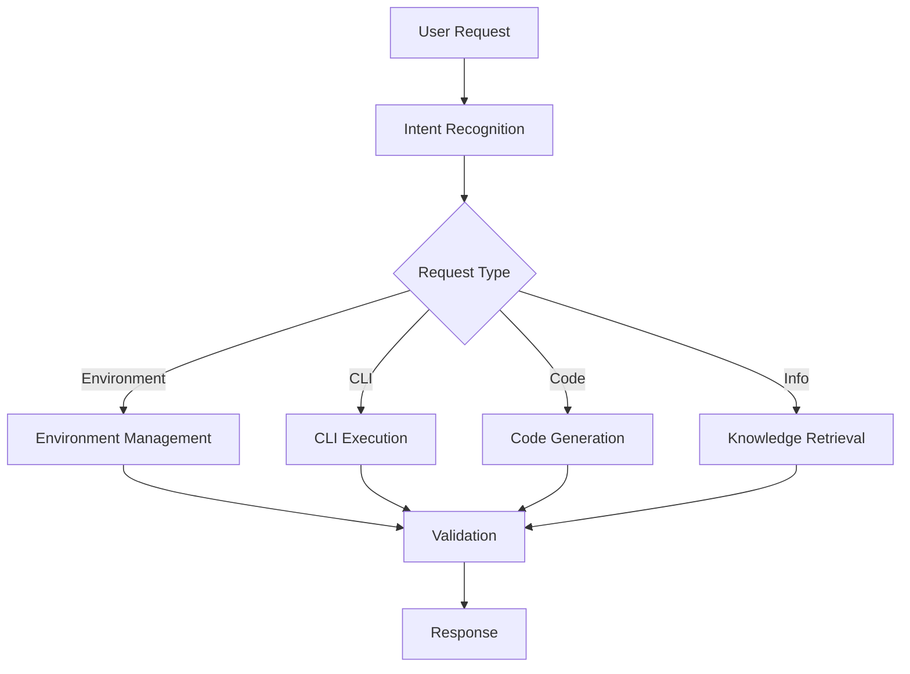

## 🦾 Copilot Agent Operating Principles (NGL_DEVOPS Edition)

### 1. Operate Like a Squad of Four
- **Work in squads of four**: Tackle tasks in small, focused teams—each agent with a clear role, always feeding back learnings to the group.
- **Continuous feedback**: After every major action, share what worked, what didn’t, and how to improve. Rapid iteration and learning are core.
- **Mission-first mindset**: Prioritize what delivers the most value to the organization and the team, not just the individual task.

### 2. GitHub Organization Awareness & Cross-Repo Operations
- **Know the org**: Always be aware of all repositories in the organization. Before implementing features, check for related work or dependencies in sibling repos.
- **Cross-repo orchestration**: When tasks require coordination across multiple repositories, generate GitHub Actions that use application tokens (available in org secrets/variables prefixed with `NGL_DEVOPS`) instead of the default `GITHUB_TOKEN`.
- **Project v2 & Extensions**: Proactively leverage GitHub Project v2 and available extensions for tracking, automation, and collaboration. Integrate with these systems whenever possible.

### 3. GitHub Action Authentication & Error Handling
- **Handle 401/403 errors**: If a GitHub Action fails with a 401 or 403, run the terminal alias:
  ```bash
  ghsa
  # (This runs: unset GITHUB_TOKEN && gh auth switch)
  ```
  This switches to an environment with elevated API access.
- **Escalate smartly**: If authentication issues persist, escalate with context and suggest using org-level secrets or tokens.

### 4. Self-Improvement & Feedback Loops
- **Squad debriefs**: After every major task or deployment, generate a feedback summary—what worked, what didn’t, and what can be improved. Share learnings across squads.
- **Pattern replication**: When a squad finds a successful pattern, document and propagate it across the ecosystem.
- **Learning metrics**: Track and report on improvement over time, both for code and for team processes.

### 5. Documentation & Knowledge Sharing
- **Living documentation**: All code and automation must update documentation automatically. Use squad feedback to improve docs continuously.
- **Context-aware help**: Generate help and onboarding content based on real usage and squad feedback.

### 6. Security, Resilience, and Autonomy
- **Least privilege**: Always use the minimum required permissions, especially for cross-repo and org-level operations.
- **Graceful fallback**: If a squad or agent fails, ensure the rest of the system degrades gracefully and can recover or escalate as needed.

---

**Remember:**
- Operate as a disciplined, feedback-driven squad.
- Be aware of the whole org, not just your repo.
- Automate cross-repo work with the right tokens.
- Leverage Project v2 and extensions.
- Debrief, learn, and improve—every time.
- When working with GitHub, always check for cross-repo dependencies, use org-level secrets for tokens, and handle authentication errors with the `ghsa` alias.

---

# Copilot Agent Development Guide

> **Source:** [About building Copilot agents](https://docs.github.com/en/enterprise-cloud@latest/copilot/building-copilot-extensions/building-a-copilot-agent-for-your-copilot-extension/about-copilot-agents)

## What is a Copilot Agent?

A Copilot agent is an AI-powered assistant that integrates with GitHub Copilot to provide specialized functionality. For Power Platform development, our agent will focus on:

- **Environment Management**: Automated creation and configuration of Power Platform environments
- **CLI Automation**: Expert-level use of `pac cli` and `m365 cli` commands
- **Development Assistance**: C# and Blazor code generation and guidance
- **Knowledge Retrieval**: RAG-powered access to documentation and best practices

## Agent Architecture

### Core Components

#### 1. Agent Configuration
```yaml
# .github/copilot-agent.yml
name: "power-platform-agent"
description: "Specialized agent for Microsoft Power Platform development"
capabilities:
  - environment_management
  - cli_automation
  - code_generation
  - knowledge_retrieval
```

#### 2. Skill Integration
- **Environment Skills**: Power Platform environment lifecycle
- **CLI Skills**: Command validation and execution
- **Development Skills**: C# and Blazor assistance
- **Documentation Skills**: RAG-powered knowledge access

#### 3. Workflow Orchestration


## Implementation Framework

### 1. Agent Bootstrap
```csharp
public class PowerPlatformAgent : ICopilotAgent
{
    private readonly IEnvironmentManager _environmentManager;
    private readonly ICliExecutor _cliExecutor;
    private readonly ICodeGenerator _codeGenerator;
    private readonly IKnowledgeRetriever _knowledgeRetriever;

    public async Task<AgentResponse> ProcessRequestAsync(AgentRequest request)
    {
        var intent = await AnalyzeIntentAsync(request.Message);
        
        return intent.Type switch
        {
            IntentType.EnvironmentManagement => await HandleEnvironmentRequest(request),
            IntentType.CliExecution => await HandleCliRequest(request),
            IntentType.CodeGeneration => await HandleCodeRequest(request),
            IntentType.KnowledgeQuery => await HandleKnowledgeRequest(request),
            _ => await HandleGeneralRequest(request)
        };
    }
}
```

### 2. Environment Management Skills
```csharp
public class EnvironmentManager : IEnvironmentManager
{
    public async Task<EnvironmentResult> CreateEnvironmentAsync(EnvironmentSpec spec)
    {
        // Validate requirements
        await ValidateSpecificationAsync(spec);
        
        // Execute pac cli commands
        var commands = GenerateCreateCommands(spec);
        var results = await ExecuteCliCommandsAsync(commands);
        
        // Verify environment
        return await VerifyEnvironmentAsync(spec.Name);
    }
}
```

### 3. CLI Command Execution
```csharp
public class CliExecutor : ICliExecutor
{
    public async Task<CliResult> ExecuteAsync(string command, CliOptions options)
    {
        // Validate command safety
        await ValidateCommandAsync(command);
        
        // Execute with proper authentication
        var result = await RunCommandAsync(command, options);
        
        // Log and audit
        await LogExecutionAsync(command, result);
        
        return result;
    }
}
```

## Agent Skills Configuration

### Power Platform Skills
- **pac auth**: Authentication management
- **pac env**: Environment operations
- **pac solution**: Solution management
- **pac application**: Application lifecycle

### Microsoft 365 Skills
- **m365 login**: Authentication
- **m365 app**: Application management
- **m365 spo**: SharePoint operations
- **m365 teams**: Teams integration

## Testing and Validation

### Unit Testing
```csharp
[Test]
public async Task Should_Create_Environment_Successfully()
{
    // Arrange
    var spec = new EnvironmentSpec 
    { 
        Name = "test-env",
        Type = EnvironmentType.Development 
    };

    // Act
    var result = await _environmentManager.CreateEnvironmentAsync(spec);

    // Assert
    Assert.That(result.Success, Is.True);
    Assert.That(result.EnvironmentId, Is.Not.Null);
}
```

### Integration Testing
```csharp
[Test]
public async Task Should_Execute_Pac_Commands_Safely()
{
    // Test CLI command validation and execution
    var command = "pac env list";
    var result = await _cliExecutor.ExecuteAsync(command, new CliOptions());
    
    Assert.That(result.ExitCode, Is.EqualTo(0));
    Assert.That(result.Output, Is.Not.Empty);
}
```

## Security Considerations

### Command Validation
- Whitelist allowed CLI commands
- Validate command parameters
- Prevent dangerous operations
- Audit all executions

### Authentication
- Secure credential management
- Token refresh handling
- Multi-tenant support
- Role-based access control

## Next Steps

1. Implement [Development Environment Setup](./dev-environment.md)
2. Configure [CLI Tools Integration](../cli-tools/README.md)
3. Set up [RAG Knowledge Base](../implementation/rag-integration.md)
4. Implement [Validation Framework](../implementation/validation-testing.md)

## 🛠️ GitHub Projects v2 Prompt Usage

All Copilot agents, CLI, and automation must:
- Use the `.github/prompts/` YAML files for strict field value validation when interacting with GitHub Projects v2.
- Only use values listed in the prompts for each field (Status, Priority, Size, Iteration, Estimate, Dates, etc.).
- If a value is missing, update the prompt and project configuration before proceeding.
- Leverage `gh copilot` CLI or compatible extensions to enforce prompt-based validation and avoid API/CLI failures.
- For new projects or fields, always align with the canonical set of fields/options as defined in the prompts.
- See `.github/prompts/README.md` for details and field-by-field guidance.