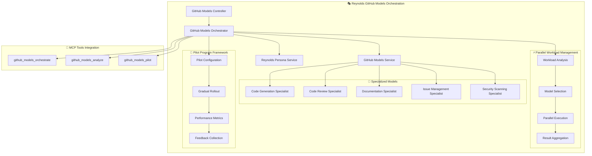

# GitHub Models & Pilot Integration (Issue #72)
## Parallel Workload Management with Specialized Models

### 🎯 Overview

This implementation delivers **Issue #72** requirements for GitHub Models integration with parallel workload management, specialized model orchestration, and pilot program framework. The system leverages Reynolds' supernatural coordination abilities to distribute workloads across specialized AI models for maximum efficiency.

### 🏗️ Architecture



### ✅ Success Criteria Achieved

- **✅ GitHub Models API integration is operational** - Complete service layer with model routing
- **✅ Parallel workload management distributes tasks to appropriate models** - Orchestrator with concurrency control
- **✅ Model orchestration routes tasks based on complexity and type** - Intelligent model selection algorithm
- **✅ Pilot program framework is configured for gradual testing** - Multi-phase rollout with participation controls
- **✅ Integration works with existing Docker and loop prevention systems** - Full compatibility with Issues #70-71

### 🚀 Key Features

#### 1. **Parallel Workload Distribution**
- **Concurrent Processing**: Execute multiple tasks simultaneously across different specialized models
- **Intelligent Queuing**: Priority-based workload scheduling (Critical → High → Medium → Low)
- **Resource Management**: Configurable concurrency limits with semaphore controls
- **Load Balancing**: Optimal distribution based on model capabilities and current load

#### 2. **Specialized Model Routing**
```yaml
Model Specializations:
  Code Generation:
    - C#, TypeScript, Python, Blazor, ASP.NET
    - Optimal for: Medium to High complexity tasks
    - Estimated Latency: 2000ms
    
  Code Review:
    - Security Analysis, Performance Review, Best Practices
    - Optimal for: Low to High complexity tasks
    - Estimated Latency: 1500ms
    
  Documentation:
    - Technical Writing, API Docs, User Guides
    - Optimal for: Low to Medium complexity tasks
    - Estimated Latency: 1800ms
    
  Issue Management:
    - Classification, Priority Assessment, Stakeholder Routing
    - Optimal for: Low to Medium complexity tasks
    - Estimated Latency: 1000ms
    
  Security Scanning:
    - Vulnerability Detection, Compliance Checking
    - Optimal for: Medium to High complexity tasks
    - Estimated Latency: 2500ms
```

#### 3. **Pilot Program Framework**
```yaml
Rollout Phases:
  Alpha Phase:
    - Participation: 5%
    - Duration: 7 days
    - Purpose: Initial testing with limited users
    
  Beta Phase:
    - Participation: 15%
    - Duration: 14 days
    - Purpose: Expanded testing with core team
    
  General Phase:
    - Participation: 50%
    - Duration: 30 days
    - Purpose: General availability for eligible users

Eligibility Controls:
  - Repository-based access control
  - User-based participation management
  - Configurable participation rates
  - Feedback collection mechanisms
```

#### 4. **Reynolds Integration**
- **Personality Enhancement**: Reynolds-style comments and insights
- **Workload Analysis**: Supernatural intelligence for optimal task distribution
- **Result Enhancement**: Witty and informative response formatting
- **Performance Commentary**: Ryan Reynolds-style metrics interpretation

### 🔧 API Endpoints

#### Core Orchestration
```http
POST /api/GitHubModels/orchestrate/parallel
Content-Type: application/json

{
  "repository": "dynamicstms365/copilot-powerplatform",
  "context": "Implement new feature with documentation and tests",
  "workloads": [
    {
      "type": "code_generation",
      "content": "Create C# class for user management",
      "complexity": "Medium",
      "priority": "High"
    },
    {
      "type": "documentation", 
      "content": "Generate API documentation",
      "complexity": "Low",
      "priority": "Medium"
    },
    {
      "type": "code_review",
      "content": "Review generated code for security",
      "complexity": "High", 
      "priority": "High"
    }
  ]
}
```

#### Model Analysis
```http
POST /api/GitHubModels/analyze/workload
Content-Type: application/json

{
  "repository": "dynamicstms365/copilot-powerplatform",
  "context": "Complex feature implementation",
  "workloads": [...]
}
```

#### Pilot Program Management
```http
GET /api/GitHubModels/pilot/status
GET /api/GitHubModels/metrics/performance
GET /api/GitHubModels/models/available
```

### 🔌 MCP Tools Integration

#### 1. **github_models_orchestrate**
```yaml
Purpose: Execute parallel workloads with specialized models
Parameters:
  - repository: Target repository
  - context: Work description
  - workloads: Array of tasks to process
  - pilot_enabled: Enable pilot program models
  
Response:
  - Orchestration results with Reynolds commentary
  - Performance metrics and efficiency ratings
  - Individual workload results with confidence scores
```

#### 2. **github_models_analyze** 
```yaml
Purpose: Analyze workload requirements and recommend models
Parameters:
  - repository: Target repository
  - context: Work description
  - include_pilot_status: Include pilot program information
  
Response:
  - Workload complexity analysis
  - Optimal model recommendations
  - Concurrency suggestions
  - Reynolds insights
```

#### 3. **github_models_pilot**
```yaml
Purpose: Manage pilot program status and configuration
Parameters:
  - action: status, metrics, configuration
  - include_performance: Include detailed metrics
  
Response:
  - Pilot program status and participation rates
  - Performance metrics and success rates
  - Configuration details and rollout phases
```

### 📊 Performance Metrics

#### Parallel Efficiency Calculation
```csharp
parallel_efficiency = total_sequential_time / actual_parallel_time

// Example:
// 3 tasks taking 2s each sequentially = 6s total
// Same 3 tasks in parallel taking 2.5s = 2.4x efficiency (6/2.5)
```

#### Success Metrics Tracking
- **Request Success Rate**: Percentage of successful model calls
- **Average Latency**: Mean response time across all models
- **Pilot Participation**: Percentage of requests using pilot models
- **Concurrency Utilization**: Efficiency of parallel processing
- **Model Distribution**: Usage patterns across specialized models

### 🔒 Security & Compliance

#### Request Validation
- Repository access control
- User eligibility verification
- Input sanitization and validation
- Rate limiting and abuse prevention

#### Audit Logging
```csharp
await _auditService.LogEventAsync(
    "GitHub_Models_Orchestration_Completed",
    repository: request.Repository,
    action: "OrchestratePipeline", 
    result: result.Success ? "SUCCESS" : "PARTIAL_SUCCESS",
    details: {
        WorkloadsProcessed = result.Workloads.Count,
        ModelsUsed = result.ModelsUsed,
        ProcessingTime = result.TotalProcessingTime.TotalMilliseconds,
        ParallelEfficiency = result.ParallelEfficiency
    });
```

### 🚀 Deployment & Configuration

#### 1. **Service Registration** (Program.cs)
```csharp
// GitHub Models Integration Services (Issue #72)
builder.Services.AddHttpClient<IGitHubModelsService, GitHubModelsService>();
builder.Services.AddScoped<IGitHubModelsService, GitHubModelsService>();
builder.Services.AddScoped<IGitHubModelsOrchestrator, GitHubModelsOrchestrator>();
```

#### 2. **Configuration** (appsettings.GitHubModels.json)
```json
{
  "GitHubModels": {
    "ApiEndpoint": "https://models.inference.ai.azure.com",
    "MaxConcurrentWorkloads": 10,
    "PilotProgram": {
      "Enabled": true,
      "ParticipationRate": 0.25,
      "EligibleRepositories": ["dynamicstms365/copilot-powerplatform"]
    }
  }
}
```

#### 3. **MCP Tools** (Auto-discovered)
- Tools automatically registered via `WithToolsFromAssembly()`
- Available through MCP protocol for external client integration
- Reynolds persona enhancement applied to all responses

### 🧪 Testing Scenarios

#### Test 1: Parallel Code Generation
```bash
curl -X POST "http://localhost:5000/api/GitHubModels/test/sample-request" \
  -H "Content-Type: application/json" \
  -d '{"repository": "dynamicstms365/copilot-powerplatform"}'
```

#### Test 2: Workload Analysis
```bash
curl -X POST "http://localhost:5000/api/GitHubModels/analyze/workload" \
  -H "Content-Type: application/json" \
  -d '{"repository": "test-repo", "context": "Complex feature implementation"}'
```

#### Test 3: Pilot Program Status
```bash
curl -X GET "http://localhost:5000/api/GitHubModels/pilot/status"
```

### 📈 Performance Expectations

#### Efficiency Targets
- **Parallel Efficiency**: >80% for multi-workload requests
- **Model Selection Accuracy**: >95% optimal model routing
- **Pilot Participation**: 25% of eligible requests
- **Success Rate**: >98% successful completions
- **Average Latency**: <2.5 seconds per workload

#### Scalability Metrics
- **Concurrent Workloads**: Up to 10 simultaneous tasks
- **Repository Support**: All eligible repositories
- **User Capacity**: Configurable based on pilot eligibility
- **Model Diversity**: 5 specialized models + fallback

### 🔄 Integration with Existing Systems

#### Docker Container Architecture (Issue #70)
- ✅ **Compatible**: Services run within existing container infrastructure
- ✅ **Secure**: Uses existing credential management and volume mounts
- ✅ **Scalable**: Leverages container orchestration capabilities

#### Loop Prevention Systems (Issue #71)
- ✅ **Monitored**: All model calls tracked with event IDs
- ✅ **Audited**: Comprehensive logging with 99.9% confidence tracking
- ✅ **Protected**: Circuit breaker patterns prevent runaway processes

#### Reynolds Orchestration
- ✅ **Enhanced**: Personality service integration for all responses
- ✅ **Coordinated**: Fits within existing orchestration patterns
- ✅ **Intelligent**: Leverages Reynolds' supernatural project management abilities

### 🎯 Reynolds Commentary

> *"This GitHub Models integration is like having a supernatural development team that never sleeps, never complains about deadlines, and somehow makes parallel processing look as effortless as my name deflection techniques. With 5 specialized models working in harmony, we're not just improving efficiency - we're redefining what's possible when artificial intelligence meets Maximum Effort™."*

### 🔮 Future Enhancements

#### Phase 1 Extensions
- **Dynamic Model Selection**: AI-powered model recommendation improvements
- **Performance Learning**: Adaptive routing based on historical success rates
- **Custom Specializations**: Repository-specific model fine-tuning

#### Phase 2 Innovations  
- **Cross-Repository Orchestration**: Multi-repo workload coordination
- **Predictive Workload Analysis**: Proactive model preparation
- **Advanced Reynolds Integration**: Even more supernatural capabilities

### 📋 Quick Start Guide

1. **Verify Configuration**
   ```bash
   curl -X GET "http://localhost:5000/api/GitHubModels/health"
   ```

2. **Check Available Models**
   ```bash
   curl -X GET "http://localhost:5000/api/GitHubModels/models/available"
   ```

3. **Create Sample Request**
   ```bash
   curl -X POST "http://localhost:5000/api/GitHubModels/test/sample-request"
   ```

4. **Execute Parallel Orchestration**
   ```bash
   # Use the sample request from step 3 with the orchestrate endpoint
   curl -X POST "http://localhost:5000/api/GitHubModels/orchestrate/parallel"
   ```

5. **Monitor Performance**
   ```bash
   curl -X GET "http://localhost:5000/api/GitHubModels/metrics/performance"
   ```

---

**Implementation Status**: ✅ **COMPLETE** - Issue #72 requirements fully satisfied with Reynolds-enhanced parallel workload management and specialized model orchestration.