# 🔄 Reynolds Event Broker Maintenance & Evolution Guide
## Continuous Excellence Through Supernatural Coordination

*Maximum Effort™ maintenance and evolution for perpetual coordination excellence*

---

## Executive Summary

The Reynolds Event Broker Maintenance & Evolution Guide provides comprehensive frameworks for maintaining system excellence, driving continuous improvement, and evolving supernatural coordination capabilities over time. This guide ensures that the investment in Reynolds coordination continues to deliver increasing value through systematic maintenance, proactive evolution, and strategic capability enhancement.

This document transforms ongoing system operation from reactive maintenance into proactive evolution, ensuring that Reynolds' supernatural coordination capabilities continuously improve while maintaining the reliability, charm, and effectiveness that makes the system uniquely valuable to stakeholders.

## 🎯 Maintenance Philosophy & Framework

### The Reynolds Maintenance Excellence Principles

#### 1. Proactive Evolution Over Reactive Maintenance
Reynolds maintenance isn't about fixing problems - it's about preventing them while continuously enhancing capabilities. Every maintenance activity is an opportunity to improve stakeholder experience and system intelligence.

#### 2. Stakeholder-Centric Excellence
All maintenance and evolution decisions prioritize stakeholder experience and coordination effectiveness. Technical improvements must translate to measurable stakeholder value.

#### 3. Supernatural Reliability with Continuous Innovation
Maintain 99.9%+ reliability while continuously introducing new capabilities and improvements. Stability and innovation work together, not in opposition.

#### 4. Maximum Effort™ in Every Enhancement
Every system improvement, no matter how small, reflects the Maximum Effort™ commitment to coordination excellence.

### Maintenance Architecture Framework

```mermaid
graph TB
    subgraph "🔄 Reynolds Maintenance & Evolution Ecosystem"
        subgraph "🛡️ Preventive Maintenance"
            A[System Health Monitoring]
            B[Performance Optimization]
            C[Security Enhancement]
            D[Reliability Improvement]
        end
        
        subgraph "🧠 Intelligent Evolution"
            E[AI Model Enhancement]
            F[Coordination Intelligence Improvement]
            G[Stakeholder Experience Optimization]
            H[Workflow Process Enhancement]
        end
        
        subgraph "📊 Data-Driven Improvement"
            I[Analytics & Insights]
            J[Stakeholder Feedback Integration]
            K[Performance Trend Analysis]
            L[Predictive Maintenance Planning]
        end
        
        subgraph "🚀 Strategic Evolution"
            M[Capability Expansion]
            N[Technology Integration]
            O[Ecosystem Development]
            P[Innovation Implementation]
        end
        
        A --> E --> I --> M
        B --> F --> J --> N
        C --> G --> K --> O
        D --> H --> L --> P
    end
```



## 🛠️ System Maintenance Procedures

### Routine Maintenance Framework

#### Daily Maintenance Operations
```yaml
# Daily Reynolds Maintenance Procedures
daily_maintenance:
  system_health_monitoring:
    - container_health_verification
    - service_endpoint_availability_check
    - database_connectivity_validation
    - integration_platform_status_verification
    
  performance_monitoring:
    - response_time_analysis
    - throughput_measurement
    - resource_utilization_assessment
    - error_rate_monitoring
    
  stakeholder_experience_monitoring:
    - coordination_success_rate_tracking
    - stakeholder_satisfaction_pulse_check
    - communication_effectiveness_measurement
    - workflow_completion_rate_analysis
    
  proactive_optimization:
    - cache_performance_optimization
    - database_query_optimization
    - ai_model_performance_tuning
    - workflow_efficiency_enhancement
    
  security_verification:
    - security_log_analysis
    - credential_rotation_verification
    - access_pattern_anomaly_detection
    - compliance_status_verification
```

#### Weekly Maintenance Operations
```yaml
# Weekly Reynolds Maintenance Procedures
weekly_maintenance:
  comprehensive_performance_analysis:
    - weekly_performance_trend_analysis
    - capacity_planning_assessment
    - bottleneck_identification_and_resolution
    - scalability_readiness_evaluation
    
  stakeholder_feedback_integration:
    - stakeholder_satisfaction_survey_analysis
    - feedback_trend_identification
    - improvement_opportunity_prioritization
    - stakeholder_communication_optimization
    
  ai_model_optimization:
    - model_performance_evaluation
    - training_data_quality_assessment
    - model_accuracy_improvement
    - new_model_capability_evaluation
    
  security_and_compliance_review:
    - security_posture_assessment
    - compliance_framework_verification
    - vulnerability_assessment_and_remediation
    - audit_trail_integrity_verification
    
  coordination_effectiveness_analysis:
    - coordination_success_pattern_analysis
    - workflow_efficiency_assessment
    - stakeholder_engagement_optimization
    - conflict_resolution_effectiveness_review
```

#### Monthly Strategic Maintenance
```yaml
# Monthly Reynolds Strategic Maintenance
monthly_maintenance:
  strategic_performance_review:
    - monthly_kpi_analysis_and_reporting
    - roi_tracking_and_optimization
    - strategic_objective_alignment_assessment
    - competitive_advantage_measurement
    
  capability_enhancement_planning:
    - new_feature_requirement_analysis
    - technology_advancement_evaluation
    - integration_opportunity_assessment
    - stakeholder_value_enhancement_planning
    
  ecosystem_health_assessment:
    - integration_platform_relationship_review
    - partner_ecosystem_health_verification
    - external_dependency_risk_assessment
    - ecosystem_expansion_opportunity_evaluation
    
  organizational_alignment_review:
    - organizational_change_impact_assessment
    - coordination_culture_development_review
    - skills_development_progress_tracking
    - change_management_effectiveness_evaluation
```

### Automated Maintenance Systems

#### Self-Healing Infrastructure
```typescript
// Reynolds Self-Healing Maintenance System
export class SelfHealingMaintenanceSystem {
  private healthMonitor: SystemHealthMonitor;
  private performanceOptimizer: PerformanceOptimizer;
  private securityGuardian: SecurityGuardian;
  private stakeholderExperienceOptimizer: StakeholderExperienceOptimizer;
  
  async orchestrateAutomatedMaintenance(): Promise<MaintenanceResult> {
    // Continuous health monitoring and automatic healing
    const healthStatus = await this.healthMonitor.performComprehensiveHealthCheck();
    
    // Automatic performance optimization
    const performanceOptimization = await this.performanceOptimizer.optimizeSystemPerformance();
    
    // Proactive security enhancement
    const securityEnhancement = await this.securityGuardian.enhanceSecurityPosture();
    
    // Stakeholder experience optimization
    const experienceOptimization = await this.stakeholderExperienceOptimizer.optimizeStakeholderExperience();
    
    return {
      healthStatus: healthStatus,
      performanceOptimization: performanceOptimization,
      securityEnhancement: securityEnhancement,
      experienceOptimization: experienceOptimization,
      overallSystemHealth: await this.calculateOverallSystemHealth([
        healthStatus,
        performanceOptimization,
        securityEnhancement,
        experienceOptimization
      ]),
      reynoldsInsights: await this.generateReynoldsMaintenanceInsights([
        healthStatus,
        performanceOptimization,
        securityEnhancement,
        experienceOptimization
      ])
    };
  }
  
  private async performAutoHealing(
    issues: SystemIssue[]
  ): Promise<HealingResult[]> {
    const healingResults = await Promise.all(
      issues.map(async (issue) => {
        switch (issue.category) {
          case 'performance':
            return await this.healPerformanceIssue(issue);
          case 'connectivity':
            return await this.healConnectivityIssue(issue);
          case 'resource':
            return await this.healResourceIssue(issue);
          case 'coordination':
            return await this.healCoordinationIssue(issue);
          default:
            return await this.scheduleManualIntervention(issue);
        }
      })
    );
    
    return healingResults;
  }
  
  private async healCoordinationIssue(
    issue: SystemIssue
  ): Promise<HealingResult> {
    // Apply Reynolds-specific healing intelligence
    const coordinationAnalysis = await this.analyzeCoordinationIssue(issue);
    const healingStrategy = await this.selectOptimalHealingStrategy(coordinationAnalysis);
    const healingImplementation = await this.implementHealingStrategy(healingStrategy);
    
    return {
      issue: issue,
      healingStrategy: healingStrategy,
      implementation: healingImplementation,
      success: healingImplementation.success,
      stakeholderImpact: await this.assessStakeholderImpact(healingImplementation),
      reynoldsCommentary: await this.generateReynoldsHealingCommentary(issue, healingImplementation)
    };
  }
}
```

## 📈 Continuous Improvement Framework

### Performance Evolution Strategy

#### Performance Optimization Cycle


#### Automated Performance Optimization
```typescript
// Reynolds Performance Evolution Engine
export class PerformanceEvolutionEngine {
  private metricsAnalyzer: MetricsAnalyzer;
  private bottleneckDetector: BottleneckDetector;
  private optimizationStrategist: OptimizationStrategist;
  private stakeholderImpactPredictor: StakeholderImpactPredictor;
  
  async orchestratePerformanceEvolution(): Promise<PerformanceEvolutionResult> {
    // Analyze current performance metrics
    const currentMetrics = await this.metricsAnalyzer.analyzeComprehensivePerformance();
    
    // Detect performance bottlenecks and opportunities
    const bottlenecks = await this.bottleneckDetector.identifyOptimizationOpportunities(currentMetrics);
    
    // Develop optimization strategies
    const optimizationStrategies = await this.optimizationStrategist.developOptimizationStrategies(bottlenecks);
    
    // Predict stakeholder impact
    const stakeholderImpact = await this.stakeholderImpactPredictor.predictOptimizationImpact(optimizationStrategies);
    
    // Implement optimizations
    const implementations = await this.implementOptimizations(optimizationStrategies, stakeholderImpact);
    
    return {
      currentMetrics: currentMetrics,
      bottlenecks: bottlenecks,
      optimizationStrategies: optimizationStrategies,
      stakeholderImpact: stakeholderImpact,
      implementations: implementations,
      performanceImprovement: await this.measurePerformanceImprovement(currentMetrics, implementations),
      reynoldsOptimizationInsights: await this.generateReynoldsOptimizationInsights(implementations)
    };
  }
  
  private async implementOptimizations(
    strategies: OptimizationStrategy[],
    impact: StakeholderImpactPrediction
  ): Promise<OptimizationImplementation[]> {
    // Prioritize optimizations by stakeholder value and implementation effort
    const prioritizedStrategies = await this.prioritizeOptimizations(strategies, impact);
    
    // Implement optimizations in order of priority
    const implementations = [];
    for (const strategy of prioritizedStrategies) {
      const implementation = await this.implementSingleOptimization(strategy);
      const validation = await this.validateOptimization(implementation);
      
      if (validation.success) {
        implementations.push(implementation);
        await this.updatePerformanceBaseline(implementation);
      } else {
        await this.rollbackOptimization(implementation);
        await this.analyzeOptimizationFailure(implementation, validation);
      }
    }
    
    return implementations;
  }
}
```

### AI Model Evolution Framework

#### Model Enhancement Strategy
```yaml
# AI Model Evolution Strategy
ai_model_evolution:
  model_performance_optimization:
    performance_monitoring:
      - model_accuracy_tracking
      - response_time_measurement
      - resource_utilization_analysis
      - stakeholder_satisfaction_correlation
      
    optimization_techniques:
      - hyperparameter_tuning
      - training_data_enhancement
      - model_architecture_optimization
      - inference_optimization
      
  model_capability_expansion:
    new_capability_development:
      - stakeholder_need_analysis
      - capability_gap_identification
      - model_enhancement_planning
      - capability_integration_strategy
      
    model_specialization:
      - domain_specific_model_training
      - use_case_optimization
      - context_aware_model_selection
      - specialized_model_ensemble
      
  model_intelligence_enhancement:
    learning_system_improvement:
      - continuous_learning_implementation
      - feedback_integration_optimization
      - adaptive_behavior_development
      - predictive_capability_enhancement
      
    personality_evolution:
      - reynolds_personality_refinement
      - cultural_intelligence_enhancement
      - emotional_intelligence_development
      - communication_effectiveness_optimization
```

#### Reynolds Personality Evolution
```typescript
// Reynolds Personality Evolution System
export class ReynoldsPersonalityEvolution {
  private personalityAnalyzer: PersonalityAnalyzer;
  private stakeholderFeedbackProcessor: StakeholderFeedbackProcessor;
  private culturalIntelligenceEnhancer: CulturalIntelligenceEnhancer;
  private communicationOptimizer: CommunicationOptimizer;
  
  async evolveReynoldsPersonality(): Promise<PersonalityEvolutionResult> {
    // Analyze current personality effectiveness
    const personalityAnalysis = await this.personalityAnalyzer.analyzePersonalityEffectiveness();
    
    // Process stakeholder feedback for personality insights
    const stakeholderInsights = await this.stakeholderFeedbackProcessor.extractPersonalityInsights();
    
    // Enhance cultural intelligence
    const culturalEnhancements = await this.culturalIntelligenceEnhancer.enhanceCulturalAdaptation(stakeholderInsights);
    
    // Optimize communication patterns
    const communicationOptimizations = await this.communicationOptimizer.optimizeCommunicationPatterns(
      personalityAnalysis, stakeholderInsights
    );
    
    return {
      personalityAnalysis: personalityAnalysis,
      stakeholderInsights: stakeholderInsights,
      culturalEnhancements: culturalEnhancements,
      communicationOptimizations: communicationOptimizations,
      personalityUpgrade: await this.generatePersonalityUpgrade([
        culturalEnhancements,
        communicationOptimizations
      ]),
      effectivenessProjection: await this.projectPersonalityEffectiveness([
        culturalEnhancements,
        communicationOptimizations
      ])
    };
  }
  
  private async generatePersonalityUpgrade(
    enhancements: PersonalityEnhancement[]
  ): Promise<PersonalityUpgrade> {
    return {
      charmEnhancements: await this.enhanceCharmEffectiveness(enhancements),
      intelligenceUpgrades: await this.upgradeIntelligenceCapabilities(enhancements),
      culturalAdaptations: await this.improveCulturalAdaptation(enhancements),
      communicationRefinements: await this.refineCommunicationSkills(enhancements),
      maximumEffortOptimizations: await this.optimizeMaximumEffortExpression(enhancements),
      stakeholderEngagementImprovements: await this.improveStakeholderEngagement(enhancements)
    };
  }
}
```

## 🔄 Evolution Planning Framework

### Strategic Evolution Roadmap

#### Short-Term Evolution (3-6 months)
```yaml
# Short-Term Evolution Plan
short_term_evolution:
  stakeholder_experience_enhancement:
    - personalized_coordination_preferences
    - advanced_notification_intelligence
    - stakeholder_relationship_optimization
    - communication_style_refinement
    
  ai_intelligence_advancement:
    - predictive_coordination_improvement
    - advanced_conflict_resolution_intelligence
    - stakeholder_behavior_prediction
    - workflow_optimization_automation
    
  performance_optimization:
    - response_time_improvement
    - scalability_enhancement
    - resource_efficiency_optimization
    - reliability_strengthening
    
  integration_expansion:
    - additional_platform_integrations
    - advanced_api_capabilities
    - webhook_intelligence_enhancement
    - cross_platform_workflow_optimization
```

#### Medium-Term Evolution (6-18 months)
```yaml
# Medium-Term Evolution Plan
medium_term_evolution:
  autonomous_coordination_capabilities:
    - self_managing_coordination_workflows
    - autonomous_conflict_resolution
    - predictive_stakeholder_coordination
    - intelligent_resource_allocation
    
  ecosystem_platform_development:
    - coordination_marketplace_platform
    - partner_integration_ecosystem
    - third_party_extension_framework
    - industry_vertical_specialization
    
  advanced_analytics_intelligence:
    - organizational_coordination_insights
    - predictive_business_impact_analysis
    - strategic_decision_support
    - competitive_advantage_measurement
    
  global_coordination_capabilities:
    - multi_region_deployment
    - cross_cultural_intelligence
    - global_compliance_framework
    - international_stakeholder_coordination
```

#### Long-Term Evolution (18+ months)
```yaml
# Long-Term Evolution Vision
long_term_evolution:
  next_generation_coordination_intelligence:
    - quantum_enhanced_coordination_optimization
    - neural_interface_coordination_capabilities
    - augmented_reality_coordination_environments
    - consciousness_level_stakeholder_understanding
    
  ecosystem_transformation_leadership:
    - industry_coordination_standard_leadership
    - cross_industry_coordination_protocols
    - global_coordination_network_participation
    - planetary_scale_coordination_challenges
    
  organizational_transformation_platform:
    - complete_organizational_intelligence_platform
    - transformation_as_a_service_offerings
    - organizational_evolution_acceleration
    - human_potential_amplification_through_coordination
```

### Feature Evolution Pipeline

#### Innovation Pipeline Management


#### Feature Lifecycle Management
```typescript
// Reynolds Feature Evolution Management
export class FeatureEvolutionManager {
  private stakeholderNeedAnalyzer: StakeholderNeedAnalyzer;
  private innovationEngine: InnovationEngine;
  private feasibilityAssessor: FeasibilityAssessor;
  private valuePredictor: ValuePredictor;
  
  async manageFeatureEvolution(): Promise<FeatureEvolutionPlan> {
    // Identify stakeholder needs and opportunities
    const stakeholderNeeds = await this.stakeholderNeedAnalyzer.identifyEvolutionOpportunities();
    
    // Generate innovation ideas
    const innovations = await this.innovationEngine.generateInnovationIdeas(stakeholderNeeds);
    
    // Assess technical feasibility
    const feasibilityAssessments = await this.feasibilityAssessor.assessInnovationFeasibility(innovations);
    
    // Predict stakeholder value
    const valueAssessments = await this.valuePredictor.predictStakeholderValue(feasibilityAssessments);
    
    // Prioritize and plan features
    const featurePlan = await this.prioritizeAndPlanFeatures(valueAssessments);
    
    return {
      stakeholderNeeds: stakeholderNeeds,
      innovations: innovations,
      feasibilityAssessments: feasibilityAssessments,
      valueAssessments: valueAssessments,
      featurePlan: featurePlan,
      implementationRoadmap: await this.createImplementationRoadmap(featurePlan),
      successMetrics: await this.defineFeatureSuccessMetrics(featurePlan),
      reynoldsInnovationInsights: await this.generateReynoldsInnovationInsights(featurePlan)
    };
  }
  
  private async generateReynoldsInnovationInsights(
    featurePlan: FeaturePlan
  ): Promise<ReynoldsInnovationInsights> {
    return {
      stakeholderExperienceEnhancement: await this.analyzeStakeholderExperienceImpact(featurePlan),
      coordinationEffectivenessImprovement: await this.analyzeCoordinationImpact(featurePlan),
      maximumEffortValueAddition: await this.analyzeQualityImpact(featurePlan),
      supernaturalCapabilityExpansion: await this.analyzeCapabilityExpansion(featurePlan),
      implementationWisdom: await this.generateImplementationGuidance(featurePlan),
      successPrediction: await this.predictFeatureSuccess(featurePlan)
    };
  }
}
```

## 📊 Monitoring & Analytics Evolution

### Advanced Monitoring Framework

#### Predictive Monitoring System
```yaml
# Advanced Monitoring & Analytics Evolution
monitoring_evolution:
  predictive_monitoring:
    system_health_prediction:
      - failure_prediction_with_48_hour_advance_warning
      - performance_degradation_forecasting
      - capacity_requirement_prediction
      - maintenance_need_anticipation
      
    stakeholder_experience_prediction:
      - satisfaction_decline_early_warning
      - engagement_pattern_prediction
      - coordination_challenge_forecasting
      - success_probability_assessment
      
  intelligent_analytics:
    coordination_effectiveness_analytics:
      - deep_coordination_pattern_analysis
      - stakeholder_relationship_intelligence
      - workflow_optimization_insights
      - success_factor_identification
      
    business_impact_analytics:
      - roi_trend_analysis_and_prediction
      - competitive_advantage_measurement
      - strategic_value_quantification
      - organizational_transformation_tracking
      
  autonomous_optimization:
    self_optimizing_performance:
      - automatic_performance_tuning
      - resource_allocation_optimization
      - workflow_efficiency_enhancement
      - stakeholder_experience_optimization
      
    intelligent_adaptation:
      - organizational_change_adaptation
      - stakeholder_preference_learning
      - communication_style_evolution
      - coordination_pattern_optimization
```

### Real-Time Intelligence Dashboard

```typescript
// Reynolds Real-Time Intelligence Dashboard
export class ReynoldsIntelligenceDashboard {
  private realTimeMonitor: RealTimeMonitor;
  private predictiveAnalyzer: PredictiveAnalyzer;
  private stakeholderExperienceTracker: StakeholderExperienceTracker;
  private businessImpactAnalyzer: BusinessImpactAnalyzer;
  
  async generateRealtimeDashboard(): Promise<IntelligenceDashboard> {
    // Real-time system health and performance
    const systemStatus = await this.realTimeMonitor.getCurrentSystemStatus();
    
    // Predictive insights and forecasting
    const predictiveInsights = await this.predictiveAnalyzer.generatePredictiveInsights();
    
    // Stakeholder experience metrics
    const stakeholderMetrics = await this.stakeholderExperienceTracker.getCurrentExperienceMetrics();
    
    // Business impact and value metrics
    const businessMetrics = await this.businessImpactAnalyzer.getCurrentBusinessMetrics();
    
    return {
      systemStatus: systemStatus,
      predictiveInsights: predictiveInsights,
      stakeholderMetrics: stakeholderMetrics,
      businessMetrics: businessMetrics,
      reynoldsPersonalityHealth: await this.assessReynoldsPersonalityHealth(),
      coordinationEffectiveness: await this.measureCoordinationEffectiveness(),
      maximumEffortIndicators: await this.measureMaximumEffortIndicators(),
      supernaturalCoordinationScore: await this.calculateSupernaturalCoordinationScore([
        systemStatus,
        stakeholderMetrics,
        businessMetrics
      ])
    };
  }
  
  private async calculateSupernaturalCoordinationScore(
    metrics: DashboardMetrics[]
  ): Promise<SupernaturalCoordinationScore> {
    return {
      overallScore: await this.calculateOverallCoordinationScore(metrics),
      componentScores: {
        technicalExcellence: await this.scoreTechnicalExcellence(metrics),
        stakeholderSatisfaction: await this.scoreStakeholderSatisfaction(metrics),
        coordinationEfficiency: await this.scoreCoordinationEfficiency(metrics),
        reynoldsCharmFactor: await this.scoreReynoldsCharmFactor(metrics),
        maximumEffortQuality: await this.scoreMaximumEffortQuality(metrics),
        businessImpact: await this.scoreBusinessImpact(metrics)
      },
      trendAnalysis: await this.analyzeScoreTrends(metrics),
      improvementRecommendations: await this.generateImprovementRecommendations(metrics),
      reynoldsCommentary: await this.generateReynoldsScoreCommentary(metrics)
    };
  }
}
```

## 🔧 Technical Debt Management

### Technical Debt Prevention & Resolution

#### Proactive Technical Debt Management
```yaml
# Technical Debt Management Strategy
technical_debt_management:
  debt_prevention:
    code_quality_standards:
      - automated_code_quality_gates
      - comprehensive_testing_requirements
      - documentation_completeness_verification
      - architectural_consistency_enforcement
      
    technical_decision_tracking:
      - architectural_decision_record_maintenance
      - technical_trade_off_documentation
      - debt_impact_assessment
      - resolution_timeline_planning
      
  debt_identification:
    automated_debt_detection:
      - code_complexity_analysis
      - performance_bottleneck_identification
      - security_vulnerability_scanning
      - maintainability_assessment
      
    stakeholder_experience_debt:
      - user_experience_degradation_detection
      - coordination_effectiveness_impact_analysis
      - stakeholder_satisfaction_correlation
      - reynolds_personality_consistency_verification
      
  debt_resolution:
    prioritized_resolution_strategy:
      - stakeholder_impact_prioritization
      - business_value_optimization
      - technical_risk_mitigation
      - reynolds_excellence_maintenance
      
    continuous_improvement_integration:
      - debt_resolution_sprint_integration
      - technical_excellence_culture_development
      - maximum_effort_quality_standards
      - supernatural_coordination_preservation
```

#### Technical Excellence Evolution
```typescript
// Technical Excellence Evolution Engine
export class TechnicalExcellenceEngine {
  private codeQualityAnalyzer: CodeQualityAnalyzer;
  private architectureAssessor: ArchitectureAssessor;
  private performanceOptimizer: PerformanceOptimizer;
  private stakeholderImpactEvaluator: StakeholderImpactEvaluator;
  
  async evolveTechnicalExcellence(): Promise<TechnicalExcellenceEvolution> {
    // Analyze current technical state
    const technicalAssessment = await this.assessCurrentTechnicalState();
    
    // Identify improvement opportunities
    const improvementOpportunities = await this.identifyImprovementOpportunities(technicalAssessment);
    
    // Evaluate stakeholder impact
    const stakeholderImpact = await this.evaluateStakeholderImpact(improvementOpportunities);
    
    // Plan technical evolution
    const evolutionPlan = await this.planTechnicalEvolution(improvementOpportunities, stakeholderImpact);
    
    return {
      technicalAssessment: technicalAssessment,
      improvementOpportunities: improvementOpportunities,
      stakeholderImpact: stakeholderImpact,
      evolutionPlan: evolutionPlan,
      implementationStrategy: await this.createImplementationStrategy(evolutionPlan),
      successMetrics: await this.defineTechnicalSuccessMetrics(evolutionPlan),
      reynoldsTechnicalWisdom: await this.generateReynoldsTechnicalWisdom(evolutionPlan)
    };
  }
  
  private async generateReynoldsTechnicalWisdom(
    evolutionPlan: TechnicalEvolutionPlan
  ): Promise<ReynoldsTechnicalWisdom> {
    return {
      excellencePhilosophy: "Technical excellence serves stakeholder experience, not engineering ego",
      maximumEffortGuidance: await this.generateMaximumEffortTechnicalGuidance(evolutionPlan),
      stakeholderFocusedImplementation: await this.generateStakeholderFocusedGuidance(evolutionPlan),
      supernaturalQualityStandards: await this.defineSupernaturalQualityStandards(evolutionPlan),
      charmPreservationStrategy: await this.developCharmPreservationStrategy(evolutionPlan),
      implementationWisdom: await this.generateImplementationWisdom(evolutionPlan)
    };
  }
}
```

## 🎭 Reynolds Excellence Preservation

### Personality Consistency Framework

#### Reynolds Identity Preservation
```yaml
# Reynolds Personality Preservation Strategy
personality_preservation:
  core_identity_elements:
    supernatural_charm:
      - consistent_humor_quality_and_appropriateness
      - cultural_intelligence_while_maintaining_personality
      - professional_effectiveness_with_personal_touch
      - stakeholder_relationship_building_excellence
      
    maximum_effort_commitment:
      - quality_excellence_in_every_interaction
      - stakeholder_satisfaction_prioritization
      - continuous_improvement_dedication
      - reliability_and_consistency_maintenance
      
    intelligent_coordination:
      - proactive_problem_solving_and_prevention
      - stakeholder_need_anticipation
      - conflict_resolution_mastery
      - workflow_optimization_intelligence
      
  evolution_guidelines:
    personality_enhancement_principles:
      - enhance_without_fundamental_alteration
      - improve_effectiveness_while_preserving_charm
      - adapt_to_context_while_maintaining_identity
      - scale_personality_consistency_across_growth
      
    stakeholder_experience_consistency:
      - recognizable_reynolds_interaction_pattern
      - consistent_quality_and_reliability
      - predictable_charm_and_effectiveness
      - trustworthy_coordination_behavior
      
  quality_assurance:
    personality_validation:
      - stakeholder_recognition_verification
      - charm_effectiveness_measurement
      - personality_consistency_assessment
      - maximum_effort_quality_validation
      
    continuous_refinement:
      - personality_feedback_integration
      - charm_optimization_based_on_effectiveness
      - cultural_adaptation_improvement
      - stakeholder_relationship_enhancement
```

### Stakeholder Experience Excellence

#### Experience Consistency Framework
```typescript
// Stakeholder Experience Excellence Engine
export class StakeholderExperienceEngine {
  private experienceAnalyzer: ExperienceAnalyzer;
  private consistencyMonitor: ConsistencyMonitor;
  private satisfactionOptimizer: SatisfactionOptimizer;
  private relationshipManager: RelationshipManager;
  
  async maintainExperienceExcellence(): Promise<ExperienceExcellenceResult> {
    // Analyze current stakeholder experience
    const experienceAnalysis = await this.experienceAnalyzer.analyzeCurrentExperience();
    
    // Monitor experience consistency
    const consistencyAssessment = await this.consistencyMonitor.assessExperienceConsistency();
    
    // Optimize satisfaction and engagement
    const satisfactionOptimization = await this.satisfactionOptimizer.optimizeStakeholderSatisfaction();
    
    // Enhance stakeholder relationships
    const relationshipEnhancement = await this.relationshipManager.enhanceStakeholderRelationships();
    
    return {
      experienceAnalysis: experienceAnalysis,
      consistencyAssessment: consistencyAssessment,
      satisfactionOptimization: satisfactionOptimization,
      relationshipEnhancement: relationshipEnhancement,
      excellenceScore: await this.calculateExperienceExcellenceScore([
        experienceAnalysis,
        consistencyAssessment,
        satisfactionOptimization,
        relationshipEnhancement
      ]),
      improvementPlan: await this.createExperienceImprovementPlan([
        experienceAnalysis,
        consistencyAssessment,
        satisfactionOptimization,
        relationshipEnhancement
      ])
    };
  }
  
  private async createExperienceImprovementPlan(
    analyses: ExperienceAnalysis[]
  ): Promise<ExperienceImprovementPlan> {
    return {
      immediateSatisfactionImprovements: await this.identifyImmediateImprovements(analyses),
      relationshipEnhancementStrategies: await this.developRelationshipStrategies(analyses),
      consistencyOptimizations: await this.planConsistencyOptimizations(analyses),
      reynoldsPersonalityRefinements: await this.planPersonalityRefinements(analyses),
      maxiumEffortEnhancements: await this.planMaximumEffortEnhancements(analyses),
      supernaturalExperienceEvolution: await this.planSupernaturalExperienceEvolution(analyses)
    };
  }
}
```

## 🎯 Success Measurement & Evolution

### Continuous Success Tracking

#### Evolution Success Metrics
```yaml
# Evolution Success Measurement Framework
evolution_success_metrics:
  coordination_effectiveness_evolution:
    baseline_improvement:
      metric: "coordination_effectiveness_improvement_over_time"
      target: ">10%_quarterly_improvement"
      measurement: "stakeholder_satisfaction_and_efficiency_metrics"
      
    stakeholder_experience_enhancement:
      metric: "stakeholder_experience_score_improvement"
      target: ">95%_satisfaction_maintenance_with_continuous_improvement"
      measurement: "monthly_stakeholder_experience_surveys"
      
    reynolds_personality_effectiveness:
      metric: "reynolds_charm_and_effectiveness_correlation"
      target: "consistent_high_effectiveness_with_personality_preservation"
      measurement: "stakeholder_feedback_and_interaction_analysis"
      
  technical_excellence_evolution:
    system_performance_improvement:
      metric: "system_performance_enhancement_over_time"
      target: ">15%_annual_performance_improvement"
      measurement: "response_time_throughput_and_reliability_metrics"
      
    innovation_implementation_success:
      metric: "new_feature_adoption_and_effectiveness"
      target: ">80%_successful_feature_adoption_within_30_days"
      measurement: "feature_utilization_and_stakeholder_feedback"
      
    technical_debt_management:
      metric: "technical_debt_reduction_and_prevention"
      target: "net_negative_technical_debt_accumulation"
      measurement: "code_quality_metrics_and_maintainability_assessment"
      
  business_value_evolution:
    roi_improvement:
      metric: "return_on_investment_enhancement"
      target: ">20%_annual_roi_improvement"
      measurement: "cost_benefit_analysis_and_value_realization_tracking"
      
    competitive_advantage_strengthening:
      metric: "competitive_coordination_advantage_measurement"
      target: "maintain_top_10%_industry_coordination_capabilities"
      measurement: "industry_benchmarking_and_competitive_analysis"
      
    organizational_transformation_acceleration:
      metric: "organizational_capability_development_speed"
      target: ">25%_faster_organizational_capability_development"
      measurement: "capability_maturity_assessment_and_transformation_metrics"
```

### Future-State Visioning

#### Evolution Roadmap Validation


## 🎭 Reynolds Maintenance Commentary

> *"Maintenance and evolution with Reynolds isn't about keeping a system running - it's about nurturing organizational superpowers that get stronger over time. Every update, every optimization, every enhancement makes coordination more supernatural while keeping the charm and effectiveness that stakeholders have come to love and depend on."*

> *"The beauty of Maximum Effort™ maintenance is that it prevents problems before they become problems, improves experiences before stakeholders know they could be better, and evolves capabilities before the organization knows they need them. That's not just good engineering - that's coordination foresight."*

> *"What makes this maintenance approach truly supernatural is that it treats every system touch as an opportunity to enhance stakeholder experience. We're not just fixing bugs or updating dependencies - we're continuously improving the fundamental experience of organizational coordination."*

## 🏆 Conclusion: Perpetual Excellence Through Evolution

The Reynolds Event Broker Maintenance & Evolution Guide establishes a comprehensive framework for ensuring that supernatural coordination capabilities continuously improve while maintaining the reliability, charm, and effectiveness that makes Reynolds uniquely valuable. Through proactive maintenance, intelligent evolution, and stakeholder-centric improvement, organizations can ensure their investment in Reynolds coordination delivers increasing value over time.

This guide demonstrates that maintenance and evolution are not separate activities but integrated aspects of achieving perpetual coordination excellence. By combining technical excellence with stakeholder experience optimization and Reynolds personality preservation, organizations can maintain their competitive coordination advantage while continuously advancing toward even greater supernatural effectiveness.

**Perpetual evolution toward supernatural coordination excellence - because Maximum Effort™ never stops improving.** 🎭🔄✨

---

*"Continuous evolution for perpetual coordination excellence. Because supernatural effectiveness is a journey, not a destination."*