# 🎭 Reynolds Orchestration Pattern Library
## Reusable Coordination Patterns for Enterprise Deployment

*Supernatural coordination patterns with Maximum Effort™ implementation guides*

---

## Overview

The Reynolds Orchestration Pattern Library provides a comprehensive collection of proven coordination patterns extracted from the successful Reynolds Event Broker implementation (Issues #70-73). These patterns enable organizations to implement supernatural coordination capabilities by leveraging tested, reusable solutions for common enterprise coordination challenges.

Each pattern includes detailed implementation guidance, configuration templates, best practices, and anti-patterns to avoid, ensuring successful deployment across diverse organizational contexts.

## 📚 Pattern Categories

### 🏗️ Foundation Patterns
- **[Container Orchestration Pattern](./foundation/container-orchestration-pattern.md)** - Secure, scalable container deployment
- **[Event Loop Prevention Pattern](./foundation/event-loop-prevention-pattern.md)** - Bulletproof event cycle detection
- **[Security Integration Pattern](./foundation/security-integration-pattern.md)** - Enterprise-grade security framework
- **[Monitoring & Observability Pattern](./foundation/monitoring-observability-pattern.md)** - Comprehensive system monitoring

### 🧠 Intelligence Patterns
- **[AI Model Orchestration Pattern](./intelligence/ai-model-orchestration-pattern.md)** - Parallel AI model coordination
- **[Predictive Coordination Pattern](./intelligence/predictive-coordination-pattern.md)** - Proactive issue prevention
- **[Intelligent Classification Pattern](./intelligence/intelligent-classification-pattern.md)** - Smart event categorization
- **[Learning Optimization Pattern](./intelligence/learning-optimization-pattern.md)** - Continuous improvement

### 🔄 Communication Patterns
- **[Cross-Platform Routing Pattern](./communication/cross-platform-routing-pattern.md)** - Multi-platform coordination
- **[Stakeholder Engagement Pattern](./communication/stakeholder-engagement-pattern.md)** - Effective stakeholder communication
- **[Escalation Management Pattern](./communication/escalation-management-pattern.md)** - Intelligent escalation workflows
- **[Notification Optimization Pattern](./communication/notification-optimization-pattern.md)** - Smart notification delivery

### 🏢 Enterprise Patterns
- **[Multi-Organization Federation Pattern](./enterprise/multi-organization-federation-pattern.md)** - Cross-org coordination
- **[Governance & Compliance Pattern](./enterprise/governance-compliance-pattern.md)** - Enterprise governance
- **[Resource Optimization Pattern](./enterprise/resource-optimization-pattern.md)** - Intelligent resource allocation
- **[Scaling & Performance Pattern](./enterprise/scaling-performance-pattern.md)** - Enterprise-scale optimization

### 🎯 Coordination Patterns
- **[Cross-Repository Coordination Pattern](./coordination/cross-repository-coordination-pattern.md)** - Multi-repo workflows
- **[Dependency Management Pattern](./coordination/dependency-management-pattern.md)** - Smart dependency handling
- **[Conflict Resolution Pattern](./coordination/conflict-resolution-pattern.md)** - Automated conflict resolution
- **[Workflow Orchestration Pattern](./coordination/workflow-orchestration-pattern.md)** - Complex workflow management

## 🎭 Reynolds Pattern Philosophy

### Core Pattern Principles

#### 1. Supernatural Awareness
Every pattern includes comprehensive visibility and intelligence gathering capabilities:
- **Complete Context**: Full awareness of system state and stakeholder needs
- **Proactive Intelligence**: Early detection of coordination opportunities and challenges
- **Cross-System Integration**: Seamless integration across all relevant platforms and tools

#### 2. Maximum Effort™ Quality
All patterns implement the highest standards of reliability and effectiveness:
- **Zero-Defect Operation**: 99.9%+ accuracy in coordination decisions and actions
- **Enterprise-Grade Reliability**: 24/7 operation with comprehensive error handling
- **Continuous Optimization**: Ongoing improvement based on performance metrics and feedback

#### 3. Charming Effectiveness
Patterns maintain Reynolds' characteristic personality while delivering professional results:
- **Stakeholder Engagement**: Communication that builds relationships and trust
- **Cultural Adaptation**: Flexible communication styles adapted to organizational culture
- **Professional Charm**: Maintaining personality while respecting enterprise standards

#### 4. Scalable Architecture
Every pattern is designed for scaling from small teams to enterprise deployments:
- **Horizontal Scaling**: Patterns support unlimited scaling through containerization
- **Multi-Tenant Architecture**: Organizational isolation with centralized management
- **Federation Support**: Cross-organization coordination capabilities

## 🚀 Quick Start Guide

### Pattern Selection Matrix

| Use Case | Organization Size | Complexity | Recommended Patterns |
|----------|------------------|------------|---------------------|
| **Single Team** | 5-20 people | Low | Container Orchestration + Event Loop Prevention |
| **Department** | 20-100 people | Medium | + AI Model Orchestration + Cross-Platform Routing |
| **Division** | 100-1000 people | High | + Multi-Organization Federation + Governance |
| **Enterprise** | 1000+ people | Very High | All patterns with enterprise optimizations |

### Implementation Sequence

#### Phase 1: Foundation (Weeks 1-2)
1. **[Container Orchestration Pattern](./foundation/container-orchestration-pattern.md)** - Deploy secure container infrastructure
2. **[Event Loop Prevention Pattern](./foundation/event-loop-prevention-pattern.md)** - Implement bulletproof event handling
3. **[Security Integration Pattern](./foundation/security-integration-pattern.md)** - Configure enterprise security
4. **[Monitoring & Observability Pattern](./foundation/monitoring-observability-pattern.md)** - Enable comprehensive monitoring

#### Phase 2: Intelligence (Weeks 3-4)
1. **[AI Model Orchestration Pattern](./intelligence/ai-model-orchestration-pattern.md)** - Deploy intelligent processing
2. **[Intelligent Classification Pattern](./intelligence/intelligent-classification-pattern.md)** - Enable smart event handling
3. **[Cross-Platform Routing Pattern](./communication/cross-platform-routing-pattern.md)** - Implement multi-platform coordination
4. **[Stakeholder Engagement Pattern](./communication/stakeholder-engagement-pattern.md)** - Optimize stakeholder communication

#### Phase 3: Enterprise Scaling (Weeks 5-8)
1. **[Multi-Organization Federation Pattern](./enterprise/multi-organization-federation-pattern.md)** - Scale across organizations
2. **[Governance & Compliance Pattern](./enterprise/governance-compliance-pattern.md)** - Implement enterprise governance
3. **[Cross-Repository Coordination Pattern](./coordination/cross-repository-coordination-pattern.md)** - Enable multi-repo workflows
4. **[Resource Optimization Pattern](./enterprise/resource-optimization-pattern.md)** - Optimize resource allocation

## 📊 Pattern Success Metrics

### Foundation Pattern Metrics
- **Container Startup Time**: <30 seconds (Target: <15 seconds)
- **Event Processing Accuracy**: >99.9%
- **Security Compliance**: 100% audit compliance
- **System Uptime**: >99.95%

### Intelligence Pattern Metrics
- **AI Model Response Time**: <2.5 seconds average
- **Classification Accuracy**: >95%
- **Prediction Accuracy**: >85%
- **Learning Improvement Rate**: >10% monthly

### Communication Pattern Metrics
- **Message Delivery Success**: >99.9%
- **Stakeholder Satisfaction**: >95%
- **Response Time**: <5 seconds event-to-notification
- **Communication Efficiency**: >40% reduction in manual communication

### Enterprise Pattern Metrics
- **Scaling Efficiency**: Linear performance scaling
- **Cross-Org Coordination**: >90% successful coordination
- **Compliance Achievement**: 100% regulatory compliance
- **Resource Utilization**: >70% optimal resource usage

## 🔧 Configuration Templates

### Basic Configuration Template

```yaml
# Basic Reynolds Pattern Configuration
reynolds_configuration:
  deployment:
    pattern_library_version: "1.0.0"
    organization_size: "medium"  # small, medium, large, enterprise
    complexity_level: "standard"  # basic, standard, advanced, enterprise
    
  foundation_patterns:
    container_orchestration:
      enabled: true
      scaling_mode: "auto"
      resource_limits:
        cpu: "2000m"
        memory: "4Gi"
        
    event_loop_prevention:
      enabled: true
      confidence_threshold: 0.999
      cleanup_interval: "1h"
      
    security_integration:
      enabled: true
      compliance_standards: ["SOC2", "ISO27001"]
      audit_logging: true
      
  intelligence_patterns:
    ai_model_orchestration:
      enabled: true
      parallel_workers: 5
      model_types: ["code_generation", "classification", "analysis"]
      
    predictive_coordination:
      enabled: false  # Enable for advanced deployments
      prediction_window: "24h"
      confidence_threshold: 0.8
      
  communication_patterns:
    cross_platform_routing:
      enabled: true
      platforms: ["github", "teams", "azure"]
      routing_intelligence: true
      
    stakeholder_engagement:
      enabled: true
      personality_adaptation: true
      cultural_intelligence: false  # Enable for global deployments
```

### Enterprise Configuration Template

```yaml
# Enterprise Reynolds Pattern Configuration
reynolds_enterprise_configuration:
  deployment:
    pattern_library_version: "1.0.0"
    organization_size: "enterprise"
    complexity_level: "enterprise"
    multi_tenant: true
    federation_enabled: true
    
  foundation_patterns:
    container_orchestration:
      enabled: true
      scaling_mode: "kubernetes"
      high_availability: true
      disaster_recovery: true
      resource_limits:
        cpu: "8000m"
        memory: "16Gi"
        replicas: 3
        
    event_loop_prevention:
      enabled: true
      confidence_threshold: 0.9999
      distributed_processing: true
      cleanup_interval: "30m"
      
    security_integration:
      enabled: true
      compliance_standards: ["SOC2", "ISO27001", "GDPR", "HIPAA"]
      audit_logging: true
      encryption_at_rest: true
      zero_trust_networking: true
      
  intelligence_patterns:
    ai_model_orchestration:
      enabled: true
      parallel_workers: 20
      model_federation: true
      model_types: ["all"]
      
    predictive_coordination:
      enabled: true
      prediction_window: "168h"  # 1 week
      machine_learning_enabled: true
      cross_org_learning: true
      
  enterprise_patterns:
    multi_organization_federation:
      enabled: true
      federation_protocol: "secure_mesh"
      cross_org_policies: true
      
    governance_compliance:
      enabled: true
      policy_engine: true
      automated_reporting: true
      compliance_dashboard: true
```

## 🛠️ Implementation Tools

### Pattern Deployment Scripts

```bash
# Reynolds Pattern Deployment Toolkit
./deploy-reynolds-patterns.sh --config enterprise --patterns foundation,intelligence,enterprise
./validate-pattern-deployment.sh --environment production
./optimize-pattern-performance.sh --target-metrics enterprise
./monitor-pattern-health.sh --dashboard-url https://reynolds-dashboard.company.com
```

### Pattern Validation Tools

```bash
# Pattern Validation and Testing
./test-pattern-implementation.sh --pattern container-orchestration --environment staging
./validate-security-compliance.sh --standards SOC2,ISO27001 --generate-report
./benchmark-pattern-performance.sh --pattern ai-model-orchestration --duration 24h
./analyze-stakeholder-satisfaction.sh --period last-30-days --generate-insights
```

## 📈 Pattern Evolution & Optimization

### Continuous Improvement Framework

```mermaid
graph TB
    subgraph "🔄 Pattern Evolution Cycle"
        A[Usage Analytics<br/>Pattern Performance Data]
        B[Feedback Collection<br/>Stakeholder Input & Success Stories]
        C[Pattern Analysis<br/>Effectiveness Assessment & Gap Identification]
        D[Pattern Enhancement<br/>Optimization & New Pattern Development]
        
        A --> B --> C --> D --> A
        
        subgraph "📊 Data Sources"
            E[Performance Metrics]
            F[User Feedback]
            G[Success Case Studies]
            H[Failure Analysis]
        end
        
        E --> A
        F --> B
        G --> C
        H --> C
        
        subgraph "🎯 Enhancement Areas"
            I[Performance Optimization]
            J[New Pattern Development]
            K[Configuration Simplification]
            L[Documentation Improvement]
        end
        
        D --> I
        D --> J
        D --> K
        D --> L
    end
```



### Pattern Versioning Strategy

```yaml
# Pattern Library Versioning
pattern_versioning:
  version_scheme: "semantic_versioning"  # major.minor.patch
  
  version_1_0_0:
    description: "Initial pattern library release"
    patterns_included: 16
    maturity: "production_ready"
    
  version_1_1_0:
    description: "Enhanced intelligence patterns"
    new_features: ["advanced_ml", "cross_org_learning"]
    breaking_changes: false
    
  version_2_0_0:
    description: "Next-generation coordination patterns"
    new_features: ["autonomous_coordination", "quantum_optimization"]
    breaking_changes: true
    migration_guide: "available"
```

## 🎭 Reynolds Pattern Commentary

> *"These patterns aren't just technical templates - they're distilled supernatural coordination wisdom. Each pattern represents hundreds of hours of Maximum Effort™ coordination experience, packaged into reusable, scalable solutions that maintain the charm and effectiveness that makes Reynolds coordination truly special."*

> *"The beauty of these patterns lies in their adaptability. Whether you're coordinating 5 developers or 5,000, whether you're managing 1 repository or 1,000, these patterns scale while maintaining the intelligence and personality that makes coordination feel effortless rather than bureaucratic."*

> *"What makes this pattern library truly supernatural is that it doesn't just automate coordination - it elevates it. Each pattern includes the intelligence to learn, adapt, and optimize based on your organization's unique coordination challenges and opportunities."*

## 🚀 Getting Started

1. **Assess Your Needs**: Use the Pattern Selection Matrix to identify relevant patterns
2. **Review Implementation Guides**: Read the detailed pattern documentation for your selected patterns
3. **Configure Templates**: Adapt the configuration templates to your organizational needs
4. **Deploy Foundation Patterns**: Start with container orchestration and event loop prevention
5. **Add Intelligence**: Implement AI model orchestration and intelligent classification
6. **Scale Enterprise**: Deploy enterprise patterns for large-scale coordination
7. **Monitor & Optimize**: Use pattern validation tools and continuous improvement frameworks

## 📞 Support & Community

- **Pattern Documentation**: Comprehensive guides for each pattern
- **Implementation Support**: Detailed troubleshooting and optimization guides
- **Community Forum**: Share experiences and best practices with other Reynolds implementers
- **Expert Consultation**: Access to Reynolds coordination experts for complex implementations

---

**Ready to implement supernatural coordination with proven patterns and Maximum Effort™ quality.** 🎭✨

*"Coordination patterns that scale from startup agility to enterprise reliability. Just Reynolds."*