# 🎯 Reynolds Portfolio Optimization Toolkit
## Strategic Framework for Event Broker Architecture Adoption

*Supernatural portfolio transformation with Maximum Effort™ strategic intelligence*

---

## Overview

The Reynolds Portfolio Optimization Toolkit provides comprehensive assessment, planning, and measurement frameworks for adopting Event Broker architecture across diverse organizational portfolios. Based on the proven success of Issues #70-73, this toolkit enables organizations to evaluate opportunities, plan implementations, calculate ROI, and measure success for Reynolds-style coordination deployment.

This toolkit transforms the supernatural coordination capabilities demonstrated in the Reynolds Event Broker into replicable, measurable, and scalable organizational transformation strategies.

## 🧰 Toolkit Components

### 📊 Assessment Tools
- **[Organizational Readiness Assessment](./organizational-readiness-assessment.md)** - Evaluate organization readiness for Event Broker adoption
- **[Portfolio Analysis Template](./portfolio-analysis-template.md)** - Comprehensive analysis of current coordination challenges and opportunities
- **[Technology Stack Assessment](./technology-stack-assessment.md)** - Technical compatibility and integration analysis
- **[Stakeholder Impact Analysis](./stakeholder-impact-analysis.md)** - Stakeholder mapping and change impact assessment

### 📐 Planning Tools
- **[Implementation Roadmap Generator](./implementation-roadmap-generator.md)** - Customized roadmap creation based on organization profile
- **[Resource Planning Template](./resource-planning-template.md)** - Comprehensive resource requirement planning
- **[Risk Assessment Framework](./risk-assessment-framework.md)** - Risk identification and mitigation planning
- **[Change Management Strategy](./change-management-strategy.md)** - Organizational change management planning

### 💰 ROI & Value Tools
- **[ROI Calculation Framework](./roi-calculation-framework.md)** - Comprehensive return on investment analysis
- **[Value Realization Tracking](./value-realization-tracking.md)** - Success measurement and value tracking
- **[Cost-Benefit Analysis](./cost-benefit-analysis.md)** - Detailed cost and benefit modeling
- **[Business Case Template](./business-case-template.md)** - Executive-ready business case development

### 📈 Success Measurement Tools
- **[KPI Dashboard Framework](./kpi-dashboard-framework.md)** - Comprehensive success metrics and dashboards
- **[Adoption Tracking System](./adoption-tracking-system.md)** - User adoption and feature utilization tracking
- **[Performance Benchmarking](./performance-benchmarking.md)** - Performance comparison and improvement tracking
- **[Stakeholder Satisfaction Measurement](./stakeholder-satisfaction-measurement.md)** - Ongoing satisfaction and feedback collection

## 🎯 Portfolio Optimization Methodology

### The Reynolds Portfolio Transformation Process

```mermaid
graph TB
    subgraph "🔍 Discovery Phase"
        A[Organizational Assessment]
        B[Portfolio Analysis]
        C[Technology Evaluation]
        D[Stakeholder Mapping]
        A --> B --> C --> D
    end
    
    subgraph "📐 Planning Phase"
        E[Roadmap Development]
        F[Resource Planning]
        G[Risk Assessment]
        H[Change Strategy]
        D --> E --> F --> G --> H
    end
    
    subgraph "💰 Validation Phase"
        I[ROI Calculation]
        J[Business Case Development]
        K[Success Metrics Definition]
        L[Approval Process]
        H --> I --> J --> K --> L
    end
    
    subgraph "🚀 Execution Phase"
        M[Implementation]
        N[Monitoring]
        O[Optimization]
        P[Value Realization]
        L --> M --> N --> O --> P
    end
    
    subgraph "📈 Evolution Phase"
        Q[Continuous Improvement]
        R[Scaling Strategy]
        S[Innovation Planning]
        T[Portfolio Expansion]
        P --> Q --> R --> S --> T
    end
```



### Portfolio Assessment Dimensions

#### Dimension 1: Coordination Complexity Analysis

```yaml
# Coordination Complexity Assessment Framework
coordination_complexity:
  repository_ecosystem:
    size: [small_1_5, medium_5_25, large_25_100, enterprise_100_plus]
    relationships: [independent, loosely_coupled, tightly_coupled, complex_mesh]
    technology_diversity: [homogeneous, mixed, highly_diverse, legacy_modern_mix]
    
  stakeholder_ecosystem:
    team_count: [single_5, department_20, division_100, enterprise_500_plus]
    organizational_levels: [flat_2, standard_3_4, hierarchical_5_plus]
    geographic_distribution: [local, regional, national, global]
    cultural_diversity: [homogeneous, multicultural, highly_diverse]
    
  process_maturity:
    coordination_processes: [ad_hoc, defined, managed, optimized]
    automation_level: [manual, partially_automated, mostly_automated, fully_automated]
    governance_maturity: [informal, structured, comprehensive, strategic]
    
  coordination_challenges:
    communication_gaps: [minor, moderate, significant, critical]
    process_inconsistencies: [minimal, some, many, pervasive]
    tool_fragmentation: [minimal, moderate, significant, severe]
    stakeholder_alignment: [strong, moderate, weak, misaligned]
```

#### Dimension 2: Technical Readiness Assessment

```yaml
# Technical Readiness Assessment Framework
technical_readiness:
  infrastructure_maturity:
    containerization: [none, basic, advanced, cloud_native]
    orchestration: [none, basic_docker, kubernetes, advanced_k8s]
    monitoring: [basic, intermediate, comprehensive, ai_enhanced]
    security: [basic, standard, advanced, zero_trust]
    
  integration_capabilities:
    github_integration: [none, basic, advanced, enterprise]
    teams_integration: [none, basic, advanced, enterprise]
    azure_services: [none, basic, advanced, enterprise]
    api_management: [none, basic, advanced, enterprise]
    
  ai_ml_readiness:
    ai_experience: [none, basic, intermediate, advanced]
    model_deployment: [none, basic, automated, enterprise]
    data_infrastructure: [basic, intermediate, advanced, ai_ready]
    ml_ops_maturity: [none, basic, intermediate, advanced]
    
  development_practices:
    ci_cd_maturity: [none, basic, intermediate, advanced]
    testing_automation: [manual, basic, intermediate, comprehensive]
    deployment_automation: [manual, scripted, automated, self_healing]
    code_quality: [basic, good, excellent, world_class]
```

#### Dimension 3: Organizational Change Readiness

```yaml
# Organizational Change Readiness Assessment
change_readiness:
  leadership_support:
    executive_sponsorship: [none, weak, moderate, strong, champion]
    middle_management_buy_in: [resistant, neutral, supportive, enthusiastic]
    technical_leadership_alignment: [opposed, neutral, supportive, driving]
    
  cultural_factors:
    innovation_culture: [risk_averse, conservative, moderate, innovative, cutting_edge]
    collaboration_culture: [siloed, functional, cross_functional, highly_collaborative]
    learning_culture: [static, slow, adaptive, learning_organization]
    automation_acceptance: [resistant, cautious, accepting, embracing]
    
  resource_availability:
    dedicated_team: [none, part_time, dedicated_small, dedicated_large]
    budget_allocation: [none, minimal, adequate, generous]
    time_commitment: [none, limited, adequate, prioritized]
    external_support: [none, minimal, adequate, comprehensive]
    
  success_factors:
    previous_transformation_success: [none, mixed, mostly_successful, highly_successful]
    stakeholder_alignment: [misaligned, partially_aligned, mostly_aligned, fully_aligned]
    communication_effectiveness: [poor, basic, good, excellent]
    change_management_capability: [none, basic, intermediate, advanced]
```

## 🎯 Quick Start Portfolio Assessment

### 15-Minute Portfolio Health Check

```yaml
# Reynolds Portfolio Quick Assessment
quick_assessment:
  coordination_pain_points:
    - question: "How often do coordination issues cause project delays?"
      options: [rarely, sometimes, often, constantly]
      weight: high
      
    - question: "How difficult is it to track work across repositories?"
      options: [easy, manageable, difficult, nearly_impossible]
      weight: high
      
    - question: "How satisfied are stakeholders with current coordination?"
      options: [very_satisfied, satisfied, unsatisfied, very_unsatisfied]
      weight: high
      
  technical_capabilities:
    - question: "What is your container/orchestration maturity?"
      options: [none, docker, kubernetes_basic, kubernetes_advanced]
      weight: medium
      
    - question: "How integrated are your GitHub and Teams workflows?"
      options: [not_integrated, basic, well_integrated, fully_automated]
      weight: medium
      
    - question: "What is your AI/ML deployment experience?"
      options: [none, basic, intermediate, advanced]
      weight: medium
      
  organizational_readiness:
    - question: "How strong is leadership support for coordination improvement?"
      options: [none, weak, moderate, strong]
      weight: high
      
    - question: "How willing is the organization to adopt new coordination tools?"
      options: [resistant, cautious, willing, eager]
      weight: high
      
    - question: "What is the organization's track record with technology adoption?"
      options: [poor, mixed, good, excellent]
      weight: medium

scoring:
  reynolds_readiness_score:
    calculation: "weighted_average_of_responses"
    interpretation:
      80_100: "ideal_candidate_for_reynolds_adoption"
      60_79: "good_candidate_with_preparation"
      40_59: "moderate_candidate_requires_foundation_work"
      20_39: "challenging_candidate_requires_significant_preparation"
      0_19: "not_ready_focus_on_foundation_building"
```

### Instant Recommendation Engine

```typescript
// Reynolds Portfolio Optimization Recommendation Engine
export class PortfolioOptimizationEngine {
  async generateRecommendations(
    assessment: PortfolioAssessment
  ): Promise<OptimizationRecommendations> {
    const readinessScore = await this.calculateReadinessScore(assessment);
    const complexity = await this.analyzeComplexity(assessment);
    const risks = await this.identifyRisks(assessment);
    const opportunities = await this.identifyOpportunities(assessment);
    
    return {
      readinessScore: readinessScore,
      recommendedApproach: await this.selectOptimalApproach(readinessScore, complexity),
      implementationTimeline: await this.generateTimeline(readinessScore, complexity),
      resourceRequirements: await this.calculateResourceRequirements(assessment),
      riskMitigation: await this.developRiskMitigation(risks),
      quickWins: await this.identifyQuickWins(opportunities),
      reynoldsInsights: await this.generateReynoldsInsights(assessment),
      nextSteps: await this.defineNextSteps(readinessScore, complexity)
    };
  }
  
  private async generateReynoldsInsights(
    assessment: PortfolioAssessment
  ): Promise<ReynoldsInsights> {
    return {
      coordinationPersonality: await this.assessCoordinationPersonality(assessment),
      supernaturalOpportunities: await this.identifySupernaturalOpportunities(assessment),
      charmFactorPotential: await this.assessCharmFactorPotential(assessment),
      maximumEffortAreas: await this.identifyMaximumEffortAreas(assessment),
      stakeholderEngagementStrategy: await this.developStakeholderStrategy(assessment)
    };
  }
}
```

## 📊 ROI & Value Measurement Framework

### Reynolds ROI Calculation Model


### Value Realization Timeline

```yaml
# Reynolds Value Realization Model
value_realization:
  immediate_benefits: # 0-3 months
    efficiency_improvements:
      - reduced_manual_coordination_overhead: "20-30%"
      - faster_issue_resolution: "40-60%"
      - improved_stakeholder_communication: "50-70%"
      
    quality_improvements:
      - reduced_coordination_errors: "60-80%"
      - improved_project_visibility: "80-95%"
      - better_stakeholder_alignment: "70-90%"
      
  short_term_benefits: # 3-12 months
    productivity_gains:
      - increased_development_velocity: "25-40%"
      - reduced_context_switching: "30-50%"
      - improved_cross_team_collaboration: "40-60%"
      
    strategic_improvements:
      - better_resource_allocation: "20-35%"
      - improved_planning_accuracy: "30-50%"
      - enhanced_risk_management: "40-70%"
      
  long_term_benefits: # 12+ months
    transformational_impact:
      - organizational_coordination_excellence: "50-80%"
      - innovation_acceleration: "30-60%"
      - competitive_advantage_establishment: "measurable_market_position"
      - scalable_growth_enablement: "linear_growth_without_overhead_increase"

roi_calculation:
  formula: "(total_benefits - total_costs) / total_costs * 100"
  
  typical_roi_ranges:
    small_organization: "150-300%"
    medium_organization: "200-400%"
    large_organization: "250-500%"
    enterprise_organization: "300-600%"
    
  payback_period:
    small_organization: "6-12_months"
    medium_organization: "4-8_months"
    large_organization: "3-6_months"
    enterprise_organization: "2-4_months"
```

## 🎯 Success Measurement Dashboard

### Comprehensive KPI Framework

```yaml
# Reynolds Success Measurement Framework
success_metrics:
  coordination_effectiveness:
    primary_kpis:
      coordination_accuracy:
        target: ">99.5%"
        measurement: "successful_coordination_actions / total_coordination_actions"
        frequency: "real_time"
        
      stakeholder_satisfaction:
        target: ">95%"
        measurement: "monthly_stakeholder_satisfaction_surveys"
        frequency: "monthly"
        
      response_time:
        target: "<5_seconds"
        measurement: "average_event_to_action_time"
        frequency: "real_time"
        
      coordination_efficiency:
        target: ">40%_improvement"
        measurement: "before_after_manual_coordination_time"
        frequency: "quarterly"
        
  technical_performance:
    primary_kpis:
      system_uptime:
        target: ">99.9%"
        measurement: "system_availability_percentage"
        frequency: "real_time"
        
      event_processing_speed:
        target: "<2.5_seconds"
        measurement: "average_event_processing_time"
        frequency: "real_time"
        
      integration_health:
        target: "100%"
        measurement: "percentage_of_integrations_healthy"
        frequency: "real_time"
        
      scalability_efficiency:
        target: "linear_scaling"
        measurement: "performance_vs_load_correlation"
        frequency: "weekly"
        
  business_impact:
    primary_kpis:
      project_delivery_speed:
        target: ">30%_faster"
        measurement: "project_completion_time_comparison"
        frequency: "monthly"
        
      defect_reduction:
        target: ">50%_fewer"
        measurement: "coordination_related_defects_count"
        frequency: "monthly"
        
      resource_utilization:
        target: ">25%_improvement"
        measurement: "productive_time_vs_coordination_overhead"
        frequency: "monthly"
        
      innovation_velocity:
        target: ">20%_increase"
        measurement: "feature_deployment_frequency"
        frequency: "quarterly"
        
  adoption_success:
    primary_kpis:
      user_adoption_rate:
        target: ">80%_within_30_days"
        measurement: "active_users / total_eligible_users"
        frequency: "weekly"
        
      feature_utilization:
        target: ">70%_of_features"
        measurement: "features_used / features_available"
        frequency: "monthly"
        
      support_ticket_volume:
        target: "<5%_of_user_base"
        measurement: "support_tickets / total_users"
        frequency: "monthly"
        
      stakeholder_advocacy:
        target: ">90%_would_recommend"
        measurement: "net_promoter_score"
        frequency: "quarterly"
```

## 🚀 Implementation Quick Start

### 30-Day Portfolio Optimization Sprint

```yaml
# Reynolds 30-Day Portfolio Optimization Sprint
sprint_schedule:
  week_1_discovery:
    day_1_2:
      - organizational_readiness_assessment
      - stakeholder_mapping_and_interviews
      - current_state_coordination_analysis
      
    day_3_4:
      - technology_stack_assessment
      - integration_capability_evaluation
      - security_and_compliance_review
      
    day_5:
      - discovery_synthesis
      - initial_opportunity_identification
      - preliminary_roadmap_sketching
      
  week_2_analysis:
    day_6_8:
      - portfolio_complexity_analysis
      - coordination_challenge_deep_dive
      - stakeholder_impact_assessment
      
    day_9_10:
      - roi_calculation_and_modeling
      - resource_requirement_analysis
      - risk_assessment_and_mitigation_planning
      
  week_3_planning:
    day_11_13:
      - implementation_roadmap_development
      - change_management_strategy_creation
      - success_metrics_and_kpi_definition
      
    day_14_15:
      - business_case_development
      - stakeholder_communication_planning
      - pilot_program_design
      
  week_4_validation:
    day_16_18:
      - stakeholder_review_and_feedback
      - plan_refinement_and_optimization
      - approval_process_initiation
      
    day_19_20:
      - final_recommendations_package
      - next_phase_planning
      - success_celebration_and_kickoff
```

## 🎭 Reynolds Portfolio Commentary

> *"Portfolio optimization with Reynolds isn't just about improving coordination - it's about transforming how organizations think about collaborative intelligence. Every assessment reveals supernatural opportunities to turn coordination chaos into choreographed excellence, and every implementation proves that Maximum Effort™ scales beautifully."*

> *"What makes this portfolio approach truly special is that it recognizes every organization's unique coordination DNA. We're not forcing a one-size-fits-all solution - we're providing a supernatural intelligence framework that adapts to your organizational personality while maintaining the charm and effectiveness that makes Reynolds coordination feel effortless."*

> *"The ROI calculations tell the business story, but the real magic happens in the transformation of stakeholder experience. When coordination becomes supernaturally effective, people don't just work better - they collaborate with joy. That's not just a business outcome, that's organizational alchemy."*

## 📞 Toolkit Support Resources

### Implementation Support
- **Assessment Facilitation**: Expert-guided organizational assessments
- **Roadmap Development**: Customized implementation planning
- **ROI Modeling**: Detailed financial analysis and projections
- **Change Management**: Organizational transformation support

### Training & Enablement
- **Executive Briefings**: Leadership education and alignment
- **Technical Training**: Implementation team enablement
- **User Adoption**: End-user training and support
- **Ongoing Optimization**: Continuous improvement guidance

### Community & Best Practices
- **Portfolio Optimization Community**: Peer learning and sharing
- **Best Practice Library**: Proven approaches and solutions
- **Success Stories**: Case studies and implementation examples
- **Expert Network**: Access to Reynolds optimization experts

---

**Ready to transform your portfolio with supernatural coordination intelligence and Maximum Effort™ optimization.** 🎯✨

*"Portfolio optimization that scales from coordination challenges to competitive advantages. Just Reynolds."*