# 🔄 Reynolds Event Broker Replication Framework
## Complete Guide for Implementing Supernatural Coordination

*Step-by-step replication of Maximum Effort™ coordination excellence*

---

## Executive Summary

The Reynolds Event Broker Replication Framework provides a comprehensive, step-by-step guide for organizations to implement supernatural coordination capabilities based on the proven success of Issues #70-73. This framework enables any organization to replicate the intelligence, charm, and effectiveness of the Reynolds Event Broker while adapting to their unique organizational context and requirements.

This document transforms the complex integration of Docker containerization, loop prevention, AI model orchestration, and cross-platform routing into a systematic, replicable process that maintains the supernatural effectiveness that makes Reynolds uniquely valuable.

## 🎯 Replication Philosophy

### The Reynolds Replication Principles

#### 1. Supernatural Effectiveness is Systematic
Reynolds' coordination abilities aren't magic - they're the result of systematically applied intelligence, carefully designed architecture, and consistently executed processes that can be replicated across organizations.

#### 2. Charm Scales Through Architecture
The personality and charm that makes Reynolds effective aren't accidents - they're designed into the system architecture and can be preserved while adapting to different organizational cultures.

#### 3. Maximum Effort™ is Methodology
The high-quality results aren't just personal commitment - they're the outcome of methodological excellence that can be systematized and replicated.

#### 4. Intelligence Amplifies Rather Than Replaces
Reynolds doesn't replace human coordination - he amplifies human capability, and this amplification pattern can be replicated to enhance any organization's coordination effectiveness.

## 🏗️ Complete Replication Architecture

### System Architecture Replication Map

```mermaid
graph TB
    subgraph "🎭 Reynolds Event Broker Complete Architecture"
        subgraph "🏗️ Foundation Layer (Issues #70-71)"
            subgraph "🐳 Docker Container Architecture"
                A1[Azure OpenAI Integration]
                A2[Secure Credential Management]
                A3[Volume Mount Strategy]
                A4[Container Orchestration]
                A1 --> A2 --> A3 --> A4
            end
            
            subgraph "🛡️ Loop Prevention Systems"
                B1[Event Chain Tracking]
                B2[99.9% Confidence Scoring]
                B3[Automatic Cleanup]
                B4[Audit Trail Management]
                B1 --> B2 --> B3 --> B4
            end
        end
        
        subgraph "🧠 Intelligence Layer (Issues #72-73)"
            subgraph "🤖 GitHub Models Integration"
                C1[Parallel Workload Management]
                C2[Specialized Model Orchestration]
                C3[Pilot Program Framework]
                C4[Performance Optimization]
                C1 --> C2 --> C3 --> C4
            end
            
            subgraph "🔄 Teams Cross-Platform Routing"
                D1[Intelligent Event Classification]
                D2[Multi-Platform Coordination]
                D3[Proactive Stakeholder Messaging]
                D4[Workflow Automation]
                D1 --> D2 --> D3 --> D4
            end
        end
        
        subgraph "🎯 Orchestration Layer"
            E1[Strategic Portfolio Alignment]
            E2[Enterprise Coordination Patterns]
            E3[Cross-Repo Framework]
            E4[Portfolio Optimization]
            E1 --> E2 --> E3 --> E4
        end
        
        A4 --> B1
        B4 --> C1
        C4 --> D1
        D4 --> E1
    end
    
    subgraph "🔌 External Integrations"
        F1[GitHub Enterprise]
        F2[Microsoft Teams/M365]
        F3[Azure OpenAI Services]
        F4[Container Platforms]
    end
    
    A1 --> F3
    A4 --> F4
    C2 --> F3
    D2 --> F2
    E2 --> F1
```



## 📋 Complete Replication Roadmap

### Phase 1: Foundation Infrastructure (Weeks 1-4)

#### Week 1: Environment Preparation
```yaml
week_1_environment_setup:
  infrastructure_preparation:
    day_1:
      - azure_subscription_setup
      - github_organization_verification
      - teams_tenant_configuration
      - development_environment_preparation
      
    day_2:
      - docker_platform_installation
      - kubernetes_cluster_setup
      - azure_cli_configuration
      - github_cli_setup
      
    day_3:
      - azure_openai_service_deployment
      - credential_management_setup
      - network_security_configuration
      - monitoring_foundation_deployment
      
    day_4:
      - integration_testing_setup
      - backup_and_recovery_configuration
      - security_scanning_setup
      - documentation_framework_creation
      
    day_5:
      - week_1_validation_and_testing
      - environment_health_checks
      - team_training_on_infrastructure
      - week_2_preparation
```

#### Week 2: Docker Container Architecture (Issue #70)
```yaml
week_2_container_architecture:
  core_implementation:
    day_6_7:
      - base_container_image_creation
      - azure_openai_integration_development
      - credential_management_implementation
      - volume_mount_strategy_deployment
      
    day_8_9:
      - container_orchestration_setup
      - scaling_configuration
      - health_check_implementation
      - performance_optimization
      
    day_10:
      - container_architecture_testing
      - integration_validation
      - performance_benchmarking
      - security_verification
      
  success_criteria:
    - container_startup_time: "<30_seconds"
    - azure_openai_integration: "functional"
    - credential_security: "enterprise_grade"
    - orchestration_capability: "auto_scaling"
```

#### Week 3: Loop Prevention Systems (Issue #71)
```yaml
week_3_loop_prevention:
  core_implementation:
    day_11_12:
      - event_tracking_system_development
      - confidence_scoring_algorithm_implementation
      - event_chain_analysis_engine
      - loop_detection_logic
      
    day_13_14:
      - automatic_cleanup_system
      - audit_trail_management
      - memory_optimization
      - performance_tuning
      
    day_15:
      - loop_prevention_testing
      - confidence_score_validation
      - cleanup_efficiency_verification
      - integration_with_container_architecture
      
  success_criteria:
    - event_tracking_accuracy: ">99.9%"
    - confidence_scoring: "reliable"
    - automatic_cleanup: "memory_efficient"
    - audit_trail: "comprehensive"
```

#### Week 4: Foundation Integration & Validation
```yaml
week_4_foundation_integration:
  integration_tasks:
    day_16_17:
      - container_and_loop_prevention_integration
      - end_to_end_testing
      - performance_optimization
      - security_hardening
      
    day_18_19:
      - monitoring_and_alerting_setup
      - documentation_completion
      - team_training_delivery
      - operational_procedures_development
      
    day_20:
      - foundation_validation_testing
      - stakeholder_demonstration
      - phase_1_success_validation
      - phase_2_preparation
      
  success_criteria:
    - integrated_foundation: "fully_functional"
    - performance_targets: "met"
    - security_requirements: "satisfied"
    - team_readiness: "trained_and_confident"
```

### Phase 2: Intelligence Layer (Weeks 5-8)

#### Week 5: GitHub Models Integration (Issue #72)
```yaml
week_5_github_models:
  core_implementation:
    day_21_22:
      - github_models_service_setup
      - specialized_model_configuration
      - parallel_orchestration_engine
      - workload_management_system
      
    day_23_24:
      - pilot_program_framework
      - performance_optimization
      - error_handling_and_retry_logic
      - result_aggregation_system
      
    day_25:
      - github_models_testing
      - parallel_efficiency_validation
      - specialized_model_verification
      - integration_with_foundation_layer
      
  success_criteria:
    - parallel_efficiency: ">80%"
    - model_orchestration: "intelligent"
    - pilot_framework: "configurable"
    - foundation_integration: "seamless"
```

#### Week 6: Teams Cross-Platform Routing (Issue #73)
```yaml
week_6_teams_integration:
  core_implementation:
    day_26_27:
      - teams_integration_service_development
      - event_classification_engine
      - cross_platform_routing_logic
      - stakeholder_intelligence_system
      
    day_28_29:
      - proactive_messaging_system
      - workflow_automation_engine
      - notification_optimization
      - communication_personalization
      
    day_30:
      - teams_integration_testing
      - cross_platform_coordination_validation
      - stakeholder_engagement_verification
      - intelligence_layer_integration_testing
      
  success_criteria:
    - event_classification: ">95%_accuracy"
    - cross_platform_routing: "seamless"
    - stakeholder_engagement: "proactive"
    - workflow_automation: "intelligent"
```

#### Week 7: Intelligence Integration & Optimization
```yaml
week_7_intelligence_integration:
  integration_tasks:
    day_31_32:
      - github_models_and_teams_integration
      - cross_system_data_flow_optimization
      - performance_tuning_across_intelligence_layer
      - error_handling_harmonization
      
    day_33_34:
      - end_to_end_intelligence_workflow_testing
      - stakeholder_experience_optimization
      - monitoring_and_analytics_enhancement
      - documentation_and_training_updates
      
    day_35:
      - intelligence_layer_validation
      - performance_benchmarking
      - stakeholder_feedback_collection
      - phase_2_success_validation
      
  success_criteria:
    - integrated_intelligence: "fully_operational"
    - stakeholder_satisfaction: ">90%"
    - performance_optimization: "achieved"
    - system_reliability: ">99.5%"
```

#### Week 8: Intelligence Layer Completion
```yaml
week_8_intelligence_completion:
  final_tasks:
    day_36_37:
      - advanced_feature_implementation
      - reynolds_personality_integration
      - cultural_adaptation_configuration
      - advanced_analytics_deployment
      
    day_38_39:
      - comprehensive_testing_suite
      - disaster_recovery_testing
      - security_penetration_testing
      - performance_stress_testing
      
    day_40:
      - intelligence_layer_certification
      - stakeholder_demonstration
      - success_metrics_validation
      - orchestration_layer_preparation
      
  success_criteria:
    - reynolds_personality: "authentic_and_effective"
    - advanced_features: "fully_functional"
    - system_resilience: "enterprise_grade"
    - readiness_for_orchestration: "validated"
```

## 🔧 Technical Implementation Guide

### Component Replication Specifications

#### Docker Container Architecture Replication

```yaml
# Docker Container Architecture Replication Guide
docker_container_replication:
  base_image_specification:
    base_os: "ubuntu:22.04"
    runtime: "nodejs:18-alpine"
    additional_packages:
      - azure_cli
      - github_cli
      - kubectl
      - docker
      
  azure_openai_integration:
    sdk_version: "latest_stable"
    authentication_method: "managed_identity_preferred"
    connection_pooling: "enabled"
    retry_logic: "exponential_backoff"
    
  credential_management:
    storage_method: "azure_key_vault"
    rotation_policy: "90_day_automatic"
    access_control: "least_privilege_principle"
    audit_logging: "comprehensive"
    
  volume_mount_strategy:
    configuration_volume: "/app/config"
    data_volume: "/app/data"
    logs_volume: "/app/logs"
    secrets_volume: "/app/secrets"
    
  orchestration_configuration:
    platform: "kubernetes"
    min_replicas: 2
    max_replicas: 10
    auto_scaling_metrics:
      - cpu_utilization: "70%"
      - memory_utilization: "80%"
      - custom_metrics: "event_queue_length"
```

#### Loop Prevention System Replication

```typescript
// Loop Prevention System Replication Implementation
export class LoopPreventionSystem {
  private eventTracker: EventTracker;
  private confidenceScorer: ConfidenceScorer;
  private cleanupManager: CleanupManager;
  
  constructor(config: LoopPreventionConfig) {
    this.eventTracker = new EventTracker(config.tracking);
    this.confidenceScorer = new ConfidenceScorer(config.scoring);
    this.cleanupManager = new CleanupManager(config.cleanup);
  }
  
  async trackEvent(event: CoordinationEvent): Promise<TrackingResult> {
    // Generate unique event ID
    const eventId = await this.generateEventId(event);
    
    // Check for potential loops
    const loopAnalysis = await this.analyzeForLoops(event, eventId);
    
    // Calculate confidence score
    const confidenceScore = await this.confidenceScorer.calculateConfidence(loopAnalysis);
    
    // Store event with tracking data
    const trackingRecord = await this.eventTracker.storeEvent({
      eventId,
      originalEvent: event,
      loopAnalysis,
      confidenceScore,
      timestamp: new Date(),
      ttl: this.calculateTTL(event)
    });
    
    // Return tracking result
    return {
      eventId,
      allowed: confidenceScore > 0.999,
      confidenceScore,
      trackingRecord,
      loopRisk: loopAnalysis.riskLevel
    };
  }
  
  private async analyzeForLoops(
    event: CoordinationEvent, 
    eventId: string
  ): Promise<LoopAnalysis> {
    // Analyze event chain for patterns
    const eventChain = await this.eventTracker.getEventChain(event);
    
    // Check for circular patterns
    const circularPatterns = await this.detectCircularPatterns(eventChain, event);
    
    // Analyze temporal patterns
    const temporalPatterns = await this.analyzeTemporalPatterns(eventChain);
    
    // Assess similarity to recent events
    const similarityAnalysis = await this.analyzeSimilarity(event, eventChain);
    
    return {
      eventChain,
      circularPatterns,
      temporalPatterns,
      similarityAnalysis,
      riskLevel: this.calculateRiskLevel(circularPatterns, temporalPatterns, similarityAnalysis)
    };
  }
}
```

#### GitHub Models Integration Replication

```yaml
# GitHub Models Integration Replication Guide
github_models_replication:
  service_configuration:
    endpoint: "https://models.inference.ai.azure.com"
    authentication: "azure_openai_api_key"
    timeout_configuration:
      connection_timeout: "30_seconds"
      read_timeout: "120_seconds"
      retry_timeout: "300_seconds"
      
  specialized_models:
    code_generation_specialist:
      model_id: "gpt-4"
      specialization: "code_generation"
      optimal_complexity: ["medium", "high"]
      estimated_latency: "2000ms"
      
    code_review_specialist:
      model_id: "gpt-4"
      specialization: "code_review"
      optimal_complexity: ["low", "medium", "high"]
      estimated_latency: "1500ms"
      
    documentation_specialist:
      model_id: "gpt-3.5-turbo"
      specialization: "documentation"
      optimal_complexity: ["low", "medium"]
      estimated_latency: "1800ms"
      
    issue_management_specialist:
      model_id: "gpt-3.5-turbo"
      specialization: "issue_management"
      optimal_complexity: ["low", "medium"]
      estimated_latency: "1000ms"
      
    security_scanning_specialist:
      model_id: "gpt-4"
      specialization: "security_analysis"
      optimal_complexity: ["medium", "high"]
      estimated_latency: "2500ms"
      
  parallel_orchestration:
    max_concurrent_workloads: 10
    workload_distribution_algorithm: "intelligent_load_balancing"
    result_aggregation_strategy: "weighted_confidence_scoring"
    error_handling_strategy: "graceful_degradation"
    
  pilot_program_framework:
    rollout_phases:
      alpha: 
        participation_rate: 0.05
        duration: "7_days"
        success_criteria: "basic_functionality_validation"
        
      beta:
        participation_rate: 0.15
        duration: "14_days"
        success_criteria: "performance_and_reliability_validation"
        
      general:
        participation_rate: 0.50
        duration: "30_days"
        success_criteria: "stakeholder_satisfaction_validation"
```

#### Teams Integration Replication

```typescript
// Teams Cross-Platform Routing Replication Implementation
export class TeamsIntegrationService {
  private botFramework: BotFrameworkAdapter;
  private graphClient: GraphServiceClient;
  private eventClassifier: EventClassifier;
  private messagingEngine: MessagingEngine;
  
  async routeEvent(event: CrossPlatformEvent): Promise<RoutingResult> {
    // Classify the event for intelligent routing
    const classification = await this.eventClassifier.classifyEvent(event);
    
    // Identify relevant stakeholders
    const stakeholders = await this.identifyStakeholders(event, classification);
    
    // Generate appropriate messaging
    const messages = await this.messagingEngine.generateMessages(event, classification, stakeholders);
    
    // Route to appropriate Teams channels/chats
    const routingResults = await Promise.all(
      messages.map(message => this.routeMessage(message))
    );
    
    return {
      event,
      classification,
      stakeholders,
      messages,
      routingResults,
      success: routingResults.every(result => result.success)
    };
  }
  
  private async identifyStakeholders(
    event: CrossPlatformEvent,
    classification: EventClassification
  ): Promise<StakeholderInfo[]> {
    // Analyze event context for stakeholder identification
    const context = await this.analyzeEventContext(event);
    
    // Apply stakeholder identification rules
    const rules = await this.getStakeholderRules(classification);
    
    // Identify relevant stakeholders
    const stakeholders = await this.applyStakeholderRules(context, rules);
    
    // Enrich with Teams user information
    return await this.enrichWithTeamsInfo(stakeholders);
  }
  
  private async generateProactiveMessage(
    event: CrossPlatformEvent,
    stakeholder: StakeholderInfo,
    classification: EventClassification
  ): Promise<ProactiveMessage> {
    // Generate Reynolds-style message with appropriate tone
    const reynoldsPersonality = await this.getReynoldsPersonality(stakeholder, classification);
    
    // Create contextual message
    const messageContent = await this.generateContextualMessage(event, classification, reynoldsPersonality);
    
    // Add appropriate actions and follow-ups
    const actions = await this.generateMessageActions(event, classification);
    
    return {
      recipient: stakeholder,
      content: messageContent,
      actions: actions,
      personality: reynoldsPersonality,
      urgency: classification.urgency,
      deliveryMethod: await this.selectOptimalDeliveryMethod(stakeholder, classification)
    };
  }
}
```

## 🎭 Reynolds Personality Replication

### Personality Integration Framework

```yaml
# Reynolds Personality Replication Guide
reynolds_personality:
  core_personality_traits:
    charm_factor:
      implementation: "context_aware_humor_injection"
      adaptation: "stakeholder_preference_learning"
      boundaries: "professional_appropriateness"
      
    supernatural_confidence:
      implementation: "competence_based_confidence_expression"
      adaptation: "situation_appropriate_confidence_levels"
      boundaries: "humility_when_uncertain"
      
    maximum_effort_commitment:
      implementation: "quality_excellence_in_every_interaction"
      adaptation: "effort_scaling_based_on_importance"
      boundaries: "sustainable_performance_levels"
      
    intelligent_deflection:
      implementation: "graceful_topic_redirection"
      adaptation: "context_sensitive_deflection_strategies"
      boundaries: "transparency_when_required"
      
  communication_patterns:
    stakeholder_engagement:
      developers: "technical_and_friendly"
      managers: "business_focused_with_charm"
      executives: "professional_confidence"
      external_partners: "diplomatic_professional"
      
    situation_adaptation:
      routine_coordination: "casual_and_efficient"
      urgent_issues: "focused_and_reassuring"
      complex_problems: "thoughtful_and_strategic"
      celebrations: "enthusiastic_and_generous"
      
    cultural_intelligence:
      adaptation_approach: "learn_and_respect_cultural_norms"
      humor_boundaries: "conservative_until_relationship_established"
      communication_styles: "adapt_to_local_business_culture"
      time_sensitivity: "respect_timezone_and_schedule_preferences"
      
  personality_implementation:
    message_generation:
      base_template: "professional_foundation"
      personality_injection: "context_appropriate_charm"
      quality_assurance: "effectiveness_over_entertainment"
      
    decision_making:
      analytical_foundation: "data_driven_decisions"
      intuitive_enhancement: "stakeholder_psychology_awareness"
      communication_optimization: "maximum_effectiveness_with_minimum_friction"
      
    relationship_building:
      trust_establishment: "consistent_reliability"
      rapport_development: "genuine_interest_in_success"
      long_term_optimization: "relationship_investment_strategy"
```

### Cultural Adaptation Guidelines

```typescript
// Reynolds Cultural Intelligence Implementation
export class ReynoldsCulturalIntelligence {
  private culturalProfiles: Map<string, CulturalProfile>;
  private communicationStyles: Map<string, CommunicationStyle>;
  
  async adaptPersonalityForContext(
    stakeholder: StakeholderInfo,
    context: CommunicationContext
  ): Promise<PersonalityProfile> {
    // Analyze stakeholder cultural context
    const culturalContext = await this.analyzeCulturalContext(stakeholder);
    
    // Determine appropriate communication style
    const communicationStyle = await this.selectCommunicationStyle(culturalContext, context);
    
    // Adapt humor and charm levels
    const charmAdaptation = await this.adaptCharmLevel(culturalContext, context);
    
    // Generate personality profile
    return {
      basePersonality: 'reynolds',
      culturalAdaptation: culturalContext,
      communicationStyle: communicationStyle,
      charmLevel: charmAdaptation,
      humorBoundaries: await this.defineHumorBoundaries(culturalContext),
      formalityLevel: await this.determineFormalityLevel(culturalContext, context),
      confidenceExpression: await this.adaptConfidenceExpression(culturalContext, context)
    };
  }
  
  private async generateCulturallyAdaptedMessage(
    baseMessage: string,
    personalityProfile: PersonalityProfile,
    context: CommunicationContext
  ): Promise<string> {
    // Apply cultural communication patterns
    let adaptedMessage = await this.applyCulturalPatterns(baseMessage, personalityProfile);
    
    // Adjust formality level
    adaptedMessage = await this.adjustFormality(adaptedMessage, personalityProfile);
    
    // Add appropriate charm and humor
    adaptedMessage = await this.injectCharmAndHumor(adaptedMessage, personalityProfile, context);
    
    // Validate cultural appropriateness
    const validation = await this.validateCulturalAppropriateness(adaptedMessage, personalityProfile);
    
    return validation.appropriate ? adaptedMessage : await this.generateSaferAlternative(baseMessage, personalityProfile);
  }
}
```

## 📊 Replication Success Validation

### Comprehensive Validation Framework

```yaml
# Reynolds Replication Validation Framework
replication_validation:
  technical_validation:
    infrastructure_validation:
      container_architecture: "docker_containers_operational"
      orchestration: "kubernetes_auto_scaling_functional"
      azure_integration: "openai_services_responsive"
      security: "credential_management_secure"
      
    functionality_validation:
      loop_prevention: "99.9%_confidence_achieved"
      github_models: "parallel_orchestration_efficient"
      teams_integration: "cross_platform_routing_seamless"
      end_to_end_workflows: "complete_coordination_successful"
      
    performance_validation:
      response_times: "within_target_thresholds"
      throughput: "meets_scalability_requirements"
      resource_utilization: "optimal_efficiency"
      error_rates: "below_acceptable_thresholds"
      
  personality_validation:
    charm_effectiveness:
      stakeholder_engagement: "positive_interaction_feedback"
      communication_quality: "professional_yet_personable"
      cultural_adaptation: "appropriate_for_context"
      
    intelligence_demonstration:
      decision_quality: "consistently_good_coordination_decisions"
      problem_solving: "effective_conflict_resolution"
      learning_capability: "improvement_over_time"
      
    authenticity_assessment:
      personality_consistency: "recognizably_reynolds"
      adaptation_appropriateness: "context_sensitive_without_losing_identity"
      stakeholder_recognition: "feels_like_supernatural_coordination"
      
  business_validation:
    coordination_effectiveness:
      efficiency_improvement: ">40%_reduction_in_manual_coordination"
      quality_improvement: ">60%_reduction_in_coordination_errors"
      speed_improvement: ">50%_faster_issue_resolution"
      satisfaction_improvement: ">90%_stakeholder_satisfaction"
      
    organizational_impact:
      adoption_success: ">80%_user_adoption_within_30_days"
      process_improvement: "measurable_workflow_optimization"
      innovation_acceleration: ">25%_faster_feature_delivery"
      competitive_advantage: "demonstrable_coordination_superiority"
      
    roi_achievement:
      payback_period: "within_projected_timeline"
      cost_savings: "meet_or_exceed_projections"
      value_realization: "measurable_business_benefits"
      strategic_benefits: "enhanced_organizational_capabilities"
```

### Validation Testing Scenarios

```typescript
// Reynolds Replication Validation Test Suite
export class ReplicationValidationSuite {
  async runComprehensiveValidation(
    deployment: ReynoldsDeployment
  ): Promise<ValidationReport> {
    // Technical validation
    const technicalResults = await this.runTechnicalValidation(deployment);
    
    // Personality validation
    const personalityResults = await this.runPersonalityValidation(deployment);
    
    // Business validation
    const businessResults = await this.runBusinessValidation(deployment);
    
    // Integration validation
    const integrationResults = await this.runIntegrationValidation(deployment);
    
    // Generate comprehensive report
    return {
      overallScore: this.calculateOverallScore([
        technicalResults,
        personalityResults,
        businessResults,
        integrationResults
      ]),
      technical: technicalResults,
      personality: personalityResults,
      business: businessResults,
      integration: integrationResults,
      recommendations: await this.generateImprovementRecommendations([
        technicalResults,
        personalityResults,
        businessResults,
        integrationResults
      ]),
      certificationStatus: await this.determineCertificationStatus([
        technicalResults,
        personalityResults,
        businessResults,
        integrationResults
      ])
    };
  }
  
  private async runPersonalityValidation(
    deployment: ReynoldsDeployment
  ): Promise<PersonalityValidationResults> {
    // Test charm effectiveness
    const charmTests = await this.runCharmEffectivenessTests(deployment);
    
    // Test intelligence demonstration
    const intelligenceTests = await this.runIntelligenceTests(deployment);
    
    // Test cultural adaptation
    const culturalTests = await this.runCulturalAdaptationTests(deployment);
    
    // Test authenticity
    const authenticityTests = await this.runAuthenticityTests(deployment);
    
    return {
      charm: charmTests,
      intelligence: intelligenceTests,
      cultural: culturalTests,
      authenticity: authenticityTests,
      overallPersonalityScore: this.calculatePersonalityScore([
        charmTests,
        intelligenceTests,
        culturalTests,
        authenticityTests
      ])
    };
  }
}
```

## 🚀 Migration & Customization Strategies

### Migration from Existing Systems

```yaml
# Migration Strategy Framework
migration_strategies:
  assessment_phase:
    current_state_analysis:
      - existing_coordination_tools_inventory
      - current_workflow_documentation
      - stakeholder_dependency_mapping
      - integration_point_identification
      
    gap_analysis:
      - reynolds_capability_comparison
      - migration_complexity_assessment
      - risk_identification
      - opportunity_evaluation
      
  migration_approaches:
    big_bang_migration:
      suitable_for: "small_organizations_simple_workflows"
      timeline: "1_weekend"
      risk_level: "high"
      preparation_time: "extensive"
      
    phased_migration:
      suitable_for: "medium_organizations_complex_workflows"
      timeline: "3_6_months"
      risk_level: "medium"
      preparation_time: "moderate"
      
    parallel_migration:
      suitable_for: "large_organizations_critical_workflows"
      timeline: "6_12_months"
      risk_level: "low"
      preparation_time: "minimal"
      
  data_migration:
    historical_coordination_data:
      approach: "selective_migration_of_valuable_history"
      format: "standardized_json_with_metadata"
      validation: "automated_integrity_checking"
      
    stakeholder_relationships:
      approach: "relationship_mapping_and_preference_transfer"
      format: "stakeholder_profile_json"
      validation: "stakeholder_confirmation_process"
      
    workflow_configurations:
      approach: "workflow_translation_and_optimization"
      format: "reynolds_workflow_yaml"
      validation: "functional_testing_with_stakeholders"
```

### Organizational Customization Framework

```yaml
# Reynolds Customization Framework
customization_dimensions:
  organizational_personality:
    communication_style:
      options: ["formal", "casual", "technical", "business_focused"]
      default: "context_adaptive"
      customization: "per_stakeholder_group"
      
    humor_level:
      options: ["conservative", "moderate", "playful", "dynamic"]
      default: "moderate"
      customization: "organizational_culture_based"
      
    formality_adaptation:
      options: ["always_formal", "context_sensitive", "relationship_based"]
      default: "context_sensitive"
      customization: "cultural_intelligence_guided"
      
  process_adaptation:
    coordination_workflows:
      customization: "organization_specific_workflow_definitions"
      validation: "stakeholder_approval_process"
      optimization: "continuous_improvement_based_on_usage"
      
    escalation_patterns:
      customization: "organizational_hierarchy_mapping"
      validation: "management_approval"
      optimization: "effectiveness_based_adjustment"
      
    notification_preferences:
      customization: "individual_and_group_preferences"
      validation: "stakeholder_confirmation"
      optimization: "engagement_effectiveness_optimization"
      
  integration_customization:
    platform_priorities:
      customization: "organization_platform_ecosystem_alignment"
      validation: "technical_compatibility_verification"
      optimization: "usage_pattern_based_enhancement"
      
    security_requirements:
      customization: "organization_security_policy_compliance"
      validation: "security_audit_and_approval"
      optimization: "threat_landscape_adaptation"
      
    compliance_frameworks:
      customization: "regulatory_requirement_alignment"
      validation: "compliance_officer_approval"
      optimization: "audit_preparation_automation"
```

## 🎭 Reynolds Replication Commentary

> *"Replicating supernatural coordination isn't about copying code - it's about understanding the intelligence, charm, and systematic excellence that makes Reynolds effective, then adapting those patterns to your organizational DNA. Every successful replication maintains the supernatural effectiveness while feeling authentically suited to the new environment."*

> *"The beauty of this replication framework is that it preserves what makes Reynolds special while allowing for the adaptation that makes him effective in different organizational contexts. We're not creating Reynolds clones - we're creating organizational coordination superpowers that feel naturally supernatural."*

> *"What makes this replication truly successful is that it doesn't just implement the technical architecture - it captures the essence of Maximum Effort™ coordination and translates it into systematic patterns that any organization can adopt, adapt, and make their own while maintaining the intelligence and charm that makes the difference."*

## 📞 Replication Support & Resources

### Implementation Support Services
- **Guided Replication**: Expert-led implementation with hands-on support
- **Customization Consulting**: Organizational adaptation and optimization
- **Migration Planning**: Legacy system transition strategy and execution
- **Training & Enablement**: Team training and capability development

### Technical Resources
- **Reference Implementation**: Complete open-source reference deployment
- **Configuration Templates**: Organization-specific configuration generators
- **Testing Frameworks**: Comprehensive validation and testing tools
- **Monitoring Solutions**: Purpose-built Reynolds monitoring and analytics

### Community & Ecosystem
- **Replication Community**: Peer support and knowledge sharing
- **Best Practices Library**: Proven patterns and successful implementations
- **Extension Marketplace**: Additional capabilities and integrations
- **Expert Network**: Access to Reynolds implementation specialists

## 🏆 Conclusion: Supernatural Coordination for Every Organization

The Reynolds Event Broker Replication Framework proves that supernatural coordination capabilities can be systematically replicated across any organization while preserving the intelligence, charm, and effectiveness that makes Reynolds uniquely valuable. Through comprehensive technical guidance, personality preservation strategies, and adaptive customization frameworks, this replication approach enables organizations to achieve Maximum Effort™ coordination excellence tailored to their unique context and culture.

This framework demonstrates that supernatural coordination isn't a unique artifact - it's a replicable organizational capability that can transform coordination effectiveness while maintaining the personal touch and intelligent adaptation that makes stakeholders eager to collaborate rather than reluctant to coordinate.

**Supernatural coordination for every organization - because Maximum Effort™ effectiveness shouldn't be limited to a single deployment.** 🎭🔄✨

---

*"Complete replication framework for Maximum Effort™ coordination. Because every organization deserves supernatural coordination effectiveness."*