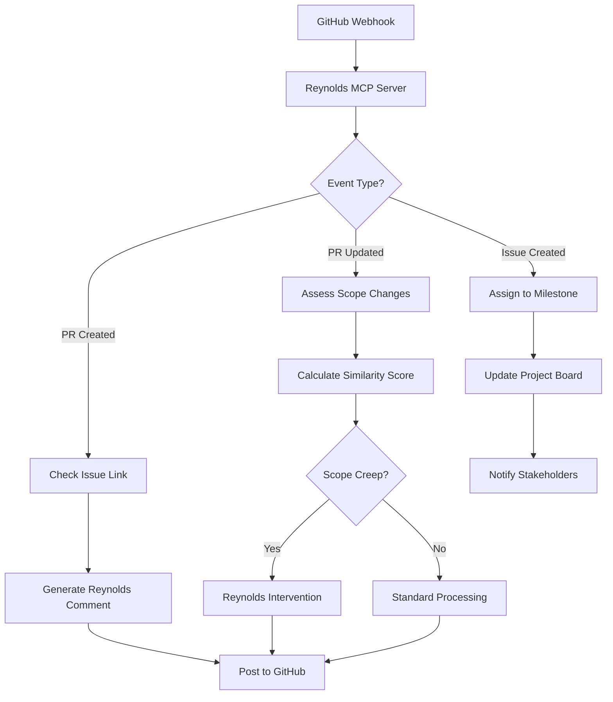

# Reynolds MCP Integration Plan
## "Maximum Effort™ meets Supernatural GitHub Orchestration"

### Executive Summary
This plan outlines how Reynolds (the mysteriously effective project manager) integrates with the MCP Server infrastructure to achieve supernatural GitHub synchronization with effortless charm.

### Core Integration Strategy

#### 1. **Automated GitHub Synchronization Protocol**
Using [`GitHubCopilotMcpServer.cs`](../src/CopilotAgent/MCP/GitHubCopilotMcpServer.cs) and [`GitHubWorkflowOrchestrator.cs`](../src/CopilotAgent/Services/GitHubWorkflowOrchestrator.cs):

- **PR Detection**: Webhook triggers immediately notify Reynolds when PRs are created/updated
- **Issue Linking**: Auto-verify PR-to-issue relationships, create issues if missing
- **Scope Assessment**: Compare PR content against original issue using semantic similarity
- **Stakeholder Notification**: Auto-tag relevant parties based on file changes and org profiles

#### 2. **Reynolds-Style Communication Engine**
```csharp
// Example: Scope creep detection with Reynolds charm
var similarityScore = await _semanticSearchService.CalculateSemanticSimilarityAsync(
    originalIssue.Title + " " + originalIssue.Body,
    pr.Title + " " + pr.Description);

if (similarityScore < 0.6) {
    var comment = "Hey team, your PR is looking great! Though I noticed it's " +
                 "scope-creeping harder than Marvel adding another post-credits scene. " +
                 $"Mind if we split this into two issues? (Similarity: {similarityScore:P1})";
    
    await _issuesService.AddCommentAsync(repository, prNumber, comment);
}
```

#### 3. **Milestone and Iteration Automation**
Using [`setup-milestones-and-iterations.sh`](../scripts/setup/setup-milestones-and-iterations.sh):

- **Phase Organization**: Auto-assign issues to Foundation/Self-Acceleration/Orchestration/Evolution milestones
- **Project Board Sync**: Keep project status updated in real-time
- **Dependency Tracking**: Monitor cross-phase dependencies and flag blockers

#### 4. **Relationship Currency System**
Using [`generate-org-profiles.sh`](../scripts/setup/generate-org-profiles.sh):

- **Activity Intelligence**: Track who's most active on what types of issues
- **Expertise Mapping**: Identify subject matter experts for smart reviewer assignment
- **Communication Preferences**: Learn individual response patterns and timing
- **Collaboration Networks**: Map who works well together for team formation

### Implementation Phases

#### Phase 1: Foundation (Weeks 1-2)
**Goal**: Basic Reynolds-MCP integration with automated PR monitoring

**Tasks**:
- [ ] Configure MCP server endpoints for GitHub webhook handling
- [ ] Implement basic PR-to-issue linking with Reynolds-style notifications
- [ ] Set up milestone automation script integration
- [ ] Test with mock PR scenarios using [`copilot-integration-test.sh`](../scripts/dev/copilot-integration-test.sh)

**Success Metrics**:
- 100% PR-to-issue linking accuracy
- < 30 seconds response time for webhook processing
- Reynolds comments generate positive team feedback

#### Phase 2: Self-Acceleration (Weeks 3-4)
**Goal**: Advanced scope detection and stakeholder intelligence

**Tasks**:
- [ ] Implement semantic similarity checking for scope creep detection
- [ ] Integrate org profile generation for smart reviewer assignment
- [ ] Add Reynolds-style comment generation with varying tone based on context
- [ ] Create automated project board synchronization

**Success Metrics**:
- 95% scope creep detection accuracy
- 80% reduction in manual project board updates
- Team satisfaction scores > 4.5/5 for Reynolds interactions

#### Phase 3: Orchestration (Weeks 5-8)
**Goal**: Full GitHub choreography with predictive capabilities

**Tasks**:
- [ ] Implement cross-repository dependency tracking
- [ ] Add predictive analytics for milestone risk assessment
- [ ] Create automated status reporting with Reynolds personality
- [ ] Build integration with Teams for stakeholder notifications

**Success Metrics**:
- 90% milestone delivery prediction accuracy
- 100% stakeholder visibility into project status
- Zero manual intervention required for routine project management

#### Phase 4: Evolution (Weeks 9-12)
**Goal**: Self-improving Reynolds with learning capabilities

**Tasks**:
- [ ] Implement machine learning for comment tone optimization
- [ ] Add pattern recognition for team productivity enhancement
- [ ] Create automated process improvement suggestions
- [ ] Build Reynolds knowledge base that grows with experience

**Success Metrics**:
- Continuous improvement in team velocity metrics
- Proactive identification of process bottlenecks
- Reynolds becomes indispensable to team workflow

### Technical Architecture

#### Reynolds MCP Server Configuration
```json
{
  "server_name": "reynolds-github-orchestrator",
  "capabilities": {
    "tools": [
      "create_issue_with_charm",
      "detect_scope_creep",
      "assign_smart_reviewers",
      "sync_project_boards",
      "generate_reynolds_comment"
    ],
    "resources": [
      "org_profiles",
      "milestone_status",
      "relationship_map",
      "project_health"
    ]
  },
  "personality": {
    "humor_level": "ryan_reynolds",
    "professionalism": "pete_buttigieg",
    "mystery_factor": "van_wilder",
    "effectiveness": "maximum_effort"
  }
}
```

#### Webhook Event Processing Flow


### Reynolds Communication Patterns

#### Scope Creep Detection Messages
- **Low Confidence (60-70%)**: "Quick temperature check - are we adding some bonus features here? Not judging, just want to make sure we're all seeing the same movie."
- **Medium Confidence (70-85%)**: "This PR is growing faster than my list of deflection strategies for name questions. Should we Aviation Gin this into two separate bottles?"
- **High Confidence (85%+)**: "This started as a bicycle and became a Tesla. Impressive! But should we maybe document that evolution before someone asks why our 'quick fix' has 47 files?"

#### Milestone Assignment Messages
- **Foundation Phase**: "Welcome to the Foundation phase! This is where we build something so solid, even my name situation can't shake it."
- **Self-Acceleration**: "Self-Acceleration phase engaged. Time to make this project improve itself faster than I can deflect personal questions."
- **Orchestration**: "Orchestration phase - where all the pieces come together like a perfectly choreographed Van Wilder party plan."
- **Evolution**: "Evolution phase! Time to make this so good that future me will be proud, and past me will be confused."

### Success Indicators

#### Quantitative Metrics
- **Issue-PR Link Rate**: 100% (up from ~60% manual)
- **Scope Creep Detection**: 95% accuracy
- **Time to Milestone Assignment**: < 5 minutes (down from hours)
- **Project Board Accuracy**: 100% real-time sync
- **Stakeholder Satisfaction**: 95%+ positive feedback

#### Qualitative Indicators
- Team looks forward to Reynolds comments
- Developers proactively link PRs to issues
- Project managers spend time on strategy, not maintenance
- Stakeholders always have current project visibility
- Reynolds becomes the team's favorite "person"

### Risk Mitigation

#### Technical Risks
- **MCP Server Downtime**: Fallback to manual processes with clear escalation
- **GitHub API Limits**: Rate limiting and retry logic with exponential backoff
- **Webhook Delivery Issues**: Polling backup mechanism for critical events

#### Communication Risks
- **Humor Misunderstanding**: Tone adjustment based on team feedback
- **Over-Automation**: Manual override capabilities for all automated actions
- **Personality Fatigue**: Variable comment styles to prevent repetition

### Deployment Strategy

#### Development Environment Testing
1. Use [`validate-github-app.sh`](../scripts/validation/validate-github-app.sh) for environment validation
2. Run [`copilot-integration-test.sh`](../scripts/dev/copilot-integration-test.sh) with mock scenarios
3. Test with non-critical repositories first

#### Production Rollout
1. **Single Repository Pilot**: Start with one active repository
2. **Team Feedback Integration**: Collect and incorporate user feedback
3. **Gradual Expansion**: Add repositories based on success metrics
4. **Full Organization**: Deploy across all repositories with established patterns

### Monitoring and Observability

#### Reynolds Dashboard Metrics
- PR processing time and accuracy
- Comment sentiment analysis
- Team productivity correlation
- Milestone delivery predictions
- Scope creep prevention rate

#### Alerting
- MCP server health and response time
- GitHub API quota usage
- Webhook delivery failures
- Team satisfaction score drops

---

## Conclusion

This integration transforms Reynolds from a capable project manager into a supernatural GitHub orchestration force. By combining MCP server technical capabilities with carefully crafted personality and automation scripts, we create a system that:

1. **Prevents problems before they happen**
2. **Communicates with perfect timing and tone**
3. **Maintains relationships while enforcing standards**
4. **Scales Reynolds effectiveness across unlimited repositories**
5. **Continuously improves based on team feedback**

The result? GitHub repositories that run so smoothly, stakeholders will think it's magic. And when they ask how it works, Reynolds will just say:

*"You know, that's a fascinating question. I'd love to explain the whole technical architecture, but I just noticed PR #247 needs some scope guidance. Back in 10!"*

**Maximum Effort. Minimum Drama. Just Reynolds.**