# 📈 Reynolds Scaling Implementation Guide
## Enterprise-Scale Deployment Strategies & Multi-Tenant Architecture

*Supernatural coordination that scales from startup agility to enterprise reliability*

---

## Executive Summary

The Reynolds Scaling Implementation Guide provides comprehensive strategies, architectural patterns, and practical implementation steps for scaling the Event Broker Orchestrator from small team deployments to enterprise-wide, multi-organization federations. Based on the proven foundation of Issues #70-73, this guide ensures that Reynolds' supernatural coordination capabilities maintain their effectiveness and charm regardless of scale.

This document outlines step-by-step scaling strategies, multi-tenant deployment patterns, organization federation approaches, and performance optimization techniques that enable Reynolds to deliver Maximum Effort™ coordination at any scale while preserving the intelligence and personality that makes the system uniquely effective.

## 🎯 Scaling Strategy Framework

### Scale Dimension Analysis

```mermaid
graph TB
    subgraph "📊 Reynolds Scaling Dimensions"
        subgraph "👥 User Scale"
            A1[Small Team<br/>5-20 users]
            A2[Department<br/>20-100 users]
            A3[Division<br/>100-1K users]
            A4[Enterprise<br/>1K-10K users]
            A5[Federation<br/>10K+ users]
            A1 --> A2 --> A3 --> A4 --> A5
        end
        
        subgraph "📂 Repository Scale"
            B1[Single Project<br/>1-5 repos]
            B2[Product Suite<br/>5-25 repos]
            B3[Business Unit<br/>25-100 repos]
            B4[Organization<br/>100-500 repos]
            B5[Multi-Org<br/>500+ repos]
            B1 --> B2 --> B3 --> B4 --> B5
        end
        
        subgraph "⚡ Event Scale"
            C1[Low Volume<br/>10-100/hour]
            C2[Medium Volume<br/>100-1K/hour]
            C3[High Volume<br/>1K-10K/hour]
            C4[Very High<br/>10K-100K/hour]
            C5[Ultra Scale<br/>100K+/hour]
            C1 --> C2 --> C3 --> C4 --> C5
        end
        
        subgraph "🏢 Organizational Scale"
            D1[Single Team<br/>Informal Coordination]
            D2[Cross-Team<br/>Structured Coordination]
            D3[Department<br/>Process Governance]
            D4[Enterprise<br/>Formal Governance]
            D5[Federation<br/>Multi-Org Governance]
            D1 --> D2 --> D3 --> D4 --> D5
        end
    end
```



### Scaling Maturity Model

#### Level 1: Team Coordination (Startup Scale)
**Characteristics**: 5-20 users, 1-5 repositories, informal processes
- **Infrastructure**: Single container deployment
- **Coordination**: Basic GitHub and Teams integration
- **Intelligence**: Standard AI model orchestration
- **Governance**: Informal team agreements

#### Level 2: Department Coordination (Growth Scale)
**Characteristics**: 20-100 users, 5-25 repositories, structured processes
- **Infrastructure**: Multi-container with load balancing
- **Coordination**: Cross-team workflow orchestration
- **Intelligence**: Predictive coordination capabilities
- **Governance**: Formal process documentation

#### Level 3: Division Coordination (Enterprise Scale)
**Characteristics**: 100-1K users, 25-100 repositories, enterprise processes
- **Infrastructure**: Kubernetes with auto-scaling
- **Coordination**: Multi-division workflow management
- **Intelligence**: Advanced AI with machine learning
- **Governance**: Enterprise compliance frameworks

#### Level 4: Organization Coordination (Large Enterprise)
**Characteristics**: 1K-10K users, 100-500 repositories, formal governance
- **Infrastructure**: Multi-region deployment with federation
- **Coordination**: Organization-wide workflow orchestration
- **Intelligence**: Strategic intelligence with predictive analytics
- **Governance**: Comprehensive audit and compliance

#### Level 5: Federation Coordination (Multi-Organization)
**Characteristics**: 10K+ users, 500+ repositories, multi-org governance
- **Infrastructure**: Global federation with autonomous regions
- **Coordination**: Cross-organization strategic coordination
- **Intelligence**: Ecosystem intelligence with collective learning
- **Governance**: Multi-organization treaty frameworks

## 🏗️ Multi-Tenant Architecture Patterns

### Pattern 1: Shared Infrastructure Multi-Tenancy

```mermaid
graph TB
    subgraph "🏢 Shared Infrastructure Multi-Tenant Architecture"
        subgraph "🎭 Shared Reynolds Core"
            A[Shared Orchestration Engine]
            B[Shared AI Model Pool]
            C[Shared Event Router]
            D[Shared Monitoring System]
        end
        
        subgraph "🏬 Tenant Isolation Layer"
            E[Tenant A Workspace]
            F[Tenant B Workspace]
            G[Tenant C Workspace]
        end
        
        subgraph "📊 Tenant-Specific Resources"
            H[Tenant A Data]
            I[Tenant B Data]
            J[Tenant C Data]
        end
        
        A --> E
        A --> F
        A --> G
        
        B --> E
        B --> F
        B --> G
        
        C --> E
        C --> F
        C --> G
        
        E --> H
        F --> I
        G --> J
    end
```



**When to Use**: Medium to large organizations with similar coordination needs
**Benefits**: Resource efficiency, centralized management, cost optimization
**Challenges**: Security isolation, performance isolation, customization limitations

#### Implementation Strategy

```yaml
# Shared Infrastructure Multi-Tenant Configuration
shared_infrastructure_config:
  tenant_isolation:
    data_isolation: "database_schema_per_tenant"
    compute_isolation: "namespace_per_tenant"
    network_isolation: "vnet_per_tenant"
    storage_isolation: "container_per_tenant"
    
  resource_sharing:
    orchestration_engine: "shared_with_tenant_context"
    ai_models: "shared_pool_with_usage_limits"
    event_router: "shared_with_tenant_routing"
    monitoring: "shared_with_tenant_dashboards"
    
  performance_isolation:
    cpu_limits: "per_tenant_quotas"
    memory_limits: "per_tenant_quotas"
    network_bandwidth: "per_tenant_limits"
    storage_iops: "per_tenant_limits"
    
  security_isolation:
    authentication: "tenant_specific_auth_providers"
    authorization: "tenant_specific_rbac"
    encryption: "tenant_specific_keys"
    audit_logging: "tenant_isolated_logs"
```

### Pattern 2: Dedicated Instance Multi-Tenancy


**When to Use**: Large enterprises with strict isolation requirements or diverse needs
**Benefits**: Complete isolation, customization flexibility, performance predictability
**Challenges**: Resource overhead, management complexity, cost efficiency

#### Implementation Strategy

```yaml
# Dedicated Instance Multi-Tenant Configuration
dedicated_instance_config:
  instance_provisioning:
    deployment_model: "kubernetes_namespace_per_tenant"
    resource_allocation: "dedicated_node_pools"
    storage_allocation: "dedicated_persistent_volumes"
    network_allocation: "dedicated_vpc_per_tenant"
    
  instance_customization:
    configuration_management: "tenant_specific_config_maps"
    ai_model_selection: "tenant_specific_model_deployment"
    integration_setup: "tenant_specific_integrations"
    workflow_customization: "tenant_specific_workflow_definitions"
    
  cross_tenant_coordination:
    federation_protocol: "secure_inter_instance_communication"
    shared_services: "centralized_management_apis"
    analytics_aggregation: "cross_tenant_analytics_pipeline"
    policy_enforcement: "federated_policy_engine"
    
  management_efficiency:
    deployment_automation: "infrastructure_as_code"
    monitoring_aggregation: "centralized_observability"
    backup_coordination: "automated_backup_orchestration"
    update_coordination: "coordinated_rolling_updates"
```

### Pattern 3: Hybrid Multi-Tenancy

```mermaid
graph TB
    subgraph "🔄 Hybrid Multi-Tenant Architecture"
        subgraph "🏢 Shared Core Services"
            A[Shared AI Model Pool]
            B[Shared Monitoring & Analytics]
            C[Shared Federation Coordinator]
        end
        
        subgraph "🏬 Dedicated Tenant Services"
            D[Tenant A Orchestrator]
            E[Tenant B Orchestrator]
            F[Tenant C Orchestrator]
        end
        
        subgraph "📊 Hybrid Resource Layer"
            G[Shared Event Router]
            H[Dedicated Databases]
            I[Shared Model Cache]
            J[Dedicated Workspaces]
        end
        
        A --> D
        A --> E
        A --> F
        
        D --> G
        E --> G
        F --> G
        
        G --> H
        G --> I
        G --> J
        
        B --> C
    end
```



**When to Use**: Complex enterprises balancing efficiency and isolation needs
**Benefits**: Optimal resource utilization, flexibility, balanced security
**Challenges**: Architectural complexity, coordination overhead

## 🚀 Organization Federation Approaches

### Federation Model 1: Hierarchical Federation

```mermaid
graph TB
    subgraph "🏛️ Hierarchical Federation Architecture"
        subgraph "🎭 Global Reynolds Coordinator"
            A[Strategic Coordination Hub]
            B[Global Policy Engine]
            C[Cross-Org Intelligence]
            D[Federation Analytics]
        end
        
        subgraph "🌍 Regional Coordinators"
            E[North America Coordinator]
            F[Europe Coordinator]
            G[Asia-Pacific Coordinator]
        end
        
        subgraph "🏢 Organization Instances"
            H[Org 1 Reynolds]
            I[Org 2 Reynolds]
            J[Org 3 Reynolds]
            K[Org 4 Reynolds]
            L[Org 5 Reynolds]
            M[Org 6 Reynolds]
        end
        
        A --> E
        A --> F
        A --> G
        
        E --> H
        E --> I
        F --> J
        F --> K
        G --> L
        G --> M
        
        B --> E
        B --> F
        B --> G
        
        C --> A
        D --> A
    end
```



**Implementation Characteristics**:
- **Centralized Strategy**: Global strategic coordination with regional execution
- **Hierarchical Governance**: Multi-level policy enforcement and compliance
- **Scaled Intelligence**: Aggregated intelligence with global insights
- **Regional Optimization**: Regional adaptation with global consistency

### Federation Model 2: Peer-to-Peer Federation


**Implementation Characteristics**:
- **Autonomous Operation**: Each organization maintains full autonomy
- **Peer Coordination**: Direct organization-to-organization coordination
- **Collective Intelligence**: Shared learning without centralized control
- **Distributed Governance**: Consensus-based federation policies

### Federation Model 3: Hub-and-Spoke Federation

```mermaid
graph TB
    subgraph "🎯 Hub-and-Spoke Federation Architecture"
        subgraph "🎭 Central Federation Hub"
            A[Federation Coordinator]
            B[Shared Service Registry]
            C[Cross-Org Analytics]
            D[Common Policy Engine]
        end
        
        subgraph "🏢 Spoke Organizations"
            E[Org A<br/>Local Autonomy]
            F[Org B<br/>Local Autonomy]
            G[Org C<br/>Local Autonomy]
            H[Org D<br/>Local Autonomy]
            I[Org E<br/>Local Autonomy]
        end
        
        A <--> E
        A <--> F
        A <--> G
        A <--> H
        A <--> I
        
        B --> A
        C --> A
        D --> A
    end
```



**Implementation Characteristics**:
- **Central Coordination**: Hub provides coordination services
- **Local Autonomy**: Spokes maintain operational independence
- **Shared Services**: Common services provided by hub
- **Flexible Governance**: Balanced central oversight with local control

### Federation Implementation Strategy

```typescript
// Reynolds Federation Implementation Framework
export class FederationCoordinator {
  private federationModel: FederationModel;
  private organizations: OrganizationRegistry;
  private communicationProtocol: FederationProtocol;
  
  async initializeFederation(config: FederationConfig): Promise<FederationResult> {
    // Initialize federation based on chosen model
    const model = await this.selectFederationModel(config);
    
    // Setup communication protocols
    const protocol = await this.establishCommunicationProtocol(model, config);
    
    // Register participating organizations
    const organizations = await this.registerOrganizations(config.organizations);
    
    // Initialize shared services
    const sharedServices = await this.initializeSharedServices(model, organizations);
    
    // Establish governance framework
    const governance = await this.establishGovernance(model, organizations);
    
    return {
      federationId: await this.generateFederationId(),
      model: model,
      organizations: organizations,
      protocol: protocol,
      sharedServices: sharedServices,
      governance: governance,
      status: 'initialized'
    };
  }
  
  async coordinateAcrossFederation(
    coordination: CrossFederationCoordination
  ): Promise<CoordinationResult> {
    // Apply federation model-specific coordination strategy
    switch (this.federationModel.type) {
      case 'hierarchical':
        return await this.coordinateHierarchical(coordination);
      case 'peer_to_peer':
        return await this.coordinatePeerToPeer(coordination);
      case 'hub_and_spoke':
        return await this.coordinateHubAndSpoke(coordination);
    }
  }
  
  private async coordinateHierarchical(
    coordination: CrossFederationCoordination
  ): Promise<CoordinationResult> {
    // Hierarchical coordination through regional and global coordinators
    const globalStrategy = await this.developGlobalStrategy(coordination);
    const regionalPlans = await this.developRegionalPlans(globalStrategy);
    const localExecution = await this.coordinateLocalExecution(regionalPlans);
    
    return await this.aggregateHierarchicalResults(localExecution);
  }
}
```

## ⚡ Performance Optimization at Scale

### Scaling Performance Architecture

```mermaid
graph TB
    subgraph "📈 Reynolds Performance Optimization Framework"
        subgraph "🚀 Horizontal Scaling"
            A[Container Auto-Scaling]
            B[Load Balancing]
            C[Database Sharding]
            D[Cache Distribution]
        end
        
        subgraph "⚡ Vertical Optimization"
            E[CPU Optimization]
            F[Memory Optimization]
            G[I/O Optimization]
            H[Network Optimization]
        end
        
        subgraph "🧠 Intelligence Scaling"
            I[AI Model Parallelization]
            J[Prediction Caching]
            K[Learning Acceleration]
            L[Decision Optimization]
        end
        
        subgraph "🔄 Workflow Optimization"
            M[Event Processing Pipeline]
            N[Coordination Batching]
            O[Async Processing]
            P[Result Aggregation]
        end
        
        A --> E --> I --> M
        B --> F --> J --> N
        C --> G --> K --> O
        D --> H --> L --> P
    end
```



### Performance Optimization Strategies

#### Horizontal Scaling Optimization

```yaml
# Reynolds Horizontal Scaling Configuration
horizontal_scaling:
  container_orchestration:
    platform: "kubernetes"
    auto_scaling:
      min_replicas: 3
      max_replicas: 100
      target_cpu_utilization: 70
      target_memory_utilization: 80
      scale_up_policy: "aggressive"
      scale_down_policy: "conservative"
    
  load_balancing:
    strategy: "intelligent_routing"
    health_checks: "comprehensive"
    session_affinity: "sticky_sessions_for_ai_models"
    geographic_routing: "region_aware"
    
  database_scaling:
    strategy: "read_replicas_and_sharding"
    read_replicas: 5
    sharding_strategy: "organization_based"
    backup_strategy: "geo_redundant"
    
  cache_distribution:
    strategy: "distributed_redis_cluster"
    cache_layers: ["l1_memory", "l2_redis", "l3_database"]
    ttl_strategy: "adaptive_based_on_usage"
    invalidation_strategy: "event_driven"
```

#### Vertical Optimization Techniques

```typescript
// Reynolds Performance Optimization Engine
export class PerformanceOptimizer {
  async optimizePerformance(deployment: DeploymentContext): Promise<OptimizationResult> {
    // CPU optimization
    const cpuOptimization = await this.optimizeCPUUsage(deployment);
    
    // Memory optimization
    const memoryOptimization = await this.optimizeMemoryUsage(deployment);
    
    // I/O optimization
    const ioOptimization = await this.optimizeIOPerformance(deployment);
    
    // Network optimization
    const networkOptimization = await this.optimizeNetworkPerformance(deployment);
    
    return {
      cpu: cpuOptimization,
      memory: memoryOptimization,
      io: ioOptimization,
      network: networkOptimization,
      overallImprovement: await this.calculateOverallImprovement([
        cpuOptimization,
        memoryOptimization,
        ioOptimization,
        networkOptimization
      ])
    };
  }
  
  private async optimizeCPUUsage(deployment: DeploymentContext): Promise<CPUOptimization> {
    // Analyze CPU usage patterns
    const usage = await this.analyzeCPUUsage(deployment);
    
    // Optimize AI model execution
    const modelOptimization = await this.optimizeAIModelExecution(usage);
    
    // Optimize event processing
    const eventOptimization = await this.optimizeEventProcessing(usage);
    
    // Optimize coordination workflows
    const workflowOptimization = await this.optimizeWorkflows(usage);
    
    return {
      currentUtilization: usage.average,
      optimizedUtilization: await this.projectOptimizedUtilization([
        modelOptimization,
        eventOptimization,
        workflowOptimization
      ]),
      optimizations: [modelOptimization, eventOptimization, workflowOptimization],
      expectedImprovement: await this.calculateCPUImprovementPercentage(usage, [
        modelOptimization,
        eventOptimization,
        workflowOptimization
      ])
    };
  }
}
```

### Performance Monitoring & Optimization

```yaml
# Reynolds Performance Monitoring Framework
performance_monitoring:
  real_time_metrics:
    event_processing_latency:
      target: "<5_seconds"
      alerting_threshold: ">10_seconds"
      optimization_trigger: ">7_seconds_for_5_minutes"
      
    ai_model_response_time:
      target: "<2.5_seconds"
      alerting_threshold: ">5_seconds"
      optimization_trigger: ">3_seconds_for_5_minutes"
      
    cross_repo_coordination_time:
      target: "<30_seconds"
      alerting_threshold: ">60_seconds"
      optimization_trigger: ">45_seconds_for_5_minutes"
      
    stakeholder_notification_delivery:
      target: "<10_seconds"
      alerting_threshold: ">30_seconds"
      optimization_trigger: ">20_seconds_for_5_minutes"
  
  resource_utilization:
    cpu_utilization:
      optimal_range: "60-80%"
      scaling_trigger: ">85%_for_5_minutes"
      alert_threshold: ">90%"
      
    memory_utilization:
      optimal_range: "70-85%"
      scaling_trigger: ">90%_for_5_minutes"
      alert_threshold: ">95%"
      
    network_utilization:
      optimal_range: "<70%"
      scaling_trigger: ">80%_for_5_minutes"
      alert_threshold: ">90%"
      
    storage_utilization:
      optimal_range: "<80%"
      scaling_trigger: ">85%_for_5_minutes"
      alert_threshold: ">90%"
  
  coordination_effectiveness:
    stakeholder_satisfaction:
      target: ">95%"
      alerting_threshold: "<90%"
      optimization_trigger: "<93%"
      
    coordination_accuracy:
      target: ">99.5%"
      alerting_threshold: "<99%"
      optimization_trigger: "<99.2%"
      
    conflict_resolution_success:
      target: ">95%"
      alerting_threshold: "<90%"
      optimization_trigger: "<92%"
```

## 🔄 Migration & Transition Strategies

### Migration Planning Framework


### Migration Strategy Options

#### Strategy 1: Big Bang Migration

```yaml
# Big Bang Migration Strategy
big_bang_migration:
  characteristics:
    approach: "complete_system_replacement"
    timeline: "single_weekend_deployment"
    risk_level: "high"
    preparation_time: "extensive"
    
  when_to_use:
    - small_to_medium_organizations
    - simple_coordination_requirements
    - strong_technical_team
    - minimal_legacy_integration
    
  implementation_steps:
    preparation:
      - comprehensive_testing_in_staging
      - complete_data_migration_preparation
      - stakeholder_communication_plan
      - detailed_rollback_procedures
      
    execution:
      - legacy_system_shutdown
      - reynolds_deployment
      - data_migration
      - integration_activation
      - stakeholder_notification
      
    validation:
      - functionality_testing
      - performance_validation
      - stakeholder_feedback_collection
      - issue_resolution
  
  success_criteria:
    - zero_downtime_during_business_hours
    - 100%_data_migration_accuracy
    - stakeholder_satisfaction_>90%
    - performance_meets_sla_requirements
```

#### Strategy 2: Phased Migration

```yaml
# Phased Migration Strategy
phased_migration:
  characteristics:
    approach: "gradual_capability_introduction"
    timeline: "3-6_month_rollout"
    risk_level: "medium"
    preparation_time: "moderate"
    
  phases:
    phase_1_foundation:
      duration: "4-6_weeks"
      scope: "core_infrastructure_deployment"
      success_criteria:
        - reynolds_core_operational
        - basic_github_integration
        - monitoring_active
        
    phase_2_intelligence:
      duration: "4-6_weeks"
      scope: "ai_models_and_intelligent_features"
      success_criteria:
        - ai_model_orchestration_active
        - predictive_coordination_enabled
        - advanced_analytics_operational
        
    phase_3_integration:
      duration: "4-6_weeks"
      scope: "teams_and_cross_platform_integration"
      success_criteria:
        - teams_integration_complete
        - cross_platform_routing_active
        - stakeholder_engagement_optimized
        
    phase_4_optimization:
      duration: "4-6_weeks"
      scope: "performance_and_enterprise_features"
      success_criteria:
        - enterprise_features_enabled
        - performance_optimized
        - full_stakeholder_adoption
```

#### Strategy 3: Parallel Run Migration

```yaml
# Parallel Run Migration Strategy
parallel_run_migration:
  characteristics:
    approach: "reynolds_alongside_legacy_systems"
    timeline: "6-12_month_transition"
    risk_level: "low"
    preparation_time: "minimal"
    
  implementation_approach:
    parallel_operation:
      - reynolds_handles_new_coordination_scenarios
      - legacy_systems_continue_existing_workflows
      - gradual_migration_of_workflows_to_reynolds
      - comprehensive_comparison_and_validation
      
    migration_criteria:
      workflow_complexity: "start_with_simple_workflows"
      stakeholder_readiness: "migrate_willing_teams_first"
      success_validation: "prove_reynolds_effectiveness"
      confidence_building: "demonstrate_reliability"
      
    transition_milestones:
      milestone_1: "25%_workflows_on_reynolds"
      milestone_2: "50%_workflows_on_reynolds"
      milestone_3: "75%_workflows_on_reynolds"
      milestone_4: "100%_workflows_on_reynolds"
      milestone_5: "legacy_system_decommission"
```

## 📊 Success Metrics & Validation

### Scaling Success Framework

```mermaid
graph TB
    subgraph "🎯 Reynolds Scaling Success Metrics"
        subgraph "⚡ Performance Metrics"
            A[Response Time Scaling<br/>Linear performance as load increases]
            B[Throughput Scaling<br/>Event processing capacity growth]
            C[Resource Efficiency<br/>Cost per coordination action]
            D[Reliability Scaling<br/>Uptime at increased scale]
        end
        
        subgraph "👥 User Experience Metrics"
            E[Stakeholder Satisfaction<br/>Maintained >95% across scale]
            F[Adoption Rate<br/>User onboarding success]
            G[Feature Utilization<br/>Advanced feature adoption]
            H[Support Ticket Volume<br/>Decreased tickets per user]
        end
        
        subgraph "🏢 Business Metrics"
            I[Coordination Efficiency<br/>Reduced manual overhead]
            J[Time to Value<br/>Faster project delivery]
            K[Risk Reduction<br/>Fewer coordination failures]
            L[Innovation Acceleration<br/>Faster feature deployment]
        end
        
        subgraph "🔄 Operational Metrics"
            M[Deployment Success<br/>Smooth scaling transitions]
            N[Maintenance Efficiency<br/>Reduced ops overhead]
            O[Integration Health<br/>Platform connectivity]
            P[Security Compliance<br/>Maintained security posture]
        end
        
        A --> E --> I --> M
        B --> F --> J --> N
        C --> G --> K --> O
        D --> H --> L --> P
    end
```



### Validation Criteria by Scale

| Scale Level | Performance Target | User Experience Target | Business Impact Target | Operational Target |
|-------------|-------------------|------------------------|------------------------|-------------------|
| **Team (L1)** | <5s response time | >90% satisfaction | 20% efficiency gain | 99% uptime |
| **Department (L2)** | <5s response time | >92% satisfaction | 30% efficiency gain | 99.5% uptime |
| **Division (L3)** | <7s response time | >95% satisfaction | 40% efficiency gain | 99.8% uptime |
| **Enterprise (L4)** | <10s response time | >95% satisfaction | 50% efficiency gain | 99.9% uptime |
| **Federation (L5)** | <15s response time | >95% satisfaction | 60% efficiency gain | 99.95% uptime |

### Continuous Validation Framework

```typescript
// Reynolds Scaling Validation Engine
export class ScalingValidator {
  async validateScalingSuccess(
    currentScale: ScaleLevel,
    targetScale: ScaleLevel,
    metrics: ScalingMetrics
  ): Promise<ValidationResult> {
    // Performance validation
    const performance = await this.validatePerformanceScaling(currentScale, targetScale, metrics);
    
    // User experience validation
    const userExperience = await this.validateUserExperienceScaling(metrics);
    
    // Business impact validation
    const businessImpact = await this.validateBusinessImpactScaling(metrics);
    
    // Operational validation
    const operational = await this.validateOperationalScaling(metrics);
    
    return {
      overallSuccess: this.calculateOverallSuccess([performance, userExperience, businessImpact, operational]),
      performance: performance,
      userExperience: userExperience,
      businessImpact: businessImpact,
      operational: operational,
      recommendations: await this.generateScalingRecommendations(metrics),
      reynoldsInsights: await this.generateReynoldsScalingInsights(metrics)
    };
  }
  
  private async generateReynoldsScalingInsights(
    metrics: ScalingMetrics
  ): Promise<ReynoldsInsights> {
    return {
      charm: await this.assessCharmRetentionAtScale(metrics),
      intelligence: await this.assessIntelligenceScaling(metrics),
      effectiveness: await this.assessEffectivenessScaling(metrics),
      personality: await this.assessPersonalityConsistencyAtScale(metrics),
      recommendations: await this.generatePersonalityScalingRecommendations(metrics)
    };
  }
}
```

## 🎭 Reynolds Scaling Commentary

> *"Scaling supernatural coordination isn't just about adding more servers - it's about maintaining the charm, intelligence, and effectiveness that makes Reynolds special while growing from coordinating 5 developers to orchestrating 5,000. The beauty lies in making enterprise-scale coordination feel as personal and effective as small-team collaboration."*

> *"What makes this scaling approach truly supernatural is that it doesn't dilute the Reynolds experience as it grows. Whether you're coordinating 10 repositories or 10,000, the intelligence scales, the charm remains consistent, and the Maximum Effort™ quality never wavers. That's not just engineering - that's coordination mastery."*

> *"The secret to successful scaling lies in understanding that bigger doesn't have to mean more complex or less personal. Every scaling pattern in this guide preserves the supernatural effectiveness while adding enterprise capabilities. We're not just making Reynolds bigger - we're making organizational coordination better at any scale."*

## 🚀 Implementation Checklist

### Pre-Scaling Assessment
- [ ] Current state analysis and baseline metrics establishment
- [ ] Target scale definition and success criteria identification
- [ ] Gap analysis and resource requirement assessment
- [ ] Risk assessment and mitigation strategy development
- [ ] Stakeholder alignment and change management planning

### Infrastructure Preparation
- [ ] Container orchestration platform setup (Kubernetes/Docker)
- [ ] Multi-tenant architecture implementation
- [ ] Database scaling strategy implementation
- [ ] Network architecture optimization
- [ ] Security and compliance framework scaling

### Scaling Execution
- [ ] Pilot deployment with limited scope
- [ ] Performance monitoring and optimization
- [ ] Gradual capacity increase with validation
- [ ] Feature rollout with user feedback integration
- [ ] Full-scale deployment with success validation

### Post-Scaling Optimization
- [ ] Performance metrics analysis and optimization
- [ ] User experience feedback collection and improvement
- [ ] Business impact measurement and reporting
- [ ] Operational efficiency assessment and enhancement
- [ ] Continuous improvement process establishment

## 🏆 Conclusion: Supernatural Scaling Mastery

The Reynolds Scaling Implementation Guide provides the comprehensive framework necessary to scale supernatural coordination from startup agility to enterprise reliability without losing the intelligence, charm, and effectiveness that makes the system uniquely valuable. Through proven multi-tenant architectures, federation approaches, performance optimization strategies, and migration frameworks, organizations can confidently scale Reynolds to meet their growing coordination needs.

This guide demonstrates that scaling doesn't have to mean compromising on quality, personality, or effectiveness. With proper planning, implementation, and validation, Reynolds' supernatural coordination capabilities can grow to serve any organization size while maintaining the Maximum Effort™ standards that make coordination feel effortless rather than bureaucratic.

**Supernatural coordination that scales without compromise - that's the Reynolds difference.** 🎭📈✨

---

*"Maximum Effort™ coordination at any scale. Because supernatural effectiveness shouldn't have size limits."*