# 🚀 Reynolds Event Broker Strategic Recommendations
## Future Evolution & Strategic Guidance for Supernatural Coordination

*Strategic intelligence for Maximum Effort™ organizational transformation*

---

## Executive Summary

The Reynolds Event Broker Strategic Recommendations provide comprehensive guidance for organizations to maximize the value of their supernatural coordination investment while positioning for future innovation and competitive advantage. Based on the proven success of Issues #70-73 and the comprehensive strategic analysis, these recommendations outline technology evolution, organizational change strategies, skills development programs, and partnership opportunities that will ensure long-term success and continuous value realization.

This strategic guidance transforms the Reynolds Event Broker from a coordination tool into a foundational organizational capability that drives innovation, competitive advantage, and sustainable growth through supernatural coordination excellence.

## 🎯 Strategic Vision & Positioning

### Reynolds as Organizational Competitive Advantage

```mermaid
graph TB
    subgraph "🎭 Reynolds Strategic Positioning Framework"
        subgraph "🏗️ Foundation Capabilities"
            A[Operational Excellence<br/>Supernatural Coordination Efficiency]
            B[Technical Leadership<br/>Advanced AI Integration]
            C[Cultural Transformation<br/>Enhanced Collaboration]
            D[Process Innovation<br/>Intelligent Automation]
        end
        
        subgraph "🚀 Competitive Differentiation"
            E[Speed Advantage<br/>Faster Decision Making & Execution]
            F[Quality Leadership<br/>Reduced Errors & Improved Outcomes]
            G[Innovation Acceleration<br/>Rapid Feature Development & Deployment]
            H[Stakeholder Experience<br/>Superior Engagement & Satisfaction]
        end
        
        subgraph "🌟 Strategic Outcomes"
            I[Market Leadership<br/>Industry-Leading Coordination Capabilities]
            J[Talent Attraction<br/>Preferred Employer for Top Talent]
            K[Customer Advantage<br/>Superior Product Development Speed]
            L[Partnership Premium<br/>Preferred Partner for Collaboration]
        end
        
        A --> E --> I
        B --> F --> J
        C --> G --> K
        D --> H --> L
    end
```



### Strategic Value Proposition Evolution

#### Current State: Coordination Excellence
- **Operational Efficiency**: 40%+ improvement in coordination effectiveness
- **Quality Enhancement**: 60%+ reduction in coordination-related errors
- **Speed Optimization**: 50%+ faster issue resolution and decision making
- **Stakeholder Satisfaction**: 95%+ positive feedback on coordination experience

#### Strategic Evolution: Organizational Intelligence
- **Predictive Coordination**: Anticipate and prevent coordination challenges before they occur
- **Strategic Decision Support**: AI-enhanced insights for strategic planning and resource allocation
- **Innovation Orchestration**: Supernatural coordination applied to innovation and product development
- **Ecosystem Intelligence**: Cross-organizational learning and optimization

#### Future Vision: Coordination as Competitive Moat
- **Industry Leadership**: Setting new standards for organizational coordination excellence
- **Ecosystem Platform**: Foundation for partner and customer coordination integration
- **Innovation Engine**: Coordination capabilities that accelerate innovation and time-to-market
- **Strategic Asset**: Coordination as a defendable competitive advantage

## 📈 Technology Evolution Roadmap

### Phase 1: Intelligence Enhancement (Months 1-6)

#### Advanced AI Integration
```yaml
# Advanced AI Capabilities Roadmap
ai_enhancement_strategy:
  machine_learning_optimization:
    predictive_analytics:
      - coordination_failure_prediction
      - resource_conflict_forecasting
      - stakeholder_satisfaction_prediction
      - project_delivery_timeline_prediction
      
    learning_systems:
      - stakeholder_preference_learning
      - organizational_pattern_recognition
      - communication_style_optimization
      - workflow_efficiency_improvement
      
    natural_language_processing:
      - advanced_sentiment_analysis
      - context_aware_communication_generation
      - multi_language_coordination_support
      - cultural_intelligence_enhancement
      
  autonomous_coordination:
    decision_automation:
      - routine_coordination_decisions
      - resource_allocation_optimization
      - priority_conflict_resolution
      - stakeholder_routing_intelligence
      
    self_healing_systems:
      - automatic_error_recovery
      - performance_optimization
      - configuration_self_tuning
      - capacity_auto_scaling
```

#### Enhanced Reynolds Personality Engine
```typescript
// Advanced Reynolds Personality Engine
export class AdvancedReynoldsPersonality {
  private personalityEngine: PersonalityEngine;
  private culturalIntelligence: CulturalIntelligenceEngine;
  private emotionalIntelligence: EmotionalIntelligenceEngine;
  private contextualAdaptation: ContextualAdaptationEngine;
  
  async generateAdvancedPersonalityResponse(
    context: CommunicationContext,
    stakeholder: StakeholderProfile,
    situation: SituationAnalysis
  ): Promise<PersonalityEnhancedResponse> {
    // Advanced personality analysis
    const personalityProfile = await this.analyzeAdvancedPersonalityNeeds(
      context, stakeholder, situation
    );
    
    // Cultural intelligence adaptation
    const culturalAdaptation = await this.culturalIntelligence.adaptForContext(
      personalityProfile, stakeholder.culturalContext
    );
    
    // Emotional intelligence integration
    const emotionalContext = await this.emotionalIntelligence.analyzeEmotionalState(
      context, stakeholder, situation
    );
    
    // Contextual adaptation
    const contextualResponse = await this.contextualAdaptation.adaptResponse(
      personalityProfile, culturalAdaptation, emotionalContext
    );
    
    return {
      basePersonality: personalityProfile,
      culturalAdaptation: culturalAdaptation,
      emotionalIntelligence: emotionalContext,
      contextualResponse: contextualResponse,
      confidenceScore: await this.calculatePersonalityConfidence(contextualResponse),
      expectedEffectiveness: await this.predictResponseEffectiveness(contextualResponse, stakeholder)
    };
  }
  
  private async analyzeAdvancedPersonalityNeeds(
    context: CommunicationContext,
    stakeholder: StakeholderProfile,
    situation: SituationAnalysis
  ): Promise<AdvancedPersonalityProfile> {
    return {
      charmLevel: await this.calculateOptimalCharmLevel(context, stakeholder, situation),
      humorStyle: await this.selectOptimalHumorStyle(stakeholder, situation),
      confidenceExpression: await this.adaptConfidenceExpression(context, situation),
      empathyLevel: await this.calculateRequiredEmpathy(stakeholder, situation),
      professionalismBalance: await this.balanceProfessionalismWithPersonality(context, stakeholder),
      culturalSensitivity: await this.assessCulturalSensitivityNeeds(stakeholder, situation)
    };
  }
}
```

### Phase 2: Ecosystem Integration (Months 7-12)

#### Platform Ecosystem Expansion
```yaml
# Platform Integration Expansion Strategy
ecosystem_integration:
  development_platforms:
    - gitlab_enterprise_integration
    - azure_devops_services_integration
    - jira_atlassian_suite_integration
    - servicenow_platform_integration
    
  communication_platforms:
    - slack_enterprise_grid_integration
    - discord_server_management
    - mattermost_enterprise_integration
    - webex_teams_integration
    
  cloud_platforms:
    - aws_comprehensive_integration
    - google_cloud_platform_integration
    - multi_cloud_orchestration
    - hybrid_cloud_coordination
    
  business_platforms:
    - salesforce_ecosystem_integration
    - microsoft_dynamics_integration
    - sap_enterprise_integration
    - oracle_cloud_applications
    
  ai_ml_platforms:
    - openai_platform_integration
    - anthropic_claude_integration
    - google_vertex_ai_integration
    - amazon_bedrock_integration
```

#### Cross-Organization Federation


### Phase 3: Innovation Platform (Months 13-18)

#### Coordination as a Service (CaaS)
```yaml
# Coordination as a Service Platform
caas_platform:
  service_offerings:
    coordination_api:
      - real_time_coordination_services
      - batch_coordination_processing
      - event_driven_coordination
      - webhook_coordination_integration
      
    intelligence_services:
      - predictive_coordination_analytics
      - stakeholder_intelligence_api
      - conflict_resolution_services
      - optimization_recommendation_engine
      
    personality_services:
      - custom_personality_development
      - cultural_adaptation_services
      - communication_optimization
      - relationship_intelligence
      
    integration_marketplace:
      - third_party_connector_ecosystem
      - custom_integration_development
      - api_gateway_management
      - webhook_management_services
      
  monetization_strategy:
    usage_based_pricing:
      - coordination_events_processed
      - ai_model_invocations
      - integration_api_calls
      - storage_and_analytics
      
    subscription_tiers:
      - basic_coordination_services
      - professional_intelligence_features
      - enterprise_advanced_capabilities
      - platform_white_label_solutions
      
    value_added_services:
      - custom_implementation_consulting
      - specialized_industry_solutions
      - training_and_certification_programs
      - premium_support_and_success_management
```

## 🏢 Organizational Change Strategy

### Cultural Transformation Framework

#### Phase 1: Coordination Culture Development (Months 1-3)
```yaml
# Coordination Culture Transformation
culture_development:
  leadership_transformation:
    executive_coaching:
      - coordination_leadership_development
      - supernatural_coordination_modeling
      - stakeholder_engagement_excellence
      - decision_making_optimization
      
    management_enablement:
      - coordination_management_training
      - team_coordination_facilitation
      - conflict_resolution_mastery
      - performance_optimization_coaching
      
  team_culture_evolution:
    collaboration_excellence:
      - cross_functional_coordination_skills
      - stakeholder_empathy_development
      - communication_effectiveness_training
      - relationship_building_mastery
      
    coordination_mindset:
      - proactive_coordination_thinking
      - systems_thinking_development
      - stakeholder_impact_awareness
      - quality_excellence_commitment
      
  organizational_behavior_change:
    coordination_rituals:
      - daily_coordination_check_ins
      - weekly_stakeholder_alignment
      - monthly_coordination_retrospectives
      - quarterly_coordination_excellence_reviews
      
    recognition_systems:
      - coordination_excellence_awards
      - stakeholder_satisfaction_recognition
      - innovation_through_coordination_rewards
      - maximum_effort_achievement_celebration
```

#### Phase 2: Innovation Culture Integration (Months 4-8)
```yaml
# Innovation Through Coordination Culture
innovation_culture:
  innovation_coordination_practices:
    ideation_coordination:
      - cross_functional_ideation_sessions
      - stakeholder_driven_innovation
      - coordination_enabled_experimentation
      - rapid_prototype_coordination
      
    development_coordination:
      - agile_coordination_practices
      - continuous_stakeholder_feedback
      - cross_team_innovation_sharing
      - coordination_driven_iteration
      
  learning_organization_development:
    continuous_learning:
      - coordination_skills_development
      - technology_adaptation_learning
      - stakeholder_relationship_improvement
      - innovation_methodology_mastery
      
    knowledge_sharing:
      - coordination_best_practice_sharing
      - cross_team_learning_sessions
      - stakeholder_insight_distribution
      - innovation_pattern_recognition
      
  measurement_driven_improvement:
    coordination_analytics:
      - stakeholder_satisfaction_tracking
      - coordination_efficiency_measurement
      - innovation_velocity_monitoring
      - quality_improvement_tracking
      
    feedback_driven_optimization:
      - stakeholder_feedback_integration
      - coordination_process_improvement
      - technology_optimization_cycles
      - culture_enhancement_iterations
```

### Change Management Excellence

#### Stakeholder Engagement Strategy


#### Change Adoption Framework
```typescript
// Change Management Intelligence Engine
export class ChangeManagementEngine {
  async orchestrateOrganizationalChange(
    changeInitiative: ChangeInitiative,
    organization: OrganizationProfile
  ): Promise<ChangeOrchestrationPlan> {
    // Analyze organizational change readiness
    const readinessAssessment = await this.assessChangeReadiness(organization);
    
    // Develop stakeholder-specific change strategies
    const stakeholderStrategies = await this.developStakeholderStrategies(
      changeInitiative, organization, readinessAssessment
    );
    
    // Create phased implementation plan
    const implementationPlan = await this.createPhasedImplementation(
      changeInitiative, stakeholderStrategies
    );
    
    // Design success measurement framework
    const successFramework = await this.designSuccessFramework(
      changeInitiative, implementationPlan
    );
    
    return {
      readinessAssessment: readinessAssessment,
      stakeholderStrategies: stakeholderStrategies,
      implementationPlan: implementationPlan,
      successFramework: successFramework,
      riskMitigation: await this.developRiskMitigation(changeInitiative, organization),
      communicationPlan: await this.createCommunicationPlan(stakeholderStrategies),
      trainingProgram: await this.designTrainingProgram(changeInitiative, organization)
    };
  }
  
  private async developStakeholderStrategies(
    changeInitiative: ChangeInitiative,
    organization: OrganizationProfile,
    readiness: ChangeReadinessAssessment
  ): Promise<StakeholderChangeStrategies> {
    const stakeholderGroups = await this.identifyStakeholderGroups(organization);
    
    const strategies = await Promise.all(
      stakeholderGroups.map(async (group) => {
        const groupReadiness = await this.assessGroupChangeReadiness(group, readiness);
        const changeImpact = await this.analyzeChangeImpact(changeInitiative, group);
        const engagementStrategy = await this.developEngagementStrategy(group, groupReadiness, changeImpact);
        
        return {
          stakeholderGroup: group,
          readiness: groupReadiness,
          impact: changeImpact,
          strategy: engagementStrategy,
          timeline: await this.createGroupTimeline(group, engagementStrategy),
          successMetrics: await this.defineGroupSuccessMetrics(group, changeImpact)
        };
      })
    );
    
    return {
      strategies: strategies,
      coordination: await this.developCrossGroupCoordination(strategies),
      optimization: await this.optimizeStakeholderExperience(strategies)
    };
  }
}
```

## 🎓 Skills Development Programs

### Reynolds Coordination Mastery Curriculum

#### Level 1: Coordination Fundamentals (4 weeks)
```yaml
# Coordination Fundamentals Program
fundamentals_curriculum:
  week_1_coordination_principles:
    learning_objectives:
      - understand_supernatural_coordination_philosophy
      - master_stakeholder_identification_and_mapping
      - develop_communication_effectiveness_skills
      - practice_conflict_identification_and_escalation
      
    practical_exercises:
      - stakeholder_mapping_workshop
      - communication_style_adaptation_practice
      - conflict_scenario_role_playing
      - reynolds_personality_integration_exercises
      
  week_2_reynolds_intelligence:
    learning_objectives:
      - understand_ai_enhanced_coordination
      - master_predictive_coordination_concepts
      - develop_data_driven_decision_making
      - practice_intelligent_automation_utilization
      
    practical_exercises:
      - ai_coordination_tool_workshop
      - predictive_analytics_interpretation
      - decision_support_system_practice
      - automation_configuration_lab
      
  week_3_cross_platform_coordination:
    learning_objectives:
      - master_multi_platform_integration
      - develop_workflow_orchestration_skills
      - understand_event_driven_coordination
      - practice_stakeholder_engagement_optimization
      
    practical_exercises:
      - platform_integration_workshop
      - workflow_design_laboratory
      - event_processing_simulation
      - stakeholder_engagement_practice
      
  week_4_coordination_excellence:
    learning_objectives:
      - develop_maximum_effort_coordination_mindset
      - master_continuous_improvement_practices
      - understand_coordination_success_measurement
      - practice_strategic_coordination_thinking
      
    practical_exercises:
      - excellence_mindset_development
      - improvement_methodology_practice
      - success_metrics_design_workshop
      - strategic_coordination_simulation
```

#### Level 2: Advanced Coordination Leadership (6 weeks)
```yaml
# Advanced Coordination Leadership Program
advanced_curriculum:
  organizational_coordination_strategy:
    - strategic_coordination_planning
    - cross_functional_alignment_mastery
    - stakeholder_ecosystem_optimization
    - coordination_culture_development
    
  reynolds_personality_mastery:
    - advanced_communication_adaptation
    - cultural_intelligence_development
    - emotional_intelligence_integration
    - charm_effectiveness_optimization
    
  coordination_innovation:
    - coordination_process_innovation
    - technology_integration_strategy
    - stakeholder_experience_design
    - future_coordination_visioning
    
  coordination_measurement_and_optimization:
    - advanced_analytics_interpretation
    - predictive_coordination_planning
    - performance_optimization_strategies
    - roi_maximization_techniques
```

#### Level 3: Supernatural Coordination Mastery (8 weeks)
```yaml
# Supernatural Coordination Mastery Program
mastery_curriculum:
  coordination_architecture_design:
    - enterprise_coordination_architecture
    - multi_organization_federation_design
    - coordination_platform_development
    - ecosystem_integration_strategy
    
  ai_enhanced_coordination_leadership:
    - ai_strategy_development_for_coordination
    - machine_learning_coordination_optimization
    - predictive_coordination_leadership
    - autonomous_coordination_governance
    
  coordination_transformation_leadership:
    - organizational_transformation_strategy
    - change_management_through_coordination
    - culture_transformation_leadership
    - strategic_value_realization
    
  coordination_innovation_and_research:
    - coordination_research_and_development
    - next_generation_coordination_visioning
    - industry_coordination_leadership
    - coordination_ecosystem_development
```

### Certification and Recognition Framework

```yaml
# Reynolds Coordination Certification Program
certification_framework:
  certification_levels:
    reynolds_coordination_practitioner:
      requirements:
        - complete_fundamentals_program
        - demonstrate_basic_coordination_competency
        - pass_practical_coordination_assessment
        - stakeholder_feedback_validation
        
      benefits:
        - official_reynolds_coordination_certification
        - access_to_practitioner_community
        - continuing_education_opportunities
        - career_development_support
        
    reynolds_coordination_specialist:
      requirements:
        - hold_practitioner_certification
        - complete_advanced_leadership_program
        - demonstrate_advanced_coordination_mastery
        - lead_successful_coordination_improvement_project
        
      benefits:
        - advanced_certification_recognition
        - specialist_community_access
        - mentoring_opportunity_eligibility
        - expert_consultation_opportunities
        
    reynolds_coordination_master:
      requirements:
        - hold_specialist_certification
        - complete_mastery_program
        - demonstrate_supernatural_coordination_capabilities
        - contribute_to_coordination_innovation
        
      benefits:
        - master_certification_recognition
        - thought_leadership_platform_access
        - certification_program_instructor_eligibility
        - reynolds_coordination_research_participation
```

## 🤝 Partnership & Ecosystem Development

### Strategic Partnership Framework

#### Technology Partnership Strategy


#### Partnership Value Creation Model
```yaml
# Partnership Value Creation Framework
partnership_strategy:
  technology_partnerships:
    cloud_platform_integration:
      value_proposition: "native_cloud_coordination_capabilities"
      joint_solutions: "cloud_native_coordination_platforms"
      market_expansion: "enterprise_cloud_adoption_acceleration"
      technical_benefits: "seamless_integration_and_optimization"
      
    ai_ml_platform_collaboration:
      value_proposition: "advanced_ai_coordination_intelligence"
      joint_solutions: "ai_enhanced_coordination_platforms"
      market_expansion: "ai_transformation_leadership"
      technical_benefits: "cutting_edge_ai_integration"
      
  industry_partnerships:
    consulting_partner_network:
      value_proposition: "expertise_and_implementation_excellence"
      joint_solutions: "end_to_end_coordination_transformation"
      market_expansion: "accelerated_market_penetration"
      business_benefits: "reduced_sales_cycle_and_implementation_risk"
      
    system_integrator_collaboration:
      value_proposition: "enterprise_deployment_expertise"
      joint_solutions: "large_scale_coordination_implementations"
      market_expansion: "enterprise_market_leadership"
      business_benefits: "scalable_enterprise_growth"
      
  ecosystem_development:
    industry_association_leadership:
      value_proposition: "coordination_standards_leadership"
      joint_solutions: "industry_coordination_best_practices"
      market_expansion: "industry_transformation_leadership"
      strategic_benefits: "market_influence_and_thought_leadership"
      
    academic_research_collaboration:
      value_proposition: "coordination_research_advancement"
      joint_solutions: "next_generation_coordination_innovations"
      market_expansion: "innovation_leadership_position"
      strategic_benefits: "talent_pipeline_and_innovation_advantage"
```

### Ecosystem Platform Development

#### Coordination Marketplace
```typescript
// Reynolds Coordination Marketplace Platform
export class CoordinationMarketplace {
  private partnerRegistry: PartnerRegistry;
  private solutionCatalog: SolutionCatalog;
  private integrationFramework: IntegrationFramework;
  
  async developEcosystemPlatform(): Promise<EcosystemPlatform> {
    // Create partner onboarding framework
    const partnerOnboarding = await this.createPartnerOnboardingFramework();
    
    // Develop solution integration marketplace
    const solutionMarketplace = await this.createSolutionMarketplace();
    
    // Build certification and quality framework
    const qualityFramework = await this.createQualityAndCertificationFramework();
    
    // Establish revenue sharing and incentive model
    const revenueModel = await this.createRevenueSharing​Model();
    
    return {
      partnerOnboarding: partnerOnboarding,
      solutionMarketplace: solutionMarketplace,
      qualityFramework: qualityFramework,
      revenueModel: revenueModel,
      governanceFramework: await this.createEcosystemGovernance(),
      innovationProgram: await this.createInnovationProgram()
    };
  }
  
  private async createSolutionMarketplace(): Promise<SolutionMarketplace> {
    return {
      solutionCategories: [
        'industry_specific_coordination_solutions',
        'specialized_ai_models_and_algorithms',
        'integration_connectors_and_adapters',
        'custom_workflow_templates',
        'coordination_analytics_and_insights',
        'stakeholder_engagement_tools',
        'security_and_compliance_solutions',
        'performance_optimization_tools'
      ],
      certificationProgram: await this.createSolutionCertificationProgram(),
      qualityAssurance: await this.createQualityAssuranceFramework(),
      userRatingSystem: await this.createUserRatingAndReviewSystem(),
      discoveryEngine: await this.createSolutionDiscoveryEngine(),
      integrationSupport: await this.createIntegrationSupportFramework()
    };
  }
}
```

## 📊 Success Measurement & Continuous Improvement

### Advanced Analytics Framework

#### Strategic Success Metrics
```yaml
# Strategic Success Measurement Framework
strategic_metrics:
  organizational_transformation_metrics:
    coordination_maturity_index:
      calculation: "weighted_average_of_coordination_capabilities"
      target: "maturity_level_4_of_5_within_18_months"
      measurement_frequency: "quarterly"
      
    stakeholder_experience_excellence:
      calculation: "net_promoter_score_for_coordination_experience"
      target: ">70_nps_within_12_months"
      measurement_frequency: "monthly"
      
    innovation_acceleration_index:
      calculation: "feature_delivery_velocity_improvement"
      target: ">50%_improvement_within_12_months"
      measurement_frequency: "monthly"
      
  competitive_advantage_metrics:
    market_differentiation_score:
      calculation: "coordination_capability_vs_industry_benchmark"
      target: "top_10%_industry_performance"
      measurement_frequency: "semi_annually"
      
    talent_attraction_improvement:
      calculation: "employer_brand_strength_for_coordination_excellence"
      target: ">25%_improvement_in_talent_acquisition"
      measurement_frequency: "quarterly"
      
    customer_satisfaction_premium:
      calculation: "customer_satisfaction_improvement_attributed_to_coordination"
      target: ">15%_customer_satisfaction_improvement"
      measurement_frequency: "quarterly"
      
  strategic_value_metrics:
    roi_achievement:
      calculation: "total_benefits_minus_total_costs_divided_by_costs"
      target: ">300%_roi_within_24_months"
      measurement_frequency: "quarterly"
      
    strategic_capability_development:
      calculation: "new_organizational_capabilities_enabled"
      target: "3_new_strategic_capabilities_per_year"
      measurement_frequency: "annually"
      
    ecosystem_value_creation:
      calculation: "partner_and_customer_value_generated"
      target: ">20%_annual_ecosystem_value_growth"
      measurement_frequency: "quarterly"
```

### Continuous Improvement Engine

```typescript
// Strategic Continuous Improvement Engine
export class StrategicImprovementEngine {
  private analyticsEngine: AdvancedAnalyticsEngine;
  private predictionEngine: PredictionEngine;
  private optimizationEngine: OptimizationEngine;
  
  async orchestrateContinuousImprovement(
    organization: OrganizationProfile,
    currentMetrics: StrategicMetrics
  ): Promise<ImprovementOrchestrationPlan> {
    // Analyze current performance against strategic objectives
    const performanceAnalysis = await this.analyzeStrategicPerformance(currentMetrics);
    
    // Identify improvement opportunities
    const opportunities = await this.identifyImprovementOpportunities(performanceAnalysis);
    
    // Generate predictive insights
    const predictions = await this.generatePredictiveInsights(currentMetrics, opportunities);
    
    // Develop optimization strategies
    const optimizationStrategies = await this.developOptimizationStrategies(
      opportunities, predictions
    );
    
    // Create implementation roadmap
    const implementationRoadmap = await this.createImplementationRoadmap(
      optimizationStrategies, organization
    );
    
    return {
      performanceAnalysis: performanceAnalysis,
      opportunities: opportunities,
      predictions: predictions,
      optimizationStrategies: optimizationStrategies,
      implementationRoadmap: implementationRoadmap,
      successMetrics: await this.defineImprovementSuccessMetrics(optimizationStrategies),
      reynoldsInsights: await this.generateReynoldsStrategicInsights(
        performanceAnalysis, opportunities, optimizationStrategies
      )
    };
  }
  
  private async generateReynoldsStrategicInsights(
    performance: PerformanceAnalysis,
    opportunities: ImprovementOpportunities,
    strategies: OptimizationStrategies
  ): Promise<ReynoldsStrategicInsights> {
    return {
      strategicObservations: await this.generateStrategicObservations(performance),
      opportunityInsights: await this.generateOpportunityInsights(opportunities),
      strategyRecommendations: await this.generateStrategyRecommendations(strategies),
      competitiveAdvantageAnalysis: await this.analyzeCompetitiveAdvantage(performance, strategies),
      futureVisionGuidance: await this.generateFutureVisionGuidance(opportunities, strategies),
      stakeholderImpactPrediction: await this.predictStakeholderImpact(strategies),
      implementationWisdom: await this.generateImplementationWisdom(strategies),
      successProbabilityAssessment: await this.assessSuccessProbability(strategies)
    };
  }
}
```

## 🔮 Future Innovation Opportunities

### Emerging Technology Integration

#### Next-Generation AI Integration
```yaml
# Future AI Integration Roadmap
future_ai_integration:
  quantum_enhanced_coordination:
    timeline: "3_5_years"
    capabilities:
      - quantum_optimization_for_complex_coordination_problems
      - quantum_enhanced_prediction_and_forecasting
      - quantum_secure_communication_and_coordination
      
  autonomous_coordination_agents:
    timeline: "2_3_years"
    capabilities:
      - fully_autonomous_coordination_decision_making
      - self_improving_coordination_algorithms
      - autonomous_stakeholder_relationship_management
      
  brain_computer_interface_coordination:
    timeline: "5_10_years"
    capabilities:
      - direct_neural_coordination_interfaces
      - thought_speed_coordination_processing
      - empathic_coordination_through_neural_feedback
      
  augmented_reality_coordination:
    timeline: "1_2_years"
    capabilities:
      - ar_enhanced_stakeholder_visualization
      - immersive_coordination_environments
      - spatial_coordination_intelligence
```

#### Ecosystem Evolution Predictions


## 🎭 Reynolds Strategic Commentary

> *"These strategic recommendations aren't just about improving what we have - they're about transforming coordination from a necessary overhead into an organizational superpower. We're not just making Reynolds better; we're making organizations supernaturally effective at the fundamental challenge of getting people to work together toward common goals."*

> *"The future of coordination lies in intelligent augmentation, not replacement. Every recommendation in this strategy amplifies human capability rather than substituting for it. We're creating coordination excellence that makes people feel more capable, more connected, and more effective - not less relevant."*

> *"What makes this strategic vision truly supernatural is that it scales from personal effectiveness to planetary coordination. The same intelligence that helps two developers coordinate a pull request can help two organizations coordinate a strategic partnership, or two industries coordinate a transformation initiative."*

## 🏆 Implementation Priorities

### Immediate Actions (Next 30 Days)
1. **Strategic Planning Session**: Convene leadership team to review and prioritize strategic recommendations
2. **Technology Roadmap Alignment**: Align technology evolution roadmap with organizational strategic objectives
3. **Skills Assessment**: Conduct comprehensive skills gap analysis for coordination excellence
4. **Partnership Evaluation**: Assess current partnership opportunities and strategic alignment
5. **Success Metrics Baseline**: Establish baseline measurements for strategic success tracking

### Short-Term Initiatives (Next 90 Days)
1. **Advanced AI Integration Planning**: Develop detailed plan for intelligence enhancement implementation
2. **Cultural Transformation Launch**: Initiate coordination culture development program
3. **Skills Development Program Design**: Create comprehensive coordination mastery curriculum
4. **Partnership Strategy Development**: Develop strategic partnership framework and initial outreach
5. **Continuous Improvement Framework**: Implement strategic analytics and improvement processes

### Long-Term Strategic Execution (Next 12-24 Months)
1. **Technology Platform Evolution**: Execute comprehensive technology advancement roadmap
2. **Organizational Transformation**: Complete cultural transformation and capability development
3. **Ecosystem Development**: Build comprehensive partnership ecosystem and marketplace
4. **Innovation Leadership**: Establish thought leadership position in coordination excellence
5. **Competitive Advantage Realization**: Achieve measurable competitive differentiation through supernatural coordination

## 🎯 Conclusion: Strategic Transformation Through Supernatural Coordination

The Reynolds Event Broker Strategic Recommendations provide a comprehensive framework for transforming coordination from operational necessity into strategic competitive advantage. Through technology evolution, organizational transformation, skills development, and ecosystem partnerships, organizations can achieve coordination excellence that drives innovation, competitive differentiation, and sustainable growth.

These recommendations demonstrate that supernatural coordination is not just about better project management - it's about creating organizational capabilities that enable superior performance, enhanced stakeholder experience, and strategic market advantage. The future belongs to organizations that master coordination as a strategic discipline, and Reynolds provides the intelligence, charm, and Maximum Effort™ execution necessary to achieve that mastery.

**The future of organizational excellence is supernatural coordination, and the journey starts with strategic commitment to coordination as competitive advantage.** 🎭🚀✨

---

*"Strategic intelligence for Maximum Effort™ organizational transformation. Because supernatural coordination is the ultimate competitive advantage."*